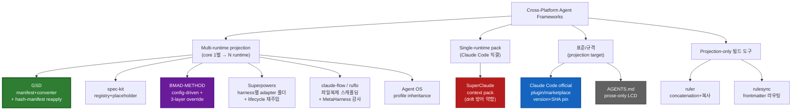

# 00 — Executive Briefing: Cross-Platform Agent Frameworks

> **한 줄 요약**: neutral core → runtime adapter projection 은 이미 지배적 패턴이며, 우리 harness 의 3-layer drift 문제에 직접 답하는 선행 사례는 **GSD 의 hash-manifest + patch-reapply** 하나뿐이다 — 나머지는 override-layer 물리 분리(spec-kit/BMAD/Agent OS)나 version/SHA-pin(Claude 공식)으로 우회한다.

## 핵심 발견

- **projection 은 표준 관행**: 조사한 9개 대상 중 GSD, spec-kit, BMAD-METHOD, Superpowers, claude-flow, Agent OS 6종이 "core 1벌 → N runtime 변환" 을 우리 `core/`→`adapters/*` 와 동형으로 구현한다 ([analysis_summary](analysis_summary.md) §1). 구현 기법은 manifest/converter(GSD) · registry/placeholder(spec-kit) · config-driven 파일복제(BMAD/claude-flow) 3갈래로 갈린다.
- **양방향 divergence 관리는 희소**: 사용자가 로컬 수정하며 upstream 도 따라가는 3-way merge 를 실제 구현한 건 **GSD (hash-manifest+`--reapply`)** 뿐. Claude 공식 plugin 규격조차 "3-way merge 도구는 문서에 없다" 고 인정한다 (`claude-code-official-plugins.md` §6).
- **파일-복사식 배포는 스스로 drift 를 낳는다**: claude-flow 는 자신의 repo 에서 367개 중복 SKILL.md drift (#1834) 를 겪는 중이고, GSD·SuperClaude 는 문서-버전 drift 를 자증한다 — "core 먼저 수정, 파생 후행" 규율의 실효성을 외부 사례가 반증적으로 뒷받침 (`claude-flow.md` §3, `superclaude.md` §6).
- **gate 강제는 이분법이 아닌 스펙트럼**: convention-only(SuperClaude, Agent OS) → state-file state machine(BMAD, spec-kit) → machine-enforced hook/CLI(GSD, claude-flow, 우리 harness). 다만 *무엇을* 강제하는지가 갈린다 — 우리 harness·GSD 는 산출물 생성 *순서 불변식*, claude-flow 는 *agent 조율*, BMAD 는 *story status 전이* ([analysis_summary](analysis_summary.md) §4-7).

## 1-Page Overview — Technology Landscape

카테고리는 4갈래: **multi-runtime projection framework** (우리 harness 와 동형, drift 문제를 정면으로 다룸) / **single-runtime pack** (SuperClaude — drift 방어가 반면교사) / **표준·규격** (Claude 공식 plugin host 규격 + AGENTS.md prose 컨벤션, 다른 프레임워크가 *투영해 들어가는* 대상) / **projection-only 빌드 도구** (ruler/rulesync — framework 가 아닌 순수 배포 도구).

## 핵심 실행 제언 Top-3 (이 repo 의 drift 문제 대상)

1. **GSD 의 hash-manifest + `--reapply` 를 `core/`→`adapters/*` 재생성 경로에 이식 검토**. 우리 harness 가 가장 부족한 "adapter 가 core 에서 갱신될 때 로컬 수정을 어떻게 보존하나" 에 대한, 유일하게 검증된 선행 사례다 (`gsd.md` §2, 특기사항). → [06_implementation](06_implementation.md) 후보 1.
2. **override-layer 물리 분리를 명시적 계층으로 승격**. spec-kit `overrides>presets>extensions>core`, BMAD `_bmad/custom/*.toml` 3-layer 는 우리의 "산출물은 소유 스킬로만 수정 + `_internal/versions/`" convention 과 같은 계보 — 이미 부분 채택 중인 패턴을 물리 계층으로 명문화 ([analysis_summary](analysis_summary.md) §4-3).
3. **parity 한계를 정직하게 문서화**. hook 같은 실행 격리는 *어떤 도구도* 없는 runtime 에서 재현 못 한다 (multi-harness 카드 결론) — 우리 harness 의 core→adapter parity 문서에 "capability loss 시 skip+warning / prompt-simulation" 처리 정책을 명시해 silent capability loss 를 차단 (`multi-harness-projection.md` §종합답).

---
관련 리포트: [01_landscape](01_landscape.md) · [03_vendor_comparison](03_vendor_comparison.md) · [04_technical_deep_dive](04_technical_deep_dive.md) · [06_implementation](06_implementation.md)
