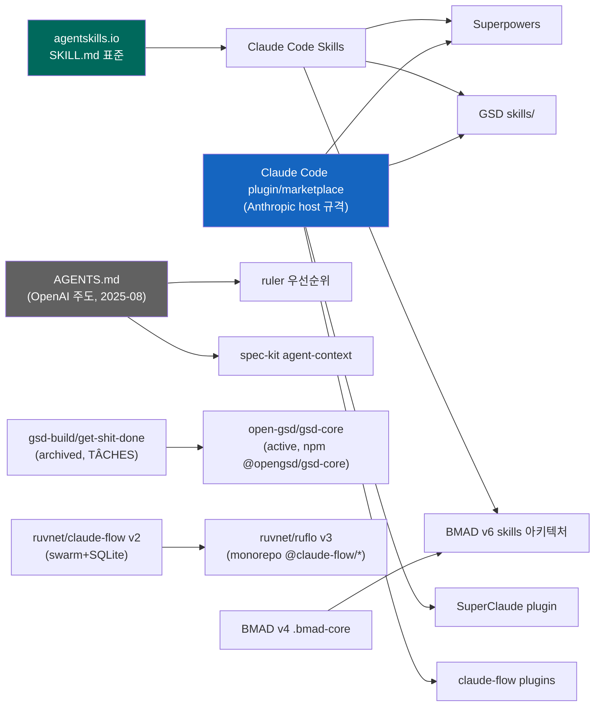

# 01 — Technology Landscape

> 대상 9종을 layer 전략·gate 강제 수준으로 분류하고, 계보와 adoption stage 를 정리한다. 모든 분류·수치는 [analysis_summary](analysis_summary.md) 및 `cards/*.md` 에 소급.

## 1. Category Taxonomy (5 카테고리)

| 카테고리 | 정의 | 소속 |
|---|---|---|
| **spec-driven pipeline framework** | spec→plan→execute 파이프라인을 산출물로 강제, multi-runtime projection | GSD, spec-kit, BMAD-METHOD, Agent OS |
| **skill-marketplace framework** | composable skill 을 progressive disclosure 로 배포, marketplace 유통 | Superpowers, SuperClaude |
| **multi-agent orchestration framework** | swarm/consensus 로 agent 조율, hook lifecycle 강제 | claude-flow (ruflo) |
| **config-sync tool** | framework 아님 — single source → N runtime 순수 배포 빌드 도구 | ruler, rulesync (+ agent_sync, ai-rules-sync) |
| **official plugin system / 표준** | 다른 프레임워크가 투영해 들어가는 host 규격·공통 컨벤션 | Claude Code official plugin, AGENTS.md |

경계는 유동적이다 — GSD 는 spec-driven 이면서 skill(~61개)·marketplace·hook 을 모두 갖춰 4카테고리에 걸친다. 분류의 1차 기준은 **"drift 를 어디서 막느냐"** (`gsd.md` §3-7).

## 2. Key-Technologies × Categories 매트릭스

| 기술 요소 | spec-driven | skill-marketplace | orchestration | config-sync | official/표준 |
|---|---|---|---|---|---|
| multi-runtime projection | GSD·spec-kit·BMAD·Agent OS | Superpowers | claude-flow | ruler·rulesync | — (AGENTS.md=projection 불필요) |
| progressive disclosure | GSD (2-stage routing) | Superpowers·SuperClaude | — | — | Claude 공식 (3-level) |
| machine-enforced gate | GSD (capability `gates[]`) | Superpowers (bootstrap 재주입) | claude-flow (hook dispatcher) | N/A | hook (`PreToolUse` block) |
| state-file state machine | spec-kit·BMAD (sprint-status) | — | — | — | — |
| hash-manifest / witness | **GSD (hash-manifest)** | — | claude-flow (`ruflo verify`) | ruler (`.bak`) | version/SHA pin |
| override-layer 물리 분리 | spec-kit·BMAD·Agent OS | — | — | rulesync (per-tool override) | managed>personal>project |
| file-based state (no DB) | 전원 | Superpowers | 예외(SQLite+HNSW) | N/A | `~/.claude/skills` |

**요점**: projection 은 전 카테고리 공통이나, 우리 harness 가 필요로 하는 **hash-manifest 기반 로컬수정 보존** 은 GSD 만 실제 구현했고 나머지는 override-layer 분리나 pin 으로 우회한다.

## 3. Lineage Diagram (계보)

두 상류 표준이 다수 프레임워크에 흘러든다: **agentskills.io SKILL.md** (progressive disclosure 의 원천) 와 **Claude Code plugin/marketplace host 규격** (유통·버전 관리의 원천). AGENTS.md 는 별도 prose 축으로 spec-kit `agent-context`·ruler 우선순위에 포섭된다 (`multi-harness-projection.md` §3).

## 4. Adoption Stage (프레임워크별)

| 프레임워크 | stage | 근거 |
|---|---|---|
| Claude Code official plugin | **mainstream** | Anthropic 공식, `claude-plugins-official` 자동 등록 (`claude-code-official-plugins.md` §2) |
| AGENTS.md | **mainstream (신흥 표준)** | 2025-12 Linux Foundation Agentic AI Foundation 기부, 60,000+ repo 채택 주장 (`multi-harness-projection.md` §3) |
| BMAD-METHOD | **mainstream** | 43K+ stars, v6.10.0 (2026-07-03), 20+ tool 지원 (`bmad-method.md`) |
| spec-kit | **mainstream** | GitHub 공식(`github/spec-kit`), 30+ agent, 활발한 진화(구/신 registry 혼재) (`spec-kit.md`) |
| GSD | **emerging (freshly rebranded)** | `gsd-build/get-shit-done` **archived** → `open-gsd/gsd-core` 로 이전, 버전 넘버링 불일치(1.7.0-rc.4 vs changelog v1.4x) (`gsd.md` 주의·미검증) |
| claude-flow | **emerging (freshly rebranded)** | `ruvnet/claude-flow` → **`ruvnet/ruflo`** 리브랜드, npm 은 여전히 `claude-flow`, 자체 중복 skill drift 진행 중 (`claude-flow.md` 정체성 주의) |
| Superpowers | **emerging** | obra/Jesse Vincent, core/lab/community 3-repo 분리, update 가 agent-dependent (`superpowers.md`) |
| SuperClaude | **emerging** | v4.3.0 stable, v5.0 plugin 완성형 개발 중(ETA 미정), 문서-버전 drift 자증 (`superclaude.md`) |
| Agent OS | **emerging** | v3.0, install 이 email-gated(verbatim 미확인) (`agent-os.md`) |
| ruler / rulesync | **emerging (niche 도구)** | npm CLI, 30~40+ tool, config-sync 전용 (`multi-harness-projection.md`) |

**요점**: 우리 harness 가 벤치마킹할 대상 중 절반(GSD, claude-flow)이 최근 리브랜드·이전을 거쳐 **문서/버전 drift 를 스스로 겪는 중** — 이는 곧 우리가 해결하려는 3-layer sync 문제가 업계 공통 미해결 과제임을 방증한다.

---
관련: [00_briefing](00_briefing.md) · [02_standards](02_standards.md) · [03_vendor_comparison](03_vendor_comparison.md)
