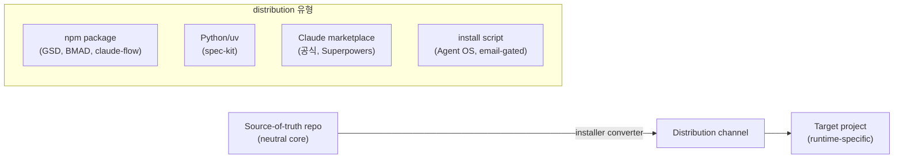

# 05 — Deployment Considerations

> reference 아키텍처, 우리 repo 채택 시 통합 경로, failure mode, N-runtime projection 유지비 모델. 근거는 `cards/*.md` 및 [analysis_summary](analysis_summary.md).

## 1. Reference Architecture Patterns

모든 조사 대상이 공유하는 3단 배포 골격: **source-of-truth repo → distribution channel → target project**.

- **GSD 는 2경로 병존**: npm `@opengsd/gsd-core` **또는** Claude plugin/marketplace — 하나의 core 가 두 채널로 배포 (`gsd.md` §2).
- **claude-flow 는 3경로**: npm/CLI + MCP server + plugin(35개) — 경량 vs 프로덕션 이중 (`claude-flow.md` §3).
- **우리 harness 매핑**: `core/`(SoT) → adapter converter(distribution) → `.agent_reports/{research,spec,plans}`(target). 이미 이 골격을 따르므로 새 아키텍처 도입이 아니라 **converter 층에 hash-manifest 를 추가** 하는 증분 작업.

## 2. 통합 경로 (우리 repo 가 채택한다면)

| 채택 패턴 | 통합 지점 | 작업 규모 |
|---|---|---|
| GSD-style hash-manifest | `core/`→`adapters/*` 재생성 스크립트에 파일 hash 기록 + 불일치 감지 | 중 (installer 로직 신설) |
| override-layer 승격 | `_internal/versions/` convention → 물리 override 디렉토리로 명문화 | 소 (이미 부분 존재) |
| Claude version/SHA-pin | 외부 skill/agent 소비 시 `ref`+`sha` pin 도입 | 소 (marketplace 소비 시나리오 한정) |
| byte-budget 테스트 | GSD `workflow-size-budget.test.cjs` 처럼 core 문서 byte 상한 CI | 소 (CLAUDE.md 비대화 방지) |
| explicit parity-loss warning | adapter 투영 시 Claude-only 기능이 lesser runtime 에서 drop 되면 warning emit | 중 (converter 계측) |

## 3. Failure Modes (실패 유형 — 조사 대상이 실제로 겪은 것)

- **fork drift**: upstream 을 복사·수정 후 rebase 못 해 divergence. Claude 공식은 이를 fork 회피(marketplace 참조)로, GSD 는 hash-manifest reapply 로 해결. 미해결 시 SuperClaude 처럼 `~/.claude/` 덮어쓰기로 로컬 수정 소실 (`superclaude.md` §6).
- **silent capability loss**: lesser runtime 투영 시 hook/subagent 가 조용히 drop (ruler 의 Copilot tool 어휘 silent drop). 감지 안 되면 기능이 사라진 줄 모름 (`multi-harness-projection.md` §2).
- **documentation / version drift (자증 사례 다수)**: GSD(repo 1.7.0-rc.4 vs changelog v1.4x), SuperClaude(한 repo 내 orchestration 서사 상충), claude-flow(#1834 367개 중복 skill) — **프레임워크 스스로 drift 를 겪음**. "core 먼저 수정" 규율의 실효성을 외부 사례가 반증적으로 입증 (`analysis_summary.md` §5).
- **복제본 drift**: 파일-복사식 배포(claude-flow init)가 `.agents/skills`·`.claude/skills`·`archive/v2/` 에 5x 중복 생성 → 어느 게 SoT 인지 불명 (`claude-flow.md` §3).

## 4. Cost Model (N-runtime projection 유지비)

| 비용 항목 | 저비용 접근 | 고비용 접근 |
|---|---|---|
| 새 runtime 추가 | config-driven 1줄(BMAD `platform-codes.yaml` target_dir 추가) | manifest 풀 작성(GSD `capability.json` 표면 계약 전체) |
| runtime 표면 변경 흡수 | converter 가 자동 흡수(GSD, spec-kit) | 파일복제면 N개 사본 수동 갱신(claude-flow) |
| 로컬 수정 보존 | override-layer 물리 분리(무비용 재설치) | hash-manifest+reapply(installer 복잡도↑) |
| parity 검증 | prose LCD(검증 불필요, 기능 0) | machine 기능 투영 동등성 테스트(claude-flow Codex parity 미검증) |

**trade-off**: 표현력(GSD manifest) ↔ 유지 단순성(BMAD config-driven) ↔ drift 안전성(override 분리). 우리 harness 는 이미 3-runtime(claude/codex/opencode) projection 을 유지 중이므로 **manifest 표현력을 높이는 방향의 한계비용이 파일-복제식 유지비보다 낮다** — claude-flow 의 #1834 가 파일-복제 유지비가 폭증하는 실증.

**요점**: 우리 repo 는 새 아키텍처가 아니라 **기존 converter 층에 (1) hash-manifest (2) explicit parity-loss warning (3) byte-budget CI** 3개를 증분 추가하는 것이 최소비용·최대효과 배치다. 파일-복제식 스캐폴딩(claude-flow 모델)은 명시적으로 회피.

---
관련: [04_technical_deep_dive](04_technical_deep_dive.md) · [06_implementation](06_implementation.md)
