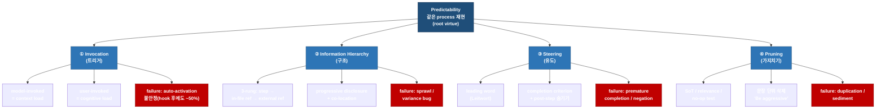

# 00 · Executive Briefing — Skill Design Principles

> mode: technology · date: 2026-07-13 · topic: Matt Pocock "Writing Great Skills" 4원칙 심층

## Level 0 — 한 문장

AI 에이전트 skill 설계는 **Predictability(같은 *과정*의 재현)**를 root virtue 로 삼고, 이를 **Invocation / Information Hierarchy / Steering / Pruning** 네 축의 레버로 달성하며, 모든 레버는 결국 **context load 와 cognitive load 라는 두 비용축**의 지불 문제로 환원된다.

## Level 1 — 핵심 발견 (3-5줄)

- 원문(Matt Pocock `writing-great-skills` GLOSSARY)의 canonical 4축은 **Invocation(트리거) / Information Hierarchy(구조) / Steering(유도) / Pruning(가지치기)**이며, 사용자의 4-set(트리거/구조/유도/가지치기)은 StartupHub 의 **Trigger / Structure / Steering / Pruning** 을 국문화한 계보다. 다만 StartupHub 의 3번째 축 **라벨 자체는 "Steering"**이고, "유도/Guidance"는 그 라벨이 아니라 정의문(*"how the skill is guided to…"*)을 옮긴 것이다 — **canonical 라벨은 Steering**.
- 4축 위에 상위 프레임 **Predictability**가 있다 — *"the agent taking the same process every run, not producing the same output"*. 사용자 요약에서 누락된 가장 중요한 목적 프레임이다.
- 모든 설계 결정(split/inline/invocation)은 두 비용축으로 환원된다: **context load**(model-invoked description 이 매 턴 상주) vs **cognitive load**(user 가 skill 존재를 기억).
- Pocock 원칙의 *메커니즘*은 Anthropic **attention budget / context rot** 로 뒷받침된다 — 저신호 토큰이 고신호 토큰의 retrieval 정확도를 깎으므로 pruning·progressive disclosure 가 성능 레버가 된다.

## Level 2 — 1 page

### Technology Landscape (Predictability → 4 axes → levers → failure modes)

### 4축 요약

| 축 | 원문 정의 (1줄) | 핵심 하위 레버 | 대표 failure mode |
|---|---|---|---|
| ① Invocation (트리거) | 스킬에 도달하는 방식의 이분 (*"how a skill is reached"*) | model-invoked(description 상주) / user-invoked(disable-model-invocation) / router | auto-activation 불안정 — description 매칭돼도 무시, hook 워크어라운드 후에도 ~50%(scottspence) |
| ② Information Hierarchy (구조) | 콘텐츠를 즉시성 사다리로 배치 (*"how its content is arranged"*) | 3-rung(step→in-file ref→external ref), progressive disclosure, co-location, context pointer | sprawl / variance bug(약한 pointer 뒤 must-have) |
| ③ Steering (유도) | 런타임 행동을 Predictability 로 형성하는 레버들 (*"how runtime behaviour is shaped"*) | leading word(_Leitwort_), completion criterion, post-completion steps 숨기기, negation→positive | premature completion / negation |
| ④ Pruning (가지치기) | 스킬을 lean 하게 유지 (*"how it is kept lean"*) | Single Source of Truth, relevance, no-op test, "Be aggressive" | duplication / sediment |

**Takeaway**: 4축은 서로 독립 체크리스트가 아니라 Predictability 라는 단일 목적을 향한 레버 묶음이며, 각 축은 두 비용축(context/cognitive load) 중 하나를 지불한다.

### Key findings

1. 원문의 실제 4축은 **Invocation / Information Hierarchy / Steering / Pruning** (GLOSSARY line 5 명시). 사용자 요약(트리거/구조/유도/가지치기)은 개념적으로 맞다.
2. "유도(Guidance)"의 canonical 라벨은 **Steering** — search stage 가설 CONFIRMED. leading word·completion criterion·미래단계 숨기기·negation 을 묶는 축.
3. 상위 개념 **Predictability**(같은 *과정*, 같은 *출력* 아님)가 4축 전체의 목적 — 사용자 요약에서 누락.
4. 모든 레버는 **context load**(description 상주) vs **cognitive load**(사람이 기억) 두 비용축으로 환원.
5. Pocock 메커니즘은 Anthropic **attention budget / context rot** 로 뒷받침 — pruning·disclosure 가 성능 레버.
6. 사용자 요약의 미세 부정확 3건: "구조=절차 외 설명 배제"(실제 Pruning 소관), "2계층"(실제 **3-rung**), "유도"(canonical=Steering).
7. **CONTEXT.md 용어집(shared language)**은 writing-great-skills 4원칙이 아니라 별도 축(README #2 / grill-with-docs / domain-modeling) — spec 에서 분리 서술 필요.

### Top-3 actionable insights

1. **hook 강제 라우팅은 합당한 방향** — scottspence 는 description wording 이 정확히 매칭돼도 자동발화가 무시될 수 있고 UserPromptSubmit hook 워크어라운드를 적용한 뒤에도 신뢰도가 ~50%에 그친다고 보고한다. 즉 소스가 지지하는 선은 "description wording 단독으로는 자동발화가 불안정하므로 hook 강제 라우팅이 합당한 방향"까지다. 우리 harness 의 `mem-recall-inject`·`workflow-guard-hook`(deterministic UserPromptSubmit 주입)은 scottspence 의 *조건부 키워드-hook* 과 성격이 다를 수 있으나, hook 이 신뢰도를 회복/해결한다는 강한 주장은 **측정 미검증**이다.
2. **28스킬 audit 은 4축 체크리스트로 표준화 가능** — analysis_summary §7 감사 체크리스트를 Invocation/IH/Steering/Pruning 4축 + Anthropic 정량 규범(500줄·1-depth·3인칭 "Use when…")으로 정형화하면 전수 스캔이 가능하다.
3. **autopilot-* 라우팅 = router skill 동형** — CLAUDE.md §0 의 autopilot-* 라우팅은 Pocock 의 cognitive-load 흡수 router skill(`ask-matt`)과 동형이며, 이미 검증된 설계 패턴이다.

## Level 3 — 전체 보고서 가이드

| file | 내용 | 답하는 핵심 질문 |
|---|---|---|
| [01_landscape.md](01_landscape.md) | 4축 + Predictability + 생태계 보강 개념 taxonomy, 개념×소스 matrix, lineage diagram | "이 분야의 개념 지도는? 사용자 요약은 어디서 왔나?" |
| [02_standards.md](02_standards.md) | 정량 규범/컨벤션 인벤토리, failure-mode 진단 규범 | "무엇을 어디까지 강제할 정량 기준이 있나?" |
| [03_vendor_comparison.md](03_vendor_comparison.md) | 세 관점(Anthropic 공식 / Pocock 철학 / 커뮤니티) 비교·상충 | "누구 말을 어디에 써야 하나?" |
| [04_technical_deep_dive.md](04_technical_deep_dive.md) | 4원칙 메커니즘 심층(정의→메커니즘→근거), trade-off, 미해결 과제 | "왜 이 원칙이 성능에 영향을 주나?" |
| [05_deployment.md](05_deployment.md) | 우리 harness 적용 시 배포 고려사항, context budget, failure mitigation | "우리 harness 에 어떻게 얹나?" |
| [06_implementation.md](06_implementation.md) | 28스킬 4축 audit 로드맵 + Before/After + Next Pipeline | "실제로 어떤 순서로 audit 하나?" |
| [07_resources.md](07_resources.md) | Tier 기반 소스·레퍼런스, quick verify 명령, 재현성 matrix | "1차 소스는 어디이고 어떻게 재현하나?" |

**Takeaway**: 04(메커니즘)와 06(audit 로드맵)이 다운스트림 spec 의 핵심 입력이며, 06 의 `## Next Pipeline` 이 실행 진입점이다.
