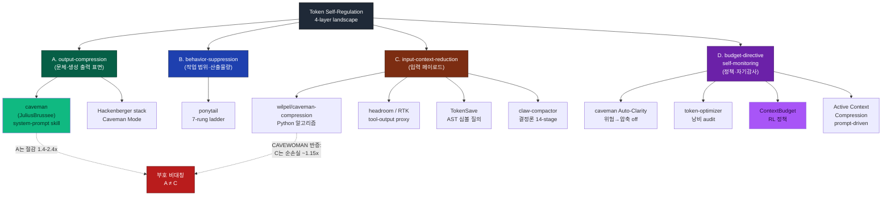

# 00 — Executive Briefing: Token Self-Regulation 생태계

> autopilot-research · technology mode · intensity=thorough
> 대상: caveman·ponytail 중심 token-saving skill 생태계 + 우리 하네스의 **token-budget 자기조절 축** 설계 입력

---

## Level 0 — 1줄 요약

"token 절감"은 단일 현상이 아니라 **부호가 서로 다른 4개 레버**이며, 광고 60-90% 는 세션 전체로는 3.7-21% 로 희석되고, input 압축은 오히려 순손실(~1.15x)이라 **output-compression 우선·input default off·safety 불가침**이 하네스 설계 불변식이다.

## Level 1 — 핵심 3-5줄

- **4계층 메커니즘**: A(output-compression, 문체) / B(behavior-suppression, 작업량) / C(input-context-reduction, 입력 압축) / D(budget-directive-self-monitoring, 자기조절·감사). caveman(JuliusBrussee)=A+D, ponytail=B+D, wilpel=C, ContextBudget=D.
- **부호 비대칭 (가장 중요)**: CAVEWOMAN(arXiv 2606.24083)이 실측 — A(output)는 1.4-2.4x 절감이지만 **C(input)는 strict lose-lose 로 순비용 ~1.15x 상승**(최악 1.8x). 같은 "caveman" 브랜드의 JuliusBrussee(A)와 wilpel(C)이 정반대 효과를 낸다.
- **광고 vs 세션 gap 은 3중 교차검증**: 저자 자기비판(caveman HONEST-NUMBERS, ponytail cost-verification) > 독립 replay(codepointer 3.7%) > 학술 반증(CAVEWOMAN, SkillReducer) 이 모두 같은 방향으로 수렴 → 결론 강건.
- **재주입 오버헤드**: skill 자체가 매 turn input 을 늘린다(caveman ~1-1.5k tok/turn). ponytail 은 OpenAI reasoning model 에서 오히려 +26~39% 비싸짐 — always-on ruleset 이 짧아진 코드보다 큼.
- **하네스 방향**: intensity 축(난이도→rigor 올림)과 직교인 token-budget 축(예산→범위 줄임)을 설계. output 레버 우선, input 레버 default off, safety rail 은 어느 축에서도 레버 대상 아님.

## Level 2 — 1페이지 종합

이 조사는 2026년 상반기에 확산된 "token-saving skill" 생태계(caveman·ponytail·wilpel·headroom·TokenSave·claw-compactor·token-optimizer)와 이를 검증·반증하는 학술 축(CAVEWOMAN·ContextBudget·SkillReducer·Active Context Compression)을 25개 소스 → 22개 카드로 정리하고, 주요 3종(caveman·ponytail·wilpel)은 실제 clone·소스 열람으로 메커니즘 실체를 확인했다.

**핵심 발견 1 — "token 절감"은 4개의 서로 다른 레버다.** 문체를 짧게 하는 output-compression(A), 작업량 자체를 줄이는 behavior-suppression(B), 입력을 LLM 도달 전 압축하는 input-context-reduction(C), 예산·위험 신호로 스스로 조절하는 self-monitoring(D). 이들을 "token 절감"으로 뭉뚱그리면 효과가 과대평가된다. 특히 A와 C는 **부호가 반대**여서, 여러 레버를 쌓으면 절감이 합쳐진다는 Hackenberger "Ultimate Stack" 식 가정은 성립하지 않는다.

**핵심 발견 2 — 광고 수치와 세션 실절감의 gap.** caveman 광고 output 65% 는 저자 자신의 HONEST-NUMBERS 에서 session-level 14-21%(output-heavy), terse workload 은 net-negative 로 내려온다. codepointer 는 500 실세션(2,182 세션·614M tok·$926 baseline) replay 로 rtk+headroom+caveman 합산 실절감을 **3.7%** 로 측정했다. gap 의 원인은 ① denominator mismatch(per-payload % vs 세션 전체 청구) ② workload mismatch ③ pricing structure(압축분이 싼 cache_read 로 떨어지고 청구는 cache_create·output 이 지배) 세 가지다.

**핵심 발견 3 — self-regulation 의 스펙트럼.** 정적 rule(caveman Auto-Clarity, ponytail ladder) → prompt-driven 자율(Active Context Compression) → RL 정책(ContextBudget). 기존 skill 대부분은 "신호=암묵적 문맥 판단, 레버=단일 표면, 항상 on" 인데, 진짜 self-regulation 은 잔여 budget·작업 가치를 **명시 신호**로 측정해 여러 레버 중 상황에 맞는 것을 선택적으로 조절하는 것이다.

우리 하네스는 이미 P0~P6 다이어트(always-on context -8.9%, 선택-로드 skill body -77%)로 재주입 오버헤드를 줄여 왔고(SkillReducer 방향과 일치), 이 조사는 그 위에 **런타임 token-budget 자기조절 축**을 얹는 설계의 근거를 제공한다.

---

## 메커니즘 Landscape (4계층)

- **A (녹색)**: 안전하나 세션 효과 작음. 출력 표면만 건드림.
- **C (갈색)**: CAVEWOMAN 이 반증한 순손실 계층 — default off 대상.
- **D (보라)**: self-regulation 의 정식화 방향. ContextBudget(강조)이 가장 정책적.

---

## Top-3 Actionable Insight (axis 4 결론)

1. **output-compression(A)은 안전하나 세션 효과 작고, input-context-reduction(C)은 순손실이라 default off.** CAVEWOMAN 의 부호 비대칭(A 1.4-2.4x 절감 ↔ C 순비용 ~1.15x)을 하네스 설계 불변식으로. token-budget 이 아무리 tight 해도 input 압축 레버를 켜지 않는다.

2. **광고 60-90% vs 세션 실절감 3.7-21% gap — 신호는 세션 denominator 기준.** codepointer 의 3중 gap(denominator/workload/pricing)을 반영해, token-budget 축의 목표는 per-payload % 가 아니라 세션 청구액·잔여 예산으로 정의한다. 레버를 stacking 해도 단순 합산되지 않는다(공통 denominator 를 나눠 가짐).

3. **safety rail 은 어느 축에서도 불가침.** caveman(security warning→압축 off)·ponytail(validation/security/a11y 축소 금지) 모두 명시. token-budget 이 tight 해도 검증·안전·에러 처리는 레버 대상이 아니다. 이 불변식을 skill 계층에 배선한다.

---

## Level 3 — 7파일 가이드

| 파일 | 내용 | 답하는 핵심 질문 |
|---|---|---|
| [00_briefing.md](00_briefing.md) | Executive briefing, 4계층 landscape, Top-3 insight | "전체 결론이 뭔가? 무엇을 해야 하나?" |
| [01_landscape.md](01_landscape.md) | 4계층 taxonomy, 발견물×계층 matrix, caveman 브랜드 lineage | "어떤 도구가 어느 계층인가? caveman 두 개는 왜 다른가?" |
| [02_standards.md](02_standards.md) | 절감을 어떻게 측정·검증했나(광고/자기검증/독립replay/학술) | "이 수치를 믿어도 되나? 검증 신뢰도는?" |
| [03_vendor_comparison.md](03_vendor_comparison.md) | 발견물 매트릭스(계층·claim·실측·오버헤드·품질·신뢰도) | "상황별로 어떤 레버를 써야 하나?" |
| [04_technical_deep_dive.md](04_technical_deep_dive.md) | caveman/ponytail/wilpel 실제 메커니즘, trade-off | "각 도구는 코드 레벨에서 어떻게 동작하나?" |
| [05_deployment.md](05_deployment.md) | 하네스 적용 고려사항, intensity⊥budget 직교, 간섭 지점 | "우리 하네스에 얹을 때 무엇을 주의하나?" |
| [06_implementation.md](06_implementation.md) | goal-adaptive roadmap(adopt+build), phased plan, Next Pipeline | "실제로 어떻게 도입하나? 다음 단계는?" |
| [07_resources.md](07_resources.md) | open-source repo/paper Tier 1/2/3, quick verify | "어디서 원본을 보나? 재현 가능한가?" |

**Takeaway**: 결론은 세 문장 — (1) token 절감은 부호 다른 4개 레버다, (2) 세션 denominator 로 재면 광고보다 훨씬 작다, (3) 하네스는 output 우선·input off·safety 불가침으로 token-budget 축을 intensity 와 직교하게 설계한다.
