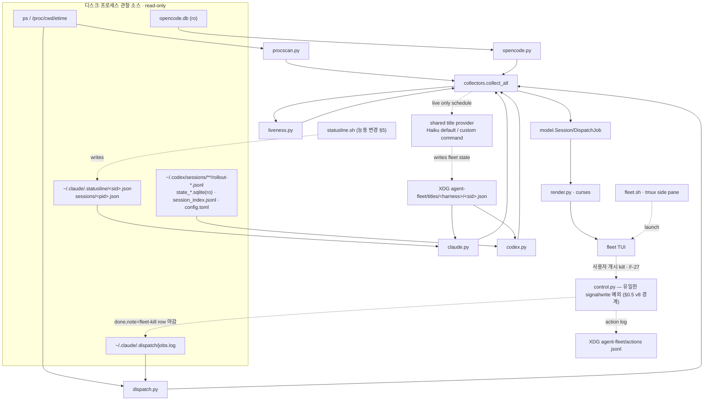

# agent-fleet-dashboard — Spec (PRD)

> mode: **cli** (터미널 TUI 도구) · 작성 2026-07-01 · **v2 2026-07-10** (drift 흡수 + stage-dispatch 관제 parity + UI 가독성 개선) · **v3 2026-07-12** (minor 5건[F-14~F-19] 흡수 승격 — §4.7 분리 신설 + audit 🟡 3건 반영: §3 `--demo` 등재·§9 모듈 트리 현행화. 근거 = `_internal/audit/audit_2026-07-12T0910.md`) · **v4 2026-07-13** (F-20 dynamic Codex rate-window contract) · **v5 2026-07-13** (F-21 Codex native title + cross-harness fleet title provider. Claude-only refresher 계약 폐기) · **v6 2026-07-14** (F-22 responsive titles + F-23 recursive-storm containment) · **v7 2026-07-15** (F-24 portable worker attribution + unique Codex rollout ownership) · **v8 2026-07-15** (F-25~F-28 — 상태 판정 단일 모델·interactive 세션 레지스트리 1급·제한적 세션 제어[Non-goal 반전]·분사 정책 연동 계약. 근거 = 사용자 결정 4건: "fleet 직접 세션 제어"·"반쪽짜리 해소, 전향적 확장"·"버그가 아니라 판정 기준 자체가 불안정"·"분사 정책과 연동되는 가장 중요한 UI") · **v9 2026-07-15** (minor 6건 흡수 + audit 🟡 2건 해소[어휘 매핑 표·§10 다이어그램] + F-27 마우스 1급 재설계 + F-30 종착 비전 등재 "dispatch·서브에이전트 처리 과정 시각화". 근거 = `_internal/audit/audit_2026-07-15T1734.md` + 사용자 방향 2건)
> 컴포넌트: `agent_setting` repo 의 **별도 내부 도구** — 기존 `spec/prd.md`(Unified Memory System)와 무관, 이 폴더(`spec/agent-fleet-dashboard/`)가 자체 청사진.
> 입력(1순위 근거): `research/agent-fleet-dashboard/00_prior_art.md`(build-vs-adopt·herdr·렌더스택) · `research/agent-fleet-dashboard/01_tap_mechanics.md`(하네스별 tap·discovery·liveness, file-cited)
> **v2 추가 입력**: `spec/stage-dispatch/prd.md`(SD-1~9 — 스테이지 단위 depth-2 headless 분사 계약, §9-13 fleet 표시 = Phase 2 잔여) · 현행 `tools/fleet/` 코드 전수 실측(2026-07-10 Explore, file:line-cited) · 사용자 관찰("워크플로우를 못 따라감 + UI 아쉬운 점 다수").
> 본 문서는 청사진(PRD). 구현은 autopilot-code (산출물 `plans/`). skeleton 은 lean 유지 위해 autopilot-code 로 이월(§9 module 구조만 확정).
> v1 원본 = `_internal/versions/v1/prd.md`. v1 이후 07-01~07-10 사이 커밋된 렌더 진화(§4 [v2 기준선] 참조)는 본 v2 가 소급 흡수 — 이 구간의 산출물 트레일은 `plans/2026-07-01_agent-fleet-dashboard/`·`plans/2026-07-01_fleet-render-v2/`·`plans/2026-07-03_fleet-cooling-groups/` + 직접 커밋(git log `tools/fleet`).

## 0. 한 줄

여러 하네스(Claude Code·Codex·opencode)의 **활성 세션 전부** + **프로젝트별 headless dispatch 잡**을, 어떤 하네스 TUI 에도 주입하지 않고 **외부에서 관찰**해 htop/nvtop 스타일 라이브 터미널 대시보드로 모아 보여준다. zero-dep python curses, tmux 세로 사이드 페인 배치.

## 0.5 설계 원칙 — 외부 관찰자 (zero-injection) ★ cross-cutting

**대시보드는 어떤 하네스의 TUI·transcript·프로세스에도 아무것도 주입하지 않는다.** 이미 디스크에 존재하는 신호(프로세스 테이블·transcript·statusline JSON·SQLite row·jobs.log)를 읽어 렌더한다. write 예외는 fleet이 _소유한_ local state뿐이다: Claude per-session statusline tap(§5)과 제목 sidecar(`$FLEET_TITLE_STATE_DIR` 또는 XDG state). 하네스 원본 transcript·DB에는 쓰지 않는다.

> **[v8 경계 개정] 관찰 + 사용자 개시 제어**: F-27이 "무제어" 절대 원칙을 "**자동 제어 0, 명시적 사용자 개시 제어만**"으로 좁힌다. fleet은 스스로 어떤 프로세스도 죽이거나 정리하지 않으며, 사용자의 명시적 키 입력 + 확인 게이트를 통과한 kill/정리 시그널만 보낸다. zero-injection(하네스 TUI·transcript·DB 무주입)은 그대로 불변 — 프로세스 시그널은 주입이 아니라 OS 표준 제어이고, 모든 제어 행위는 fleet 소유 action log에 남는다.

> **[v2 확장] "관찰" 의 범위**: 디스크·프로세스 외에 **하네스 계정 usage API 의 read-only 호출**(claude OAuth `/api/oauth/usage`, codex `wham/usage` — usage 헤더의 rate-limit 소스, `usage_api.py`·`codex.py` 실측)을 관찰로 인정한다. 쓰기·주입이 아니고 하네스 세션에 영향 0 — F-1 불변. opencode 는 usage API 부재 → 헤더에 "no usage api" 명시(결손 침묵 금지, F-3 동형).

- **왜**: codex·opencode 의 TUI/hook 은 우리가 못 건드림(그리고 건드리면 안 됨). 관찰자로만 두면 하네스 버전 업그레이드·재시작과 무관하게 동작하고, 대시보드 크래시가 세션에 영향 0.
- **적용**: 새 데이터가 필요하면 "이 하네스가 이미 어디에 남기나?"를 먼저 묻는다(§2 tap 매트릭스). 없으면 프로세스 스캔(universal 백본)으로 fallback. 새 emit 경로를 하네스에 심지 않는다.

## 1. 아키텍처 — 3계층, 2섹션

```
[발견 계층·universal 백본]  프로세스 스캔: comm ∈ {claude,codex,opencode} + /proc/<pid>/cwd + ps etime
        ↓  (모든 하네스의 모든 활성 세션을 무조건 열거 — 유일하게 100% 보장되는 tap)
[보강 계층·하네스별 passive enrichment]  세션당 상세를 디스크에서 read-only 로 부착
        · claude   → ~/.claude/.statusline/<session_id>.json (신규 per-session tap, §5) · fallback: ~/.claude/sessions/<pid>.json
        · codex    → 최신 rollout jsonl 의 마지막 token_count 이벤트 tail + config.toml (model/effort)
        · opencode → opencode.db `session` row (ro) — model/agent/tokens/cost
        · dispatch → statusline 잡스캔 로직(재사용) + .dispatch/jobs.log 병합
        ↓
[렌더 계층]  curses TUI — (A) fleet 그리드 + (B) dispatch 리스트, 1~2초 tick 라이브 갱신
```

- **백본이 세션 목록의 진실**: enrichment 가 실패/결손이어도 세션은 프로세스 스캔으로 항상 잡힌다. enrichment 는 "칸 채우기"일 뿐, 세션 존재 판정 아님.
- **pid ↔ session 매핑**: claude=`~/.claude/sessions/<pid>.json` 또는 statusline 파일의 session_id; codex=broker `--cwd`/leaf `/proc/cwd`; opencode=`/proc/cwd` == `session.directory`(argv 에 세션 id 없음).

## 2. Discovery & tap 매트릭스 (근거: 01_tap_mechanics.md)

| Need | Claude Code | Codex CLI | opencode |
|---|---|---|---|
| process comm | `claude` | `codex`(`app-server`/`exec`) | `opencode` |
| /proc/cwd + etime | ✅ | ✅ | ✅ |
| 세션 id | UUID | UUID | `ses_…`(+slug) |
| model / cwd | statusline JSON | rollout `session_meta.cwd` + config model | DB `session.model`/`directory` |
| token / context% | statusline `context_window.*` | rollout `token_count.info.*` | DB `tokens_*`(ctx% 유도) |
| **rate limit** | ✅ 5h/7d | ✅ duration-labeled windows | ❌ 없음 |
| **effort** | ✅ | ✅ config | ❌ 없음 |
| cost | ✅ | 토큰서 유도 | ✅ `session.cost` |
| liveness | transcript mtime + `sessions/<pid>.json` | rollout mtime | DB `MAX(time_updated)` |

**Takeaway**: 세션 _존재_ 는 프로세스 스캔으로 100% 균질. _상세_ 는 하네스별 비대칭 — opencode 는 rate-limit·effort 칸이 구조적으로 빈다(UI 가 결손 칸을 `—` 로 허용해야 함, §4). Codex telemetry 는 rollout jsonl 마지막 `token_count` 한 줄 tail 로 취득.

## 3. [cli] 명령·옵션·I/O

> **[minor edit · render v2 cycle, 2026-07-01]** 아래 옵션 표·키·런처 설명은 render v2 재구성 반영(cwd-group 레이아웃·스크롤·stale 토글). v1 원본은 `plans/2026-07-01_agent-fleet-dashboard/` 참조.

단일 진입 명령. 서브명령 없음(모니터 도구).

| 옵션 | 기본 | 의미 |
|---|---|---|
| `--interval <sec>` | `2` | 라이브 tick 주기(초). 백본 프로세스 스캔·enrichment 재수집 주기. |
| `--once` | off | 1회 스냅샷 렌더 후 종료(스크립트·디버그용, curses 미진입 시 plain 출력). |
| `--no-tmux` | off | tmux split 없이 현재 터미널에서 직접 실행(런처가 아니라 TUI 직접). |
| `--section <fleet\|dispatch\|both>` | `both` | **(v2 의미 변경)** 더 이상 화면 전체를 2섹션으로 쪼개지 않는다 — project(cwd) 그룹 _안에서_ 어떤 row-type 을 보여줄지 필터한다. `fleet`=그룹 안 세션 행만, `dispatch`=그룹 안 dispatch 행만, `both`=전체(기본). 필터 후 행이 0개가 된 그룹은 헤더째 생략(빈 그룹 미출력). |
| `--harness <list>` | all | 특정 하네스만(예: `claude,codex`). |
| `--json` | off | curses 대신 수집 결과를 JSON 으로 stdout(파이프·디버그·테스트). |
| `--all` | off | fleet 리스트에 stale/dead 세션도 표시. **기본은 숨김**(활성 working/idle 만; 헤더 카운트·`+N hidden` 요약은 유지). |
| `--demo` | off | **(v3 소급 등재 — audit 🟡-2)** demo fixture 를 라이브 데이터에 _병합_ 주입해 렌더 검증(대체 아님 — `2e23462`). env `FLEET_DEMO=1` 동등(런처·alias 경유 시). |

**(v2 신설) 라이브 조작 키**:

| 키 | 동작 |
|---|---|
| `↑`/`↓`, `j`/`k` | 1줄 스크롤 |
| `PgUp`/`PgDn` | 페이지 단위 스크롤 |
| `Home`/`g`, `End`/`G` | 맨 위 / 맨 아래로 이동(뷰포트는 항상 맨 아래까지 도달) |
| `a` | stale/dead 세션 + codex app-server companion 표시↔숨김 토글(`--all` 과 동일 효과, 라이브 재토글 가능) |
| `w` | **(v2 소급 흡수)** 레이아웃 cycle `auto → wide → narrow → stack` — auto 는 폭 컷오프(70/110열)가 결정, wide=1줄 grid·narrow=2줄 카드·stack=3줄 세로. 어느 모드든 harness 배지·slug·liveness 는 불락(정체성 anchor). footer 키 바에 현재 모드 표기(3-모드 전부 — §4.6 F-12). |
| 마우스 클릭(`+N hidden` 줄) | `a` 와 동일한 토글. `tmux set -g mouse on` 필요 |
| `q` | 종료 |
| `r` | 즉시 새로고침 |

- **마우스 트레이드오프(1줄 메모)**: 키보드 스크롤(`jk`/`PgUp,Dn`/`g,G`)이 기본(primary) 조작 경로다. tmux 마우스(`set -g mouse on`)를 켜면 `+N hidden` 클릭 토글이 되지만, 그 대가로 터미널 네이티브 클릭-선택·복사가 막힌다 — 그래서 마우스는 opt-in.
- **Input**: 없음(디스크·프로세스 관찰만). 환경변수 `AGENT_HOME`/`CLAUDE_HOME`(기본 `~/.claude`), `AGENT_DISPATCH_JOBS`(기본 `<AGENT_HOME>/.dispatch/jobs.log`) 존중.
- **Output**: curses full-screen(기본) / `--once`·`--json` 시 plain stdout.
- **Exit code**: `0` 정상 종료(q/Ctrl-C) · `1` 초기화 실패(터미널 아님·의존 누락) · `2` 인자 오류.
- **런처 (v2: normal-terminal 비율)**: 세로 사이드 페인 강제 배치는 폐기(retire). `fleet.sh` 기본 동작은 현재 터미널에서 `fleet.py` 를 **전체 크기(full-terminal)** 로 직접 실행. `--window` 옵션 시 tmux 안이면 새 tmux 창(역시 full-size)으로 열고, tmux 밖이면 direct 실행으로 degrade.

## 4. UI — project(cwd) 그룹 레이아웃 + 렌더 모델

> **[minor edit · render v2 cycle, 2026-07-01]** 아래는 v1 의 "(A) fleet 섹션 / (B) dispatch 섹션" 2섹션 분리 모델을 **project(cwd) 그룹** 모델로 대체한다. v1 원본 레이아웃은 `plans/2026-07-01_agent-fleet-dashboard/`(v1 빌드 사이클) 참조. §1 아키텍처 다이어그램의 "2섹션" 표기는 개념상 이 그룹 모델로 대체된 것으로 읽는다(다이어그램 자체는 미변경, §9-11 도 동일).

### [v2 기준선] 현행 화면 구성 (07-01~07-10 진화 소급 흡수 — 코드 실측)

v1 이후 커밋으로 진화한 현행 렌더 모델을 spec 기준선으로 승인한다 (render.py `_build_lines` 실측 순서):

1. **usage 헤더** — harness 별 1행 rate-limit 게이지: claude `5h/7d/<per-model>` (OAuth usage API + statusline tap), codex `duration-labeled windows` (wham API + rollout fallback, expiry-aware; `limit_window_seconds` 우선, legacy 에서만 primary=5h/secondary=7d), opencode = "no usage api" 명시행. 라벨은 dim(harness 로 오독 방지).
2. **fleet pulse 요약행** — `fleet <spinner> N working · M idle · [K detached] · ↳ J jobs (…)`. app-server companion 은 카운트 제외.
3. **alert strip** (조건부, healthy 면 0줄) — ctx ≥80% 세션 + stale/dead job, 최대 6개.
4. **프로젝트 그룹 카드** — 그룹 헤더(hot/cooling/cold 3단계 + `🚧 N` worktree 카운트 + tracked/untracked 게이트 배지) → 세션 행 → dispatch 트리. 그룹핑 키 = 부모 repo 역매핑(`-wt`/`_worktrees` 2-pass) + `drill:<case>` 특수 그룹 + `loops` 그룹.
5. **folded 집계 1행** — live 세션 0 + 잡 0 그룹은 접어 `inactive +N folded <names>`.
6. **legend + footer 키 바** — 글리프 범례, 키 힌트, 스크롤 `↑N/↓N` 인디케이터.

레이아웃 3모드(`w` cycle, §3) · main-session bold · stale/companion dim·숨김 · 수동 blink(tmux A_BLINK strip 대응) · 256색 body tint(hot=midnight-blue/cooling=brown/cold=grey, 실패 시 `▍` rail fallback) 포함 전부 기준선. 이 기준선 위에서 v2 의 신규 계약은 §4.5(stage-dispatch 관제)·§4.6(UI 가독성)이다.

### project(cwd) 그룹 — 부모 repo 당 그룹 1개
세션과 그 프로젝트의 dispatch 잡을 **같은 그룹**에 묶는다. 그룹핑 키 = 부모 repo:
- worktree cwd (`<repo>-wt/<slug>`, `<repo>_worktrees/<slug>`) → 부모 repo 이름으로 역매핑.
- loops 잡(cwd 없음, key ∈ {oncall,note,study,drill}) → `loops` 그룹.
- 그 외 → cwd basename(`.broken*` 접미사는 제거).

각 그룹은 **세션 행 먼저, 그 다음 dispatch 행** 순서로 구성된다. 그룹 정렬은 활동도(working 포함 그룹 우선) → 최근성 → 이름순.

> **[minor edit · cooling state, 2026-07-03]** 디렉토리(그룹) 헤더의 활동 상태를 **3단계**로 표시한다 — 코드 = `render.py` 그룹 헤더 (`_COOL_WINDOW_MIN`).
> - **활성(hot)**: 그룹 안에 `working` 세션/잡이 있음 → 이름 앞 녹색 `●`(blink) + green-bold 제목.
> - **대기(cooling)**: `working` 은 없지만 그룹 안 세션 transcript 의 최신 write 가 `_COOL_WINDOW_MIN`(기본 180분) 이내 → "방금 끝나 아직 온기" 중간 상태. 이름·인디케이터(채운 `●`)·`✓` 완료-경과 아이콘+경과시간(예 `✓ 1h32m`)을 **어두운 노랑**(dim yellow), body 틴트 = **살짝 어두운 갈색**(`_TINT_BODY_COOL`, 256-lvl 94 ≈ #875f00, `init_color` 가능 시 더 짙게). 온도 gradient = 활성 녹색 → cooling 노랑/갈색(잔열) → cold 회색. 세션은 idle 로 남아(48h live 창 안) 그룹이 접히지 않는다(R4). §7 의 dispatch-전용 `done` 을 _그룹 레벨_ 로 끌어올린 개념.
> - **비활성(cold)**: `working` 없음 + 최근 활동 없음(창 초과 또는 mtime 부재) → 이름 앞 **회색 고리 `○`**. shape-size gradient(채운 `●` 최근·활동적 > 고리 `○` 잠듦, design r2). dead(`✕` 적)·stale(`·`)와는 회색으로 구분.

### 세션 행 — harness 배지 + 1줄 패널
```
[Claude] <slug>  ✨<model> ·<effort>  🧠<ctx%>  5h<r>/7d<r>  ⏳<elapsed>  <liveness>
```
- **harness 배지(v2: 풀네임 로고, 단일 문자 C/X/O 폐기)**: `[Claude]`/`[Codex]`/`[opencode]` 텍스트를 하네스별 색상 + reverse-video 블록으로 표시. codex app-server companion 프로세스는 배지 옆에 `⚙app-server` 마커를 추가로 붙인다.
- **결손 칸 규칙(불변)**: 하네스가 안 주는 값(opencode 의 rate-limit·effort 등)은 `—` 로 표시(빈칸 아님 — "없음"을 명시).
- liveness: herdr 4-상태 어휘 재사용 — `idle`/`working`/`blocked`/`done`(+ `stale`/`dead`, §7). 색: working=녹, idle=dim, blocked=황, stale/dead=적.
- 정렬(그룹 내): working→idle→stale→dead→최근성.

### dispatch 행 — 부모 세션 밑 `└▸` 자식 트리
> **[minor edit · nested-tree cycle, 2026-07-01]** v2 의 그룹당 dim `dispatch:` 서브 라벨 모델을 **세션→잡 단일 트리**로 대체한다. 각 dispatch 잡을 _그것을 분사한 부모 세션_ 아래 `└▸🚀` 자식 행으로 종속시키고, 별도 `dispatch:` 서브 라벨은 폐기. (v2 서브 라벨 원본은 `plans/2026-07-01_fleet-render-v2/` 참조.)

statusline 잡스캔 로직 재사용(**top-3 cap 제거** + `.dispatch/jobs.log` 병합). 세션 행 직후 그 세션의 자식 잡을 `└▸` 로 들여쓴다:
```
[Claude] <slug> 🛰️  ✨<model> …  <liveness>          ← 자식을 분사한 부모 세션 (command-center 🛰️)
  └▸🚀<pipe-key>▸<stage>  (<mode>·<qa>)  ⏳<elapsed>  <liveness>  <slug>
```
- **부모 링크 = 프로세스 env** (실측, `/proc/<pid>/environ`): `CLAUDE_CODE_SESSION_ID` = 그 잡을 분사한 부모 세션 id → 화면의 `Session.session_id` 와 매칭해 그 밑에 nest. `CLAUDE_CODE_CHILD_SESSION=1` = 헤드리스 자식 표식(argv `-p` 추측 대체). environ read 는 동일 user 만(충족) — 실패 시 graceful(orphan fallback). env가 없는 codex/opencode 분사는 registry `parent_cwd` → 화면 세션 cwd 매칭으로 nest한다(v9 흡수 — v8 minor #6: 세 어댑터 래퍼가 §5.10 pipe 계약의 `parent_cwd`를 부모 문맥 존재 시 기록하도록 정합 수정; 수정 전 기록 행은 잡 종료까지 orphan 유지).
- **아이콘(R5)**: 자식을 ≥1개 가진 부모 세션 앞에 command-center `🛰️`, 각 자식 잡 앞에 launch `🚀`. 자식 없는 일반 세션엔 붙이지 않음. double-width 정렬이 깨지면 render.py 의 `_ICON_PARENT`/`_ICON_CHILD` 한 곳에서 ASCII(`⌘`/`▸`)로 degrade.
- **orphan 규칙(R2)**: 부모 세션이 화면에 alive 인 동안만 nest. 부모가 죽거나(프로세스·화면 소멸) 화면 밖·env 없음이면 그 잡을 **프로젝트 레벨 orphan 으로 승격**(사라지지 않게) + `(orphan)` 마커. cron loops(oncall/note/study/drill) 는 애초에 부모 없음이 정상 → loops/프로젝트 레벨 flat(orphan 마커 없음). `--section dispatch`(세션 숨김) 에선 nest 앵커가 없어 전 잡이 flat 표시되며 이때 `(orphan)` 마커는 억제(의도적 off 이지 진짜 orphan 아님).
- **qa 실측 레이어드 fallback(R3)**: effective qa = argv `--qa` → jobs.log pipe 의 `qa=` 구조필드(신형 `capability=…,mode=…,qa=…` codex 형식) → 잡 산출물 `plans/*_<slug>/pipeline_state.yaml` 의 `qa_level` 실측 → CONVENTIONS §1.4 capability→default 맵 순. 명시값(argv)이 아닌 유도값(2~4)은 dim + `~` 접두(예 `~thorough`)로 구분 — argv 텍스트 오탐 방지 위해 `--qa` 파싱은 `[a-z]+` + valid-level 화이트리스트로 좁힘. mode·stage 도 동류로 잡 산출물(`live_stage`) 우선.
- stage = `live_stage()` 재사용(plan→exec→test→done).
- 소스 = (a) 프로세스 스캔의 Claude autopilot/loops 잡 + (b) jobs.log 의 running/open 행(codex/opencode dispatch 는 여기서만 보임 — §6). dispatch 의 stale/dead 는 `--all` 무관 **항상 노출**(정리 신호).

### stale/companion 표시 비대칭 (v2 신설 — 세션 ≠ dispatch)
- **세션**: stale/dead 상태 또는 codex app-server companion 은 그룹별로 **기본 숨김**, 그룹 하단에 `+N stale/companion hidden` 요약 행(클릭·`a` 토글 가능). 표시로 전환 시 telemetry(모델/ctx%/rl/effort/cost)는 **dim(어둡게)** 처리 — last-observed 값이며 라이브 값이 아님을 시각적으로 구분. codex app-server 는 표시 전환 시 ctx%/rl 이 대시(`—`)로 남는다(companion 오귀속 문제 — §7 참조).
- **dispatch**: stale/dead 잡은 `--all` 여부와 무관하게 **항상 표시**(숨김 폴드 없음) — 잡 실패·중단 신호를 놓치지 않기 위함.
- **그룹 접기(R4, nested-tree cycle 2026-07-01)**: live 세션(비-stale/dead)이 0인 프로젝트 그룹은 **기본 접기** + `━━ 📁 <name>  (+N folded)` 요약 행(같은 `a`/클릭 토글로 펼침) — 세션 stale-hide 를 그룹 레벨로 미러. **caveat**: 노출 필요한 dispatch(active/stale/orphan 잡)가 그룹에 있으면 접지 않는다(dispatch 를 절대 숨기지 않기 — 접기 조건 = live 세션 0 AND 그룹 잡 0). 접힌 요약 행도 `_TOGGLE_ROWS` 등록으로 클릭 토글.

### 렌더 모델 (zero-dep curses)
- 단일 `curses` 루프, `--interval` 마다 재수집→재그림. `KEY_RESIZE` 처리(폭/높이 재계산, 스크롤 위치는 재클램프만 하고 리셋하지 않음). flicker 는 이 규모에서 무시(전체 지우고 다시 그림, 또는 `erase()`+`noutrefresh()`).
- **뷰포트 스크롤(v2 핵심 수정)**: 전체 라인이 화면 높이를 넘으면 v1 은 `+N more (resize)` 로 잘려 맨 아래에 도달할 수 없었다(핵심 버그). v2 는 offset 기반 뷰포트 렌더러로 교체 — 스크롤(§3 키 표)로 **항상 맨 아래까지 도달**. 푸터에 `↑{above}`/`↓{below}` 인디케이터 + 키 힌트 표시.
- 키: `q`=종료, `r`=즉시 새로고침, 스크롤/`a`/마우스는 §3 참조.
- 폭이 아주 좁으면(<~70열) cost/rl → effort → model 순으로 필드를 줄인다(배지·slug·liveness 는 정체성·상태 앵커라 항상 유지). 2열 그리드 승격은 MVP 밖(변경 없음).

## 4.5 [v2 신설] stage-dispatch 관제 parity — 스테이지 row 계약 ★ 이번 사이클 핵심

> 근거: `spec/stage-dispatch/prd.md` SD-3(스테이지 세션 = jobs.log `depth=2,parent=<conductor>,worker_role=<sub-skill>,owner=autopilot-code` 등록 → fleet 스테이지 row)·§9-13(fleet 표시 라벨 = Phase 2 잔여). 운영 실증 ① "fleet 관제 불가시" 해소의 마지막 마일. 사용자 관찰("워크플로우를 못 따라감")과 일치.

- **SD-F1 (스테이지 row 사람 라벨)**: `worker_role=code-plan/code-execute/code-test/code-report`(+`:phase-A` 류 접미 허용) depth-2 row 는 raw role 문자열 대신 **스테이지 단계명**으로 렌더 — `plan`/`exec`/`test`/`report` (기존 `_PIPE_STAGES` breadcrumb 어휘와 동일 — 새 어휘 발명 금지). 접미는 뒤에 dim 으로 (`exec:phase-A`). 현행 14자 중간잘림(`diagnosis_gro…`)이 스테이지 워커에 적용되지 않게 한다.
- **SD-F2 (conductor 집계)**: depth-1 job 이 `owner=autopilot-code` 스테이지 자식(depth-2, worker_role=code-*)을 가지면 그 job 은 **conductor** — conductor row 의 stage breadcrumb(`code: plan › exec › test`) 하이라이트는 **활성(=live) 스테이지 자식과 일치**해야 한다(자식 실측 우선, `live_stage()` 산출물 유도는 fallback). 스테이지 자식이 done 이고 다음 스테이지가 미분사인 갭 구간은 conductor 의 산출물 유도값으로 표시.
- **SD-F3 (스테이지 자기 model/effort)**: dispatch wrapper 는 pipe 에 `model_role=/model=/effort=` 를 이미 실으므로(dispatch-headless.py 실측) 스테이지 row 는 **자기 모델·effort 를 1급 표시** — SD-5(스테이지별 model role 명시) 관제의 핵심. 현행 "parent effort 상속 표시"는 pipe 값 부재 시 fallback 으로 강등(dim + 상속 표기).
- **SD-F4 (pipe 파싱 tolerant)**: pipe key=value 구분자는 콤마가 canonical(OPERATIONS §5.10 하드 계약)이되, **wild 에 실존하는 공백 구분 행**(2026-07-09 실측 — 현행 파서는 첫 key 의 value 에 나머지 전체가 붙어 오파싱)을 **공백/콤마 혼용 tolerant** 로 수용한다. F-5(jobs.log tolerant) 원칙의 확장 — 미지 key 는 무시, 오파싱은 결손(`—`)보다 나쁘다.
- **비대상(경계)**: conductor·스테이지의 _제어_(재분사·kill)는 여전히 Non-goal(모니터 only). depth-3+ 는 wrapper 가 막으므로 fleet 은 depth ≤2 만 정식 렌더(3+ 는 방어적 들여쓰기만).

## 4.6 [v2 신설] UI 가독성 개선 — 정보 위계·스캔 가능성 (사용자 "아쉬운 점" 해소)

- **F-9 (dispatch 메타라벨 가독화)**: 현행 `(loop/drill-diagnosis·q/diagnosis_gro…/qa:~q)` 처럼 축약·중간잘림이 겹친 라벨을 재배분 — (a) role 은 SD-F1 단계명 매핑 우선, 매핑 밖 role 은 **중간잘림 대신 뒤에서 자름**(head 보존) (b) drill 케이스 하드코딩 축약 맵(`g6`/`g9` 등)은 **일반 규칙으로 대체**(`g\d+` 접두 추출 — 신규 케이스마다 코드 수정하는 구조 제거) (c) 라벨 성분 우선순위 명문화: 폭 부족 시 `qa → intensity → role` 순으로 드롭하되 mode 는 유지 (d) `~` 유도값 접두는 유지 + legend 에 1회 설명.
- **F-10 (alert 행 humanize)**: alert 의 job 이름도 dispatch 행과 같은 compact 이름 경로 재사용 — loop 잡의 `<case>-<ts>-<pid>` 꼬리(`…-20260710035842-294678`)는 strip. 같은 종류 alert 다수면 개수 집계(`⚠ 2 dead jobs: a·b`). 화면 폭 초과는 조용한 클립 대신 우선순위 절단(dead > stale > ctx).
- **F-11 (raw status 어휘 정리)**: registry-only 잡의 stage=`open`/`running` raw 노출과 loop 잡 `drill: running` 류를 사람 어휘로 — `open`=`queued`(미기동 대기), `running`=breadcrumb 미점등 트랙(기존 규칙 재사용). status 어휘 자체(jobs.log)는 불변 — 표시층만.
- **F-12 (footer·잡음 절제)**: (a) `+N malformed jobs.log rows skipped` 는 dim 강등 — 진단 상세는 `--json` 몫 (b) footer `w` 라벨이 stack 모드를 누락하는 표기 버그 수정(3-모드 전부) (c) legend 는 현재 화면에 실제 등장한 글리프만.
- **F-13 (dead/stale 행 결손 절제)**: dead/stale row 의 `— … — … —` 나열 대신 telemetry 셀은 생략하고 **마지막 관측 경과**(`last seen 2h`) 1값으로 대체 — "없음" 명시 원칙(F-3)은 live 행에만 적용, 죽은 행은 결손 나열이 정보가 아니다.
## 4.7 [v3 승격] 표시명·관제 표면 확장 — F-14~F-19

> v2 minor 5건(2026-07-10~11)의 승격 흡수. §4.6 이 "가독성 정제"(표시층 한정)였다면 본 절은 **신기능·신규 표면**이다 — 제목 소스 승격(F-14)·레이아웃 재설계(F-15/16)·fleet 소유 sidecar+LLM 워커(F-17)·collector 태깅(F-18)·신규 collector+패널(F-19). audit 🟡-1(섹션 의미 확장) 해소 분할.

- **F-14 (세션 표시명 = 하네스 세션 제목, 사용자 요청 2026-07-10 — 후속 사이클)**: 세션 row 이름을 합성 slug(`<cwd>-<sid8>`)에서 **하네스가 이미 남긴 세션 제목**으로 승격 — "ChatGPT 세션명처럼" 내용 요약이 관제에 보이게.
  - **소스 (실측 2026-07-10, Codex 재검 2026-07-13)**: claude = transcript jsonl 의 마지막 `{"type":"ai-title","aiTitle":…}` 라인 / opencode = DB `session.title` / codex = `$CODEX_HOME/state_<version>.sqlite` read-only `threads.title`(현재 활성 세션 포함) 우선 + `session_index.jsonl`의 최신 `thread_name` compatibility fallback. Codex 0.144.1에서 state DB 293행 중 286개 title, JSONL index 164개 이름을 확인했고 공식 `/rename` 표면과 정합한다. 전부 tolerant 파싱하며 부재·스키마 변경 시 fallback한다. Codex rollout `session_meta`에 제목이 없다는 과거 관찰만으로 Codex 전체 runtime에 제목 소스가 없다고 결론 내리지 않는다.
  - **표시 규칙**: 제목 있으면 name zone 에 제목(뒤에서 자름 — F-9 head 보존), 합성 slug 는 대체(식별 필요 시 dim 보조). headless 자식 세션(`-p`)엔 ai-title 이 없음 → 현행 slug 유지. 제목 부재·파싱 실패 = 현행 합성명 fallback (회귀 없음 원칙).
  - **비용**: liveness 가 이미 transcript mtime 을 보고 있으므로 같은 파일 tail 역스캔(수 KB)으로 마지막 ai-title 추출 — tick 당 부담 미미, 필요 시 mtime 키 캐시.
  - 하네스 자체 기능과의 경계: Claude Code 는 `/rename`·시작 시 auto-name 만 있고 _진행형_ 자동 재요약·프로그램적 갱신은 미지원(공식 문서 확인) — 그래서 이 자리는 fleet 표시층이 맡는 게 맞다 (zero-injection 관찰, §0.5).
- **F-15 (분사 row 레이아웃 재설계 — 탈가로화 + 옵션 1급 유지, 사용자 피드백 2026-07-10 저녁)**: F-14 출하 후 사용자 최대 불만 = "분사 세션 명이 다양한 옵션과 함께 가로로 쭉 늘어짐". 단 **옵션(capability·mode·qa·intensity·model/effort)은 사용자가 관찰하는 중요한 요소 — 숨기지 말고 더 잘 설계하라**가 명시 요구.
  - **방향**: 1차 라인은 정체성(단계 라벨·stage breadcrumb·상태·경과)로 다이어트하고, 옵션 메타는 **가로 나열 태그 대신 정렬된 자리**로 이동 — wide 레이아웃 = 고정 컬럼 정렬(세션 row 의 model/ctx 컬럼과 같은 원리), narrow = 2줄 카드의 L2 dim 옵션 라인 (세션 2줄 카드 기존 패턴 미러). F-9(c)의 "폭 부족 시 성분 드롭" 접근은 이 재배치로 대체.
  - **workflow-first 정렬**: 관제의 1차 질문 = "어느 파이프가 어느 스테이지에 있고 어디가 막혔나". conductor row 의 파이프 진행(breadcrumb, SD-F2)이 1급이고, **done 스테이지 자식 row 는 기본 접어 breadcrumb 하이라이트로 흡수**(완료 잡 나열이 세로·가로 노이즈) — 활성(working/미기동)·실패(stale/dead/killed) 스테이지만 자식 row 로 남긴다.
  - **queued 오라벨 해소 (사용자 관찰: "queued 가 계속 뜨는데 작업 중인 건지?")**: 현행 `open`→queued 매핑은 registry-only row 전부에 적용돼, 실제 작업 중인데 proc 매칭이 안 된 row(proc-job 과 registry row 의 slug 불일치, cross-harness 등)도 queued 로 뜬다. 해소: registry-only row 에 **worktree transcript/rollout mtime 기반 liveness 유도**를 적용해 실작업 중이면 working 으로, queued 는 _진짜 미기동_(등록 후 transcript 무활동)만. proc-job ↔ registry row 의 slug 정합(dedup 키) 개선 포함.
  - 디자인팀 critic 을 plan 단계 텍스트 목업 비평에 필수 투입 (UI plan-review 계약) — 잡 다수일 때 세로 폭증·레이아웃별(wide/narrow/stack) 분기까지 비평 범위.
- **F-16 (세션 표시명: 짧은 영어 기준선, 사용자 요구 2026-07-10 저녁; 고정 폭은 F-22가 대체)**: F-14 의 title 표시가 문장형(한국어)으로 길어 20~24 display cols의 고정 tail-cut과 짧은 영어 sidecar를 도입했다. v6/F-22는 이 고정 폭만 대체하며, 영어·head 보존·native fallback 계약은 유지한다.
- **F-17 (라이브 제목 refresher — cross-harness fleet sidecar + no-tools 경량 LLM 워커, 사용자 승인 2026-07-10·공유 확장 2026-07-13)**: 하네스 원본 transcript에 쓰지 않고 **fleet 소유 neutral sidecar**로 진행형 재요약을 제공한다.
  - **sidecar**: `${FLEET_TITLE_STATE_DIR:-${XDG_STATE_HOME:-~/.local/state}/agent-fleet/titles}/<harness>/<sid>.json` — `{title, ts, source, offset}`. `<harness>/<sid>` namespace로 충돌을 막는다. 기존 `~/.claude/.fleet-titles/<sid>.json`은 Claude read-only migration fallback이다. 표시 우선순위 = **fresh sidecar(<24h) → runtime-native title(ai-title/threads.title/thread_name/session.title) → slug**.
  - **공용 워커**: `tools/fleet/refresh_title.py`가 Claude/Codex transcript delta를 공통 대화 텍스트로 정규화한다. 기본 provider는 기존 `claude -p --model haiku` + 도구 전면 차단이다. `FLEET_TITLE_COMMAND` argv template와 `FLEET_TITLE_MODEL`로 GPT 계열 등 별도 저비용 no-tools wrapper를 교체할 수 있다. shell은 사용하지 않으며 모델 출력은 한 줄 영어 제목 데이터로만 검증한다. 제목은 4~8단어를 목표로 하고 검증 상한은 8단어·64자다(v9 흡수 — v8 minor #1, 코드 `80c492e9` 동기; 이전 8~12단어·96자 계약은 사용자 피드백 "반응형 확장이 오히려 별로"로 폐기).
  - **트리거**: Claude는 statusline debounce를 유지하되 neutral state/공용 워커를 쓴다. Codex는 live fleet loop가 collector가 찾은 rollout을 대상으로 같은 debounce(기본 10분)·`<harness>/<sid>` lock을 적용한다. `--json`, `--once`, demo/test 경로는 worker를 spawn하지 않는다.
  - **하네스 차이**: title provider와 sidecar 계약은 공용이다. native source만 다르다(Claude `ai-title`, Codex `threads.title` + legacy `thread_name`, OpenCode `session.title`). OpenCode는 native title이 충분해 이번 live refresher trigger 대상에서 제외하되 provider 계약을 막지 않는다.
  - **비용·fallback**: provider 실패·미설치·quota 소진은 sidecar 미갱신으로 끝난다. Codex는 state DB/JSONL native title, Claude/OpenCode는 각 native title, 마지막으로 slug가 남으므로 제목이 사라지지 않는다.
- **F-18 (loop·drill·mem-워커 귀속 정밀화, 사용자 점검 요청 2026-07-11 "fleet에서 loop나 drill 관련한 부분 점검")**: 2026-07-11 drill 실발사 관찰로 확정된 표시 결함 2종.
  - **F-18a (drill runner 이중 표시 dedup)**: 같은 drill 실행이 두 row 로 뜬다 — (i) proc-scan loop job (key=`drill`, cwd=fixture) (ii) lib-runner 가 registry 에 쓴 row (slug=`drill-<harness>-<case>-<ts>-<pid>`, 매 실행 고유). slug 불일치로 기존 dedup(동일 slug skip)이 안 걸린다. 해소: **case 명 + cwd 상관**으로 매칭해 registry row 를 정본으로 1행 병합(proc 는 liveness 소스로 흡수) — F-15 의 proc↔registry 정합과 같은 계열, 매칭 키만 drill 명명으로 확장.
  - **F-18b (mem-워커 오귀속)**: 메모리 distiller/curator(`claude -p`, env `MEM_DISTILL=1`)와 F-17 refresher(`FLEET_TITLE_REFRESH=1`)가 부모 세션의 cwd·env 를 물려받아 (i) 부모 세션 밑 `↳` 자식 row 로 떠올랐다 수 분 내 사라지고(사용자 실관찰 "서브로 떴다가 지시하자마자 없어짐") (ii) cwd 가 drill fixture 면 `drill:<case>` 그룹으로 오귀속된다(실관찰: 큐레이터가 "drill running" 으로 표시). 해소: procscan 이 `/proc/<pid>/environ` 의 이 마커들을 읽어(동일 user, dispatch collector 의 AGENT_DISPATCH_* 선례) **mem-worker 세션으로 태깅** — 기본은 fleet pulse 카운트·그룹 row 에서 제외하고 legend 급 요약(`🧠N`)으로만, `a` 토글 시 dim row 노출(라벨 `mem`). drill/프로젝트 그룹 오귀속 차단이 1차 목적.
  - 불변식: collector/`--json` additive only(drill g9/g10 파이썬 임포트 표면)·registry 무write·기존 dedup·F-14~F-17 계약 유지.
- **F-19 (메모리 관측 패널 — mem 이벤트 요약행+상세, 사용자 확정 2026-07-11 "fleet에 memory 기능 추가")**: F-18b 가 mem-*워커*(프로세스)를 태깅한다면 F-19 는 그 *효과*(무엇이 기억·삭제됐나)를 보인다. 소스 = Unified Memory System PRD **v15 Cluster J** 의 write-events.jsonl(변이 이벤트 저널, D-37) + `memory/deleted-records.jsonl`(graveyard) tail — 둘 다 memory 시스템이 자기 목적으로 남기는 로그를 read-only 관찰(F-1 zero-injection 불변, 신규 emit 경로 아님).
  - **collector**: `collectors/memory.py` 신설 — 저널·graveyard tail 파싱(tolerant: 파일 부재·미구현·malformed 행 = 패널 생략/부분 표시, 회귀 없음). 기존 Session/DispatchJob 스키마 불변 — additive 신규 구조(`--json` 에 `memory` 키 추가).
  - **요약행**: pulse 근처 1행 — `🧠 mem  +N added(w·d) · M expired · K pruned · last distill <경과>` (오늘 로컬 자정 기준 집계, 이벤트 0 이고 alert 없으면 행 생략 — healthy 무음 원칙, alert strip 동형).
  - **상세**: `a` 토글 시 최근 이벤트 N줄(기본 8) dim row — 시각·action·tier/type·actor·body 스니펫 (F-18b dim row 계열, legend 글리프는 등장 시만 — F-12).
  - **alert 편입**: durable soft-ceiling 초과 · 활성 프로젝트 distill 무소식(저널 기준 임계 초과 = silent-death 신호) → 기존 alert strip 버킷 추가(우선순위 dead > stale > ctx > mem).
  - **의존·경계**: Cluster J D-37 저널이 add/reinforce 계열의 유일 소스 — 저널 미출하 구간엔 graveyard 만으로 삭제측 degrade 표시. 저널 포맷 변경 시 양 spec 동기 의무. 제어(prune 실행 등)는 여전히 Non-goal — 관찰만.
- **F-20 (Codex dynamic rate-window contract, 2026-07-13 runtime-currentness incident)**: Codex usage windows are runtime data, not fixed names.
  - **Runtime support (official-source basis)**: OpenAI Codex public docs now frame Codex usage through ChatGPT plan-relative usage, credits, and token/credit consumption rather than a universal API-primary 5h window. Claude official support still documents Claude/Claude Code shared usage limits and reset waiting behavior. Normative fleet labels must come from official sources plus observed runtime schema, never from stale harness assumptions.
  - **Local projection**: Codex `wham/usage` and rollout `rate_limits` windows may carry `limit_window_seconds`. Fleet must parse that duration and render the label from the duration (`604800` -> `7d`, `18000` -> `5h`, etc.). The legacy mapping remains only when duration is absent: `primary`/`primary_window` -> `5h`, `secondary`/`secondary_window` -> `7d`.
  - **Parity gap**: Claude still exposes/usefully maps `5h`/`7d` buckets; Codex may expose one or more differently-sized windows, and `secondary_window` may be null. Fleet must not force Codex parity by naming primary as `5h`.
  - **Fallback**: Unknown positive durations render as their actual duration (`12345s`, `90m`, `2w`) rather than a false semantic label. Missing duration plus missing legacy slot renders the normal `—`/no usage row fallback. Expired reset timestamps still zero out stale rollout samples.
  - **Docs/examples**: user-facing examples must say `windows` or duration labels for Codex, not "Codex 5h/7d" as a guarantee. Claude examples may keep 5h/7d where the source remains Claude usage support.
- **F-21 (Codex title parity + shared provider, 2026-07-13 사용자 요구)**: F-14/F-17의 stale Codex `slug` 폴백을 폐기한다. Codex collector는 최신 versioned state DB의 `threads.title`을 read-only로 읽고 DB/WAL stamp cache를 적용하며, `session_index.jsonl` 최신 `thread_name`은 compatibility fallback으로 병합한다. fresh fleet sidecar가 native title을 이기며, live fleet만 shared refresher를 schedule한다. acceptance = 현재 활성 Codex native title 표시, JSONL fallback, sidecar precedence, Claude legacy fallback, 두 transcript parser, provider shell-free argv, live-only spawn, canonical/Claude mirror parity.
- **F-22 (세션명이 터미널 가로폭을 채우는 반응형 name zone, 2026-07-14 사용자 요구)**:
  - **wide**: 터미널 폭에서 branch·model·context·time과 패널 inset을 먼저 예약하고 남는 slack을 세션 name column에 준다. 세션 제목은 이 동적 예산까지 표시하되 child-count와 tracked/untracked 태그 공간을 먼저 보존한다. dispatch 이름은 F-15의 24열 compact 상한을 유지하고 늘어난 name column에는 padding만 추가해 공통 컬럼 정렬을 보존한다.
  - **narrow/stack**: 현재 터미널 폭과 L1 suffix(child-count·gate·branch·상태 태그)를 기준으로 제목 예산을 계산한다. `_clip_w`의 display-cell/CJK 안전 tail-cut을 계속 사용하며 메타데이터가 화면 밖으로 밀려나지 않는다.
  - **provider**: sidecar는 4~8단어·최대 64자의 구체적인 영어 요약을 저장한다(v9 흡수 — v8 minor #1). 기존 sidecar는 호환하며 다음 debounce 갱신 때 자연스럽게 교체한다.
  - **[v8 minor 2026-07-15 — wide name zone 고정 상한 복원]**: F-22의 "터미널 slack을 세션 name column에 전부 준다" 계약은 **회귀로 판정**(사용자 피드백: "session 길이를 맞춤형으로 늘린 건 오히려 별로"). wide 레이아웃의 세션 제목 컬럼은 **고정 상한(기본 40 display cols, 상수 한곳에서 조정)**을 넘지 않으며, 남는 slack은 name column에 재배분하지 않는다. narrow/stack의 suffix-예약 예산 계산, display-cell/CJK 안전 tail-cut, dispatch compact 상한(F-15 24열)은 그대로 유지. F-22의 acceptance 중 "168열에서 예산이 24열보다 커진다"는 "40열 상한까지만 커진다"로 대체.
  - **acceptance**: 168열 wide에서 세션 제목 예산이 기존 24열보다 커지고 가용 name zone을 사용한다. 60/120/168열에서 행이 터미널 경계를 넘지 않고, branch/model/context/time 및 dispatch 정렬이 유지되며, ASCII와 한글 제목 모두 display-cell 경계에서만 잘린다.
- **F-23 (제목 생성 재귀 폭풍 봉쇄, 2026-07-14 사고 후 사용자 요구)**:
  - **사고/원인**: 앞선 distill 큐레이터 폭풍이 남긴 수백 개 내부 세션이 live fleet 수집에 보였고, scheduler가 `mem_worker`/child를 제목 대상에서 제외하지 않아 각 transcript마다 `refresh_title.py → claude -p`를 시작했다. 제목 provider 자체도 세션으로 다시 수집되는 재귀 경로와 전역 상한 없는 백로그 drain이 결합해 title chain 216개, Claude 계열 프로세스 607개까지 증식했다. per-session lock/debounce는 서로 다른 sid 사이의 폭발을 막지 못한다.
  - **그래프 차단**: live scheduler는 `mem_worker`, `is_child`, `app_server`, dead/stale을 절대 title 대상으로 삼지 않는다. provider/worker는 `AGENT_SESSION_ROLE=worker`와 `FLEET_TITLE_REFRESH=1`을 계속 상속하고 procscan은 전자를 child, 후자를 `mem_worker`로 태깅한다. Claude statusline도 동일 env 재귀가드와 중앙 worker 안전 계약을 사용한다.
  - **하드 상한**: fleet state root의 cross-process lease를 사용해 provider 동시 실행 기본 2·하드 최대 4(`FLEET_TITLE_CONCURRENCY`)를 강제한다. 별도 rolling 600초 start budget 기본 4·하드 최대 16(`FLEET_TITLE_MAX_STARTS`)을 영속 적용해 수백 개 backlog가 슬롯 해제 뒤 순차적으로 토큰을 계속 태우는 것도 막는다. 0은 비활성화이며 잘못된 값은 안전 기본값으로 복귀한다.
  - **kill switch/fail closed**: `FLEET_TITLE_DISABLE=1` 또는 `<title-state-root>/.refresh-disabled`가 있으면 statusline shell, scheduler, worker main, provider 직전 네 경계에서 새 호출을 거부한다. state guard 획득 실패·provider 부재·quota 소진도 sidecar 미갱신으로 끝나며 native title/slug fallback을 유지한다.
  - **복구**: SIGKILL로 남은 worker slot은 `2 × WORKER_TIMEOUT` 뒤 회수한다. rolling-start lease는 600초 뒤 회수한다. lock/lease 갱신은 cross-process file lock 아래 수행하고 경합 시 fail closed한다.
  - **acceptance**: provider를 stub한 hermetic test에서 200개 live root session backlog도 동시에 2개보다 많이 spawn하지 않는다. 슬롯을 즉시 반환하는 20개 순차 backlog도 600초당 4개만 시작한다. mem-worker/child/app-server는 0회, kill switch는 모든 진입점 0회, stale slot은 회수된다. live provider smoke는 사고 검증에 사용하지 않는다.
- **F-24 (portable worker 귀속 + Codex 세션 ID 단일 소유, 2026-07-15)**:
  - 모든 repo-owned background launcher의 `AGENT_SESSION_ROLE=worker`를 procscan/dispatch collector가 `is_child`의 강한 증거로 사용한다. title/distill의 `mem_worker` 분류는 유지하되, 일반 loop/cron/dispatch worker도 main title scheduler의 대상이 되지 않는다.
  - Codex는 같은 cwd의 두 TUI 중 한 프로세스만 rollout fd를 소유할 수 있다. collector tick 시작 시 모든 `/proc/<pid>/fd` 기반 강한 rollout 소유권을 먼저 예약하고, fd가 없는 row의 cwd/start-time fallback은 예약된 sid를 절대 재사용하지 않는다. 따라서 한 sid/title이 두 PID에 동시에 찍히지 않는다. 식별 불충분 row는 `session_id/title=None`으로 정직하게 degrade하며 살아 있는 프로세스를 숨기지는 않는다.
  - acceptance: 같은 cwd의 fd-owner + fd-less TUI fixture에서 owner만 sid/title을 얻고, worker marker는 child로 분류되어 title scheduler에서 제외된다. live `--json` snapshot에서도 동일 sid 중복이 없어야 한다.
- **적용 순서(정보 위계, v7 정정)**: §4.6(F-9~F-13)은 표시층(render.py) 한정 — collector 계약·모델 스키마 불변(SD-F4 만 collector). §4.7(F-14~F-24)은 각 항목에 명시된 표면까지 — F-17/F-21 neutral sidecar+shared trigger, F-18/F-24 procscan environ 태깅·Codex identity ownership, F-19 신규 collector(`collectors/memory.py`)·`--json` additive `memory` 키, F-20 Codex usage runtime-currentness, F-22 responsive render/provider, F-23 모든 title-provider ingress 안전 경계. 시각 결정이 substantial 해지면 autopilot-design 리드.
- **🧠 글리프 위계 (v3 명문화, audit 정보성 반영)**: 같은 글리프의 두 표면 — 그룹 헤더 `🧠 N` = F-18b mem-*워커 프로세스* 수 / pulse 인접 `🧠 mem …` 행 = F-19 메모리 *이벤트* 집계. 라벨 문맥(`N` vs `mem`)이 구분자 — 새 🧠 표면 추가 시 이 두 의미와 충돌 금지.

## 4.8 [v8 신설] 관제 신뢰성·세션 제어·분사 정책 연동 — F-25~F-28

> 계기(2026-07-15 사용자 결정 4건): ① herdr가 띄운 pid 1168514 유령 interactive 세션이 `title None`의 익명 idle 행으로만 표시돼 사용자가 어디서도 인지 불가 실측 ② "버그라기보다 동작의 판정 기준 자체가 계속 불안정한 느낌" ③ "fleet에서 직접 세션 제어 가능하게" ④ "에이전트 분사 정책과 연동되는 가장 중요한 UI — 제대로 검토 필요". §4.6이 표시층 가독성, §4.7이 표면 확장이었다면 본 절은 **판정의 신뢰성과 관제 폐루프**다.

- **F-25 (세션·잡 상태 판정의 단일 상태 모델)** ★ v8 핵심 — "기준 불안정" 해소.
  - **문제**: 상태 판정이 층층이 쌓인 사고별 휴리스틱에 분산돼 있다 — proc scan, transcript/rollout mtime 창(15min), slug 상관 dedup(F-18a), `open`→queued 매핑과 worktree mtime 유도(F-15), env 마커(F-18b/F-24), rollout fd 소유권(F-24). 각각은 정당하나 **우선순위·충돌 규칙이 코드 암묵**이라 같은 세션이 tick마다 다른 기준으로 분류될 수 있고, 사용자는 "왜 이 상태인가"를 검증할 수 없다.
  - **계약**: 단일 분류기(`model.py` 소유)가 모든 세션/잡의 상태를 결정한다. 입력 소스 우선순위를 규범으로 고정: **(1) 명시 registry 상태**(jobs.log status, `~/.claude/sessions` status) > **(2) 강한 프로세스 증거**(exact pid + `/proc` start-time, rollout fd 소유권, `AGENT_SESSION_ROLE` 등 env 마커) > **(3) mtime 휴리스틱**(최후, 유도값 표시 `~` 접두 유지). 하위 소스는 상위 소스와 모순될 때 절대 이기지 못한다.
  - **어휘 정합 — 규범 매핑 표 [v9 삽입, audit 🟡 해소]**: 표시층은 아래 표를 임의 재해석하지 않는다. 구현 상수는 `model.py` 한곳(`SESSION_WORK_SEC=60s`, `SESSION_STALE_MIN=48h`, `JOB_STALE_MIN=15min`, `UNUSED_ACTIVITY_MS=2000ms`).

    **세션** (위 tier 우선순위 하에서):

    | 입력 증거 | tier | 상태 |
    |---|---|---|
    | pid 사망 · registry procStart ≠ `/proc` start-time (PID 재사용) | 2 | `dead` (즉시, hysteresis 없음) |
    | cwd symlink `(deleted)` (worktree 소멸) | 2 | `stale` |
    | registry `status=busy` | 1 | `working` |
    | registry `status=idle/shell` + transcript 부재 + `updatedAt-startedAt ≤ 2000ms` | 1 | `unused` — **stale 창 면제**(mtime이 스폰 시각 고정이므로; 살아있는 한 유지, v8 minor #4) |
    | registry `status=idle/shell` (사용 이력 있음) | 1 | `idle` |
    | transcript 침묵 > 48h (registry busy/idle이어도) | 3 | `stale` — **하위 tier가 상위를 이기는 유일한 규범 예외**(48h 침묵 세션을 working으로 보이는 것이 더 나쁨; v8 사이클 D1 명문화). unused는 면제 |
    | transcript 활동 < 60s | 3 | `working` |
    | 그 외 | 3 | `idle` |

    **잡** (jobs.log 원어휘 → 표시, OPERATIONS §5.10 status는 불변):

    | jobs.log | 표시 | 비고 |
    |---|---|---|
    | `open` (미기동) | `queued` | 진짜 미기동만 (F-15) |
    | `open` + worktree transcript/rollout 활동 | `working` | 유도값 — `~` 접두 (F-15) |
    | `running` | `working` | |
    | `done` | `done` | |
    | `killed` / `cancelled` | `killed` | cancelled는 어휘 통합, raw는 evidence에 보존 |
    | (liveness 유도) 15min 침묵 / pid 사망 | `stale` / `dead` | dispatch는 `--all` 무관 항상 노출 |

    **hysteresis**: 하향 전이(`working→stale`, `idle→stale`)는 tier-3 유도에만 300초 dwell 적용, 상향(활동 재개)과 `dead/killed/done`은 즉시. tier-1 명시 선언은 dwell로 지연되지 않는다.
  - **플래핑 방지 hysteresis**: 상태 하향 전이(working→idle, idle→stale)는 임계 시간 지속 시에만, 상향 전이(활동 재개)는 즉시. 임계값은 상수 한곳(`model.py`)에 모으고 tick 간 직전 상태를 참조해 경계 진동을 흡수한다.
  - **판정 근거 노출**: `--json`의 각 row에 `state_evidence`(판정 소스·근거 요약) 필드를 additive로 추가 — "왜 이 상태인가"를 기계·사람 모두 검증 가능하게. 관측된 불안정 사례는 픽스처로 고정해 회귀를 막는다.
  - **재배치**: F-15 queued 유도·F-18 상관 dedup·F-24 fd 소유권은 폐기가 아니라 이 분류기의 **입력 계층으로 재배치**된다 — 독립 패치 층으로 남기지 않는다.
- **F-26 (interactive 세션 레지스트리 1급 소스화 — 유령 세션 가시성)**:
  - `~/.claude/sessions/<pid>.json`(pid·session_id·name·status·startedAt·kind)을 fallback에서 **1급 enrichment 계약**으로 승격. Codex/OpenCode의 동형 레지스트리는 실측 후 tolerant 추가(부재 = 기존 경로, 회귀 없음).
  - **이름 fallback 사슬 확장**: fresh sidecar → runtime-native title → **세션 레지스트리 `name`**(예: `agent-setting-17`) → 합성 slug. 이름 없는 익명 행을 제거한다.
  - **`unused` 배지**: transcript 부재 + 시작 이후 무활동(레지스트리 `updatedAt`≈`startedAt`) 세션은 idle과 구분되는 `unused <경과>` 상태로 표시 — 프롬프트가 한 번도 제출되지 않은 유령 세션의 1급 신호(F-27 정리 후보의 기본 대상). **[v8 minor #4, 사용자 결정 2026-07-15]** unused는 stale 창(48h) **면제** — mtime이 스폰 시각에 고정되는 형태라 창 적용 시 F-26의 목적이 자동 무력화됨. 프로세스가 살아있는 한 계속 `unused`로 노출하고, 종료는 존재 축(tier 2 dead)이 담당한다. 면제는 unused 형태 한정 — 사용된 세션의 48h 침묵→stale 순서는 불변.
  - **provenance 태깅(best-effort)**: 부모 프로세스 계보로 출처를 추정해 dim 태그(`herdr`/`terminal`/`vscode`/`worker`)로 표시. 판별 실패 시 조용히 생략(오귀속보다 결손).
- **F-27 (제한적 세션 제어 — Non-goal 반전, 범위=kill+정리만, 사용자 확정 2026-07-15)**:
  - **반전 폭**: kill과 유령/stale 정리만. **attach·resume은 여전히 Non-goal**(herdr·tmux 영역). 자동 제어는 없다 — §0.5 v8 경계 개정 참조.
  - **조작 모델 [v9 개정 — 마우스 1급, 사용자 방향 2026-07-15 "그냥 마우스로 처리"]**: v8의 키보드 선택 모드(s/x 커서)를 사용자가 "별로"로 평가 → 마우스를 1차 경로로 재설계한다.
    - **마우스(1급)**: 행 클릭 = 해당 행 선택(하이라이트, 선택 모드 진입과 동일 상태) → 선택된 행 재클릭 = kill 요청 → 확인 프롬프트의 `[kill]`/`[cancel]` 클릭 타깃으로 확정/취소. 다른 행 클릭 = 선택 이동, 행 밖 클릭 = 해제. 기존 `+N hidden` 클릭 토글과 같은 `_TOGGLE_ROWS`/mouse mask 기제 재사용, tmux `set -g mouse on` opt-in 전제와 §3 트레이드오프(터미널 네이티브 클릭-복사 차단) 불변.
    - **키보드(폴백)**: v8의 `s`/`x` 진입 → `↑↓`/`jk` 이동 → `x` 요청 → `Esc` 해제 경로를 no-mouse 환경·접근성 폴백으로 유지. 확인 프롬프트는 y/n 키 병행.
    - kill 요청 시 대상 요약과 함께 확인 프롬프트. 기본 허용 대상 = `unused`/`stale`/`dead`/idle worker 세션과 registry 잡의 exact pid; `working`/`busy` 세션은 경고 + 이중 확인. (안전 계약·행위 기록·registry 마감은 아래 항 불변.)
  - **안전 계약**: 시그널 전 exact pid + `/proc` start-time 재검증(PID 재사용 방지, F-24·liveness 동형). SIGTERM 기본, 미종료 시 명시 재확인 후 SIGKILL 에스컬레이션. fleet 자신·현재 조작 중인 메인 세션은 대상 제외.
  - **행위 기록**: 모든 제어 행위는 fleet 소유 `action log`(XDG state jsonl, bounded rotation — 제목 sidecar·write-events 저널 동형)에 `ts/action/pid/sid/state/승인 방식`으로 append. 관제 도구가 자기 행위를 스스로 관측 대상으로 남긴다.
  - **registry 마감**: kill 성공한 registry 잡의 row는 `done,note=fleet-kill`로 마감한다 — F-18의 "registry 무write" 불변식에 대한 **명시적 단일 예외**(SD-15 `close_job_row` 동형 경로 재사용, 임의 write 아님).
- **F-28 (분사 정책 연동 관제 — 계약 선고정, 구현 후행, 사용자 확정 2026-07-15)**:
  - **방향**: stage-dispatch PRD v9의 immutable route record + `capabilities/topologies.json` topology registry가 착륙하면, Fleet의 capability/stage/depth/write-scope 표시는 pipe 문자열 휴리스틱이 아니라 **route record를 canonical 소스로 읽는다** — 분사 정책(라우팅 결정)과 관제 UI가 단일 SoT를 공유해 "정책 따로 표시 따로"의 기준 불일치를 구조적으로 제거한다.
  - **소비 계약**: dispatch가 pipe 필드에 `route=<record path>`(또는 `route_hash=`)를 실으면 fleet은 read-only 파싱해 topology class·node graph·stage 진행·완료 게이트를 표시한다. record 부재·파싱 실패 = 현행 pipe 휴리스틱 fallback(회귀 없음 원칙). fleet은 route record를 절대 쓰지 않는다.
  - **추가 관제 표면(소스 착륙 후 단계 적용)**: ① detached resource-runner run registry(장기 GPU/학습 잡) — 세션과 구분되는 resource-runner 행으로 표시, 재부착 상태 노출 ② model-worker-governor lease 현황 — pulse 인접 1행(`⚙ governor <active>/<cap>`, healthy 무음 원칙 적용 가능).
  - **의존·순서**: stage-dispatch v9 구현(topology registry → route compiler)이 선행한다(타 세션 진행 중). v8은 소비 계약만 고정하고, fleet 측 구현은 registry/route record 착륙 후의 별도 phase다. 저널/record 포맷 변경 시 양 spec 동기 의무(F-19 선례).
- **F-29 (native 서브 에이전트 호출 관측 — v8 minor #3, 사용자 확정 2026-07-15)**: 메인/분사 세션 외에 runtime-native 서브 에이전트(Claude Agent 도구, Codex `agents.max_threads`, OpenCode subagent)의 호출 현황을 표시한다.
  - **위상**: 서브 에이전트는 별도 OS 프로세스가 아니므로 proc 백본 비대상 — **enrichment 전용**. 세션 존재 판정에 절대 관여하지 않는다.
  - **소스(하네스별)**: OpenCode = DB `session.parent_id`+`agent` 컬럼(2026-07-15 실측 확인 — 가장 완전, 토큰·비용 포함) / Claude = 세션 transcript의 `isSidechain: true` 라인 + Agent tool_use↔tool_result 짝짓기로 타입·시작·종료 유도(제목/liveness가 이미 읽는 tail 재사용, mtime 키 캐시) / Codex = state DB threads 표면 probe 후 확정 — 확정 전에는 honest 결손(`—`), 추측 표시 금지.
  - **표시**: 세션 행 아래 `└⚡<agent-type> ⏳<경과>` 서브 행 — 분사 잡 `└▸🚀`와 글리프로 구분. 완료분은 기본 숨김, 활성만 표시 + 세션 행에 `⚡N` 카운트 배지, `a` 토글 시 최근 완료분 dim 노출. fleet pulse의 세션/잡 카운트에 혼입 금지(F-18 계열 — 별도 집계).
  - **불변식**: zero-injection(read-only) 유지, `--json` additive(신규 `subagents` 키), 소스 부재·파싱 실패 = 서브 행 생략(회귀 없음).
  - **구현**: v8 사이클(`fleet-v8-reliability`) 수확 완료 → **v9 구현 사이클 스코프에 편입**.
- **F-30 (종착 비전 — dispatch·서브에이전트 처리 과정 시각화, 사용자 방향 2026-07-15)**: "이후에 내가 진짜 원하는 건 dispatch 구조 및 서브에이전트 구조의 **처리 과정을 시각화**해서 보는 것." 행 나열이 아니라 오케스트레이션의 흐름 — conductor→stage 전이, 부모→서브에이전트 fan-out, 파이프라인 진행 — 을 과정으로 보이게 한다. 이 비전이 F-28(capability별 실제 topology DAG의 canonical 소비)·F-29(서브에이전트 관측)의 우선순위 근거다. 완전한 처리-과정 뷰(전용 워크플로우 뷰 모드 등)의 설계는 stage-dispatch v9 topology registry/route record 착륙 후 F-28 구현과 함께 확정한다 — v9에서는 방향만 등재하고 조기 설계를 고정하지 않는다.

## 5. 능동 변경 — fleet-owned local state write

현재 `statusline.sh:10` 이 **모든 세션을 `~/.claude/.statusline-last.json` 한 파일에 덮어씀**(last-writer-wins) → 멀티세션 대시보드가 세션별 telemetry 를 못 얻음. 해결:

- statusLine 실행 시 stdin JSON 을 **세션별 파일**로도 dump: `~/.claude/.statusline/<session_id>.json`(디렉토리 신설). 기존 `.statusline-last.json` 단일 파일은 하위호환으로 유지.
- **stale 청소**: 대시보드 또는 statusline 이 오래된(예: mtime > 1일) 세션 파일 정리(디렉토리 폭증 방지). 또는 SessionEnd hook 이 해당 파일 삭제.
- 구현 위치 후보: (a) `statusline.sh` 에 `<session_id>.json` 추가 write 한 줄(가장 간단, 60s 주기라 최신성 충분), (b) SessionStart/UserPromptSubmit/Stop hook — 단 hook stdin 엔 telemetry 없음(§01_tap 1b), 그래서 **(a) statusline.sh 확장이 정답**. 결정: **(a)**.
- 하위호환·drift: statusline.sh 은 이 repo 소유 파일이라 변경이 곧 배포(심링크). 세션별 파일 추가는 기존 렌더 무영향.
- F-17/F-21 제목 sidecar도 fleet-owned local state다. Claude statusline과 live fleet scheduler는 같은 neutral title state/lock을 사용하며 하네스 transcript·DB를 수정하지 않는다.

## 6. 알려진 버그 동시 정리 (scope 포함)

`.dispatch/jobs.log` 실제 status 어휘 = `running`/`done`/`killed`/`cancelled`(`open` 0개)인데, `harness-status.sh:209`·`utilities/dispatch-liveness.sh:19` 는 `$2=="open"` 만 필터 → **현재 라이브 파일에 매칭 0**(Claude 수동 write 가 `open` 대신 `running` 을 씀).

- **대시보드 측**: live 판정에 `{open, running}` 둘 다 수용. malformed 행(field ≠ 6, `worktree`=`-`/`(main-tree)`) tolerant — skip 하되 카운트만.
- **동반 수정(권고, autopilot-code 가 판단)**: `harness-status.sh`·`dispatch-liveness.sh`·`dispatch-liveness.py`(codex/opencode) 의 `open` 필터를 `{open,running}` 으로 통일하거나, 쓰기 측(Claude 수동 append 규약)을 `open` 으로 통일. **canonical 은 `core/OPERATIONS.md:95`** — 어휘 단일화는 그 문서 갱신과 함께(대응 동기화). 대시보드 자체는 어느 쪽이든 tolerant 하게 읽어 회귀 안전.
- **[v2 추가] pipe 구분자 wild drift**: 2026-07-09 실측 — 콤마 canonical 인데 공백 구분 `key=value` 행이 레지스트리에 실존(현행 파서 오파싱). 표시층이 아니라 collector tolerance 로 흡수 = §4.5 SD-F4.

## 7. Liveness 모델 (재사용)

기존 3 스크립트 로직 재사용(15min stale 창):
- claude/codex = transcript(또는 rollout) mtime; opencode = DB `MAX(time_updated)`. `age ≤ 15min` → live, 초과 → `stale`, 없음 → `dead`.
- 추가 신호: pid `kill -0`(프로세스 생존), cwd symlink `(deleted)` 접미사 = orphan(worktree 지워짐), claude `sessions/<pid>.json.status`(idle/shell/busy).
- 4-상태(herdr) 매핑: `busy`/최근 write=working, `idle`=idle, (blocked 은 herdr 소켓 있을 때만 — 스코프 밖), stale/dead 는 별도.

## 8. herdr 계약 재사용 (채택 X)

`herdr`(github.com/ogulcancelik/herdr, Rust 멀티플렉서, ~9.1k★, AGPL 듀얼)은 **채택 안 함** — 터미널을 소유하는 멀티플렉서라 "zero-injection 관찰자" 목표와 상충하고 우리 dispatch(jobs.log)를 모름(00_prior_art.md).

- **재사용하는 것**: 4-상태 어휘(idle/working/blocked/done) — 세션 상태 표준으로. 이 repo 가 이미 가진 emitter(`hooks/herdr-agent-state.sh`)·liveness(`dispatch-liveness.*`).
- **옵션(스코프 밖, 후순위)**: `HERDR_ENV=1` 로 herdr 소켓이 떠 있으면 대시보드가 그 소켓의 push 상태를 _옵션 소스_ 로 구독(blocked 상태를 정확히 얻는 유일 경로). MVP 는 미포함.

## 9. Module 구조 (확정 — 코드 생성은 autopilot-code)

```
tools/fleet/
  fleet.py          # 진입 — 인자 파싱, curses 루프 or --once/--json/--demo
  collectors/
    __init__.py     # collect_all() → [Session...] (백본 프로세스 스캔 + 하네스별 enrich 디스패치)
    procscan.py     # comm ∈ {claude,codex,opencode} + /proc/cwd + etime + environ 마커 태깅(F-18b)
    claude.py       # ~/.claude/.statusline/<sid>.json + sessions/<pid>.json + ai-title/shared sidecar
    codex.py        # rollout token_count + config.toml + state DB title/JSONL fallback/shared sidecar
    opencode.py     # opencode.db session row (sqlite3 ro)
    dispatch.py     # statusline 잡스캔 로직 포팅(uncapped) + jobs.log 병합 + SD-F4 tolerant 파싱
    liveness.py     # 15min stale + kill -0 + (deleted) orphan → 4-state
    memory.py       # (v3/F-19) write-events 저널 + graveyard tail read-only 관찰
    usage_api.py    # (v2 F-1 확장) 하네스 계정 usage API read-only
  render.py         # curses 레이아웃(그룹 카드 + dispatch 트리 + mem 패널), 결손칸 —, 색
  model.py          # Session/DispatchJob dataclass + (v8/F-25) 단일 상태 분류기·state_evidence
  control.py        # (v8/F-27) verify_target/kill_target/close_registry_row + action log
  titles.py         # (v5/F-21) neutral <harness>/<sid> sidecar + Claude legacy fallback
  refresh_title.py  # (v5/F-21) cross-harness transcript parser + pluggable no-tools title provider/scheduler
  demo.py           # --demo/FLEET_DEMO fixture 병합 (§3)
  tests/            # unittest 스위트 (mirror-parity 가드 포함)
  fleet.sh          # 런처 (v2: full-terminal 기본, --window 시 tmux 새 창) → fleet.py
```
- 의존성: python3 표준 라이브러리만(`curses`,`sqlite3`,`json`,`os`,`subprocess`,`re`,`time`). 외부 pip 0.
- 설치: `~/.claude/tools/fleet/` 심링크(statusline.sh 선례). 실행 = `bash ~/.claude/tools/fleet/fleet.sh` 또는 alias.

## 10. Component diagram



## 11. MVP 경계

**MVP(이번 사이클)**: (A) fleet 세로 스택 + (B) dispatch uncapped 리스트 + 1~2초 tick 라이브 갱신 + §5 per-session tap + §6 jobs.log tolerant 읽기. 하네스 3종 collector + liveness 4-state. `--once`/`--json`(테스트용).

**후순위 (스코프 밖 — 명시)**:
- 시계열 sparkline(context%·usage 히스토리 — nvtop 그래프).
- herdr 소켓 구독(blocked 정확화, §8).
- 색·정렬·필터 커스터마이즈, 2열 그리드 승격.
- §6 동반 스크립트 수정(대시보드 tolerant 읽기로 회귀 없음 — 별도 결정).

## Non-goals

- 하네스 TUI·hook·프로세스에 주입(§0.5) — 오직 관찰. (v8: 사용자 개시 kill/정리 시그널은 주입이 아니라 제어 — §0.5 경계 개정 참조.)
- 세션 attach·resume — herdr/tmux 영역. (kill·유령/stale 정리는 v8 F-27로 도입 — 사용자 개시 + 확인 게이트 한정. 자동 제어(fleet 자체 판단 kill)는 계속 Non-goal.)
- 원격·웹 대시보드 — 로컬 터미널 only.
- 새 telemetry 파이프 신설 — 하네스가 이미 남긴 것만 읽음. (fleet 소유 action log는 telemetry 파이프가 아니라 자기 행위 기록 — 제목 sidecar 동렬.)

## 확정 결정 (locked, v1)

- **F-1 (외부 관찰자)**: zero-injection. write는 우리 소유 local state(statusline tap + neutral title sidecar)만 허용하고 하네스 원본 transcript/DB에는 쓰지 않는다. (§0.5·§5)
- **F-2 (3계층·2섹션)**: 프로세스 스캔 백본(세션 존재 진실) + 하네스별 passive enrichment(칸 채우기) + curses 렌더. fleet + dispatch 2섹션. (§1)
- **F-3 (하네스 비대칭 허용)**: opencode rate-limit·effort 결손 칸 `—`. Codex telemetry = rollout `token_count` tail. (§2,§4)
- **F-4 (per-session Claude tap)**: statusline.sh 이 `~/.claude/.statusline/<sid>.json` 도 write(단일 파일 덮어쓰기 해소). 구현=statusline.sh 확장. (§5)
- **F-5 (dispatch uncapped + jobs.log tolerant)**: statusline 잡스캔 재사용·top-3 cap 제거, jobs.log `{open,running}` 수용·malformed tolerant. jobs.log 어휘 버그 동반 정리 권고. (§6)
- **F-6 (재사용)**: herdr 4-상태 어휘 + 기존 liveness(15min stale). herdr 자체는 채택 X. (§7,§8)
- **F-7 (zero-dep curses)**: python 표준 라이브러리만. tmux 세로 사이드 페인 런처. (§9)
- **F-8 (MVP 경계)**: sparkline·herdr 소켓·커스터마이즈는 후순위 스코프 밖. (§11)

## 확정 결정 (v2 추가, 2026-07-10)

- **SD-F1~F4 (stage-dispatch 관제 parity)**: 스테이지 row 단계명 라벨 / conductor 집계 breadcrumb = 자식 실측 우선 / 스테이지 자기 model·effort 1급 / pipe 공백·콤마 tolerant. (§4.5, stage-dispatch SD-3·§9-13)
- **F-9~F-13 (UI 가독성)**: 메타라벨 축약 재배분(+drill 하드코딩 맵 → 일반 규칙) / alert humanize / raw status 어휘 표시층 정리 / footer·legend 잡음 절제 / dead·stale 결손 절제(`last seen`). (§4.6)
- **F-1 확장**: 관찰 = 디스크·프로세스 + 하네스 usage API read-only. (§0.5)
- **v2 기준선 승인**: usage 헤더·pulse 요약·alert strip·그룹 카드(3단계 온도·🚧·게이트 배지)·folded 집계·`w` 레이아웃 cycle·main-bold·tint 체계 — 07-01~07-10 진화 전체. (§4 [v2 기준선])

## 확정 결정 (v3 승격, 2026-07-12 — minor 5건 흡수 + audit 반영)

- **F-14~F-19 lock (§4.7)**: 세션 표시명=하네스 제목(+짧게·영어 F-16, sidecar refresher F-17) / 분사 row 레이아웃 재설계·done-stage breadcrumb 흡수·queued=진짜 미기동만(F-15) / mem-워커 environ 태깅·drill dedup(F-18) / 메모리 관측 패널 — memory PRD v15 Cluster J 저널 소비(F-19). 구현 전량 main 머지 확인 (audit forward 15/15 🟢).
- **§3 `--demo` 소급 등재** (audit 🟡-2) · **§9 모듈 트리 현행화** (audit 🟡-3) · **🧠 글리프 위계 명문화** (§4.7).
- minor log 리셋 — v3 스냅샷 baseline (audit `_internal/audit/audit_2026-07-12T0910.md`).

## 확정 결정 (v4 승격, 2026-07-13 — runtime-currentness F-20)

- **F-20 lock**: Codex rate windows are dynamically labeled from `limit_window_seconds` when present. The old `primary=5h`/`secondary=7d` mapping is compatibility fallback only. Incident recorded inline: local Codex `primary_window.limit_window_seconds=604800, used_percent=10, secondary_window=null` must render as a 7d window, not `5h 10% reset 6d22h`.

## 확정 결정 (v5 승격, 2026-07-13 — cross-harness title F-21)

- **F-21 lock**: Codex `threads.title`은 현재 native title 정본이며 `thread_name`은 compatibility fallback이다. title provider/sidecar는 Claude adapter 기능이 아니라 fleet 공용 계약이며, 기본 Haiku no-tools provider는 `FLEET_TITLE_COMMAND`로 다른 저비용 no-tools model wrapper와 교체 가능하다. fresh sidecar → native title → slug 순서와 live-only scheduling을 강제한다.

## 확정 결정 (v6 승격, 2026-07-14 — responsive title F-22 + storm containment F-23)

- **F-22 lock**: 세션 제목의 24열 고정 상한을 폐기하고 터미널 가용폭 기반 예산을 쓴다. 세션만 slack을 사용하고 dispatch compact 상한은 유지한다. sidecar provider는 넓은 행을 활용할 수 있는 최대 12단어·96자의 영어 요약을 생성하며, 모든 레이아웃은 display-cell 안전 클립과 핵심 메타데이터 정렬을 보존한다.
- **F-23 lock**: 내부 worker를 title target에서 그래프 차단하고, 모든 진입점이 cross-process 동시성 lease(기본 2/최대 4)와 rolling 600초 start budget(기본 4/최대 16), env/state kill switch를 공유한다. 2026-07-14 재귀 title chain 사고는 200-session hermetic 회귀 fixture로 고정하며 live provider를 검증에 호출하지 않는다.

## 확정 결정 (v7 승격, 2026-07-15 — worker attribution + Codex identity ownership)

- **F-24 lock**: `AGENT_SESSION_ROLE=worker`는 cross-harness child 귀속의 portable 강한 표식이다. Codex rollout fd 소유권을 tick prepass에서 먼저 예약해 same-cwd fallback이 이미 소유된 sid를 복제하지 못하게 한다. 불확실한 PID는 unknown으로 남기며 live row 자체는 보존한다.

## 확정 결정 (v8 승격, 2026-07-15 — 관제 신뢰성·세션 제어·분사 정책 연동, 사용자 확인 3건)

- **F-25 lock (상태 판정 단일 모델)**: 모든 세션/잡 상태는 `model.py` 소유 단일 분류기가 결정한다. 소스 우선순위 = 명시 registry > 강한 프로세스 증거(pid+start-time·fd 소유·env 마커) > mtime 휴리스틱. 하향 전이만 hysteresis, `--json`에 `state_evidence` additive 노출, 어휘 매핑 표 규범화. 기존 휴리스틱은 입력 계층으로 재배치. 접근 방식 "전면 재설계"는 사용자 확인(2026-07-15).
- **F-26 lock (세션 레지스트리 1급)**: `~/.claude/sessions`를 1급 enrichment로. 이름 사슬에 registry name 삽입, `unused` 상태 신설(무transcript+무활동), provenance dim 태그 best-effort.
- **F-27 lock (제한적 세션 제어)**: 범위 = kill+정리만(사용자 확인 — attach/resume 비대상 유지). 행 선택+확인 게이트, exact pid+start-time 재검증, SIGTERM→명시 SIGKILL, action log 기록, kill 성공 시 registry row `done,note=fleet-kill` 마감(무write 불변식의 명시 단일 예외). 자동 제어 0.
- **F-28 lock (분사 정책 연동)**: 타이밍 = "계약 선고정, 구현 후행"(사용자 확인). route record/topology registry 착륙 후 pipe 휴리스틱을 canonical record 소비로 대체, 부재 시 fallback 회귀 없음. detached run registry·governor lease 관측은 소스 착륙 후 단계 적용.

## 확정 결정 (v9 승격, 2026-07-15 — minor 흡수 + audit 해소 + 마우스 재설계 + 종착 비전)

- **minor 6건 흡수**: v8 minor #1~#6(제목 4~8단어·64자 / name zone 40열 캡 / F-29 등재 / unused stale 면제 / kill 키 확정·§9 등재 / parent_cwd 래퍼 정합)을 본문으로 정리(취소선 제거), minor-log 리셋. 근거 = `_internal/audit/audit_2026-07-15T1734.md` (🟢 12 — 전 계약 코드 실재 확인).
- **F-25 규범 매핑 표 삽입** (audit 🟡-1 해소): 세션/잡 상태 표 + "48h 침묵이 registry 명시를 이기는 유일 예외"(v8 사이클 D1) 명문화. 구현 상수는 `model.py` 한곳.
- **§10 다이어그램 갱신** (audit 🟡-2 해소): `control.py` signal/write 예외 노드 + action log + registry row 마감 경로.
- **F-27 v9 (마우스 1급)**: 행 클릭 선택 → 재클릭 kill 요청 → `[kill]`/`[cancel]` 클릭 확정. 키보드 s/x 경로는 폴백 유지. 안전 계약(확인 게이트·start-time 재검증·working 이중 확인·action log·자동 제어 0) 불변. 근거 = 사용자 "그냥 마우스로 처리가 되는게 좋을것 같긴해"(2026-07-15).
- **F-30 (종착 비전)**: dispatch·서브에이전트 **처리 과정의 시각화**가 fleet의 목표 상태 — F-28/F-29 우선순위 근거로 등재, 전용 뷰 설계는 topology registry 착륙 후.

## Next (구현 순서 — autopilot-code, 본 v2 입력 · v1 순서 1~7 은 완료)

0. ✅ **F-21 cross-harness title parity** — `plans/2026-07-13_fleet-cross-harness-title/`: Codex state DB title + JSONL fallback, neutral sidecar, shared provider/scheduler, cross-harness tests, mirror sync. 구현·검증 완료(`92181b6`).
0. **F-22/F-23 responsive + bounded session title** — terminal width를 renderer에 전달해 session name zone을 확장하고, provider 제목을 최대 12단어·96자로 늘린다. 이어 internal-session graph cut, concurrency/start budget, kill switch를 적용하고 60/120/168열 및 200-session no-provider storm 회귀와 mirror parity를 검증한다.
0. ✅ **v8 구현 완료** (2026-07-15, `plans/2026-07-15_fleet-v8-reliability`, 테스트 416) — F-25 상태 분류기·F-26 레지스트리 1급·F-22 minor·F-27 키보드 kill.
0. **v9 구현 순서 (autopilot-code, 별도 사이클)** — ① F-27 마우스 1급 재설계(행 클릭 선택→재클릭 kill→클릭 확정, 키보드 폴백 유지, 안전 acceptance 재검증) ② F-29 서브에이전트 관측(OpenCode DB `parent_id/agent` → Claude transcript sidechain → Codex threads probe 순, `└⚡` 서브 행 + `⚡N` 배지, `--json` additive `subagents`) ③ 잔여 후속 — dispatch stage zone 폭 상한(v8 사이클 D3), 스크롤 회귀 테스트 신설. F-28/F-30은 stage-dispatch v9 topology registry 착륙 대기. 각 단계는 `--once`/`--json` smoke + 전체 tests 회귀(416+) + mirror parity + 디자인 critic 렌더 비평 유지.

`/autopilot-code --mode dev --intensity standard "fleet UI 개선 — PRD v2 §4.5·§4.6"` (worktree 브랜치, depth-1 conductor 분사 + 스테이지 depth-2 분사 — 이 파이프 자체가 SD-F1~F3 의 라이브 검증 fixture 가 된다). 권장 순서:
1. **SD-F4 pipe tolerant 파싱** (collectors/dispatch.py) — 공백/콤마 혼용 + 미지 key 무시. 기존 tests 에 wild 실측 행(2026-07-09 space-separated) fixture 추가.
2. **SD-F1~F3 스테이지 row 렌더** (render.py) — 단계명 라벨·conductor breadcrumb 자식 실측 연동·자기 model/effort 표시.
3. **F-9~F-13 가독성** (render.py) — 라벨 재배분·drill 일반 규칙·alert humanize·status 어휘·footer/legend·dead/stale 절제.
4. **검증** — 단위 tests(tests/) + `--once`/`--json` smoke + **스테이지 분사 라이브 관제 실측**(이 사이클의 depth-2 스테이지 세션이 fleet 에 단계명 row 로 뜨는지 — stage-dispatch pilot 성공 기준 ① 의 fleet 측 마감).

테스트: 기존 tests/ 회귀 + 신규 fixture(스테이지 row·space-separated pipe·alert humanize) + `--once` 렌더 smoke.
