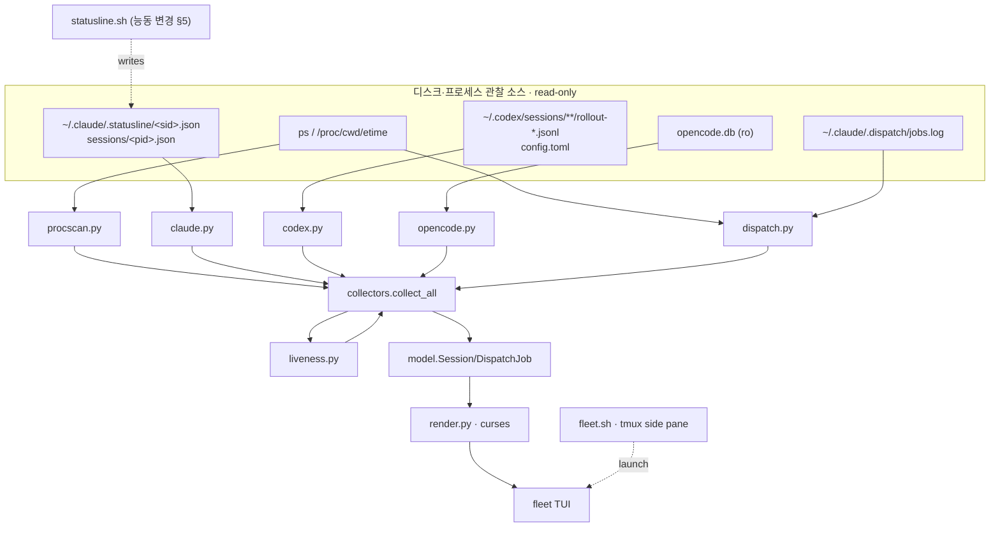

# agent-fleet-dashboard — Spec (PRD)

> mode: **cli** (터미널 TUI 도구) · 작성 2026-07-01 · **v2 2026-07-10** (drift 흡수 + stage-dispatch 관제 parity + UI 가독성 개선)
> 컴포넌트: `agent_setting` repo 의 **별도 내부 도구** — 기존 `spec/prd.md`(Unified Memory System)와 무관, 이 폴더(`spec/agent-fleet-dashboard/`)가 자체 청사진.
> 입력(1순위 근거): `research/agent-fleet-dashboard/00_prior_art.md`(build-vs-adopt·herdr·렌더스택) · `research/agent-fleet-dashboard/01_tap_mechanics.md`(하네스별 tap·discovery·liveness, file-cited)
> **v2 추가 입력**: `spec/stage-dispatch/prd.md`(SD-1~9 — 스테이지 단위 depth-2 headless 분사 계약, §9-13 fleet 표시 = Phase 2 잔여) · 현행 `tools/fleet/` 코드 전수 실측(2026-07-10 Explore, file:line-cited) · 사용자 관찰("워크플로우를 못 따라감 + UI 아쉬운 점 다수").
> 본 문서는 청사진(PRD). 구현은 autopilot-code (산출물 `plans/`). skeleton 은 lean 유지 위해 autopilot-code 로 이월(§9 module 구조만 확정).
> v1 원본 = `_internal/versions/v1/prd.md`. v1 이후 07-01~07-10 사이 커밋된 렌더 진화(§4 [v2 기준선] 참조)는 본 v2 가 소급 흡수 — 이 구간의 산출물 트레일은 `plans/2026-07-01_agent-fleet-dashboard/`·`plans/2026-07-01_fleet-render-v2/`·`plans/2026-07-03_fleet-cooling-groups/` + 직접 커밋(git log `tools/fleet`).

## 0. 한 줄

여러 하네스(Claude Code·Codex·opencode)의 **활성 세션 전부** + **프로젝트별 headless dispatch 잡**을, 어떤 하네스 TUI 에도 주입하지 않고 **외부에서 관찰**해 htop/nvtop 스타일 라이브 터미널 대시보드로 모아 보여준다. zero-dep python curses, tmux 세로 사이드 페인 배치.

## 0.5 설계 원칙 — 외부 관찰자 (zero-injection) ★ cross-cutting

**대시보드는 어떤 하네스의 TUI·hook·프로세스에도 아무것도 주입하지 않는다.** 이미 디스크에 존재하는 신호(프로세스 테이블·transcript·statusline JSON·SQLite row·jobs.log)만 읽어 렌더한다. 유일한 예외 = 우리가 _소유한_ Claude statusLine 을 세션별 파일도 쓰게 하는 것(§5) — 이건 우리 자산이라 주입이 아니다.

> **[v2 확장] "관찰" 의 범위**: 디스크·프로세스 외에 **하네스 계정 usage API 의 read-only 호출**(claude OAuth `/api/oauth/usage`, codex `wham/usage` — usage 헤더의 rate-limit 소스, `usage_api.py`·`codex.py` 실측)을 관찰로 인정한다. 쓰기·주입이 아니고 하네스 세션에 영향 0 — F-1 불변. opencode 는 usage API 부재 → 헤더에 "no usage api" 명시(결손 침묵 금지, F-3 동형).

- **왜**: codex·opencode 의 TUI/hook 은 우리가 못 건드림(그리고 건드리면 안 됨). 관찰자로만 두면 하네스 버전 업그레이드·재시작과 무관하게 동작하고, 대시보드 크래시가 세션에 영향 0.
- **적용**: 새 데이터가 필요하면 "이 하네스가 이미 어디에 남기나?"를 먼저 묻는다(§2 tap 매트릭스). 없으면 프로세스 스캔(universal 백본)으로 fallback. 새 emit 경로를 하네스에 심지 않는다.

## 1. 아키텍처 — 3계층, 2섹션

```
[발견 계층·universal 백본]  프로세스 스캔: comm ∈ {claude,codex,opencode} + /proc/<pid>/cwd + ps etime
        ↓  (모든 하네스의 모든 활성 세션을 무조건 열거 — 유일하게 100% 보장되는 tap)
[보강 계층·하네스별 passive enrichment]  세션당 상세를 디스크에서 read-only 로 부착
        · claude   → ~/.claude/.statusline/<session_id>.json (신규 per-session tap, §5) · fallback: ~/.claude/sessions/<pid>.json
        · codex    → 최신 rollout jsonl 의 마지막 token_count 이벤트 tail + config.toml (model/effort)
        · opencode → opencode.db `session` row (ro) — model/agent/tokens/cost
        · dispatch → statusline 잡스캔 로직(재사용) + .dispatch/jobs.log 병합
        ↓
[렌더 계층]  curses TUI — (A) fleet 그리드 + (B) dispatch 리스트, 1~2초 tick 라이브 갱신
```

- **백본이 세션 목록의 진실**: enrichment 가 실패/결손이어도 세션은 프로세스 스캔으로 항상 잡힌다. enrichment 는 "칸 채우기"일 뿐, 세션 존재 판정 아님.
- **pid ↔ session 매핑**: claude=`~/.claude/sessions/<pid>.json` 또는 statusline 파일의 session_id; codex=broker `--cwd`/leaf `/proc/cwd`; opencode=`/proc/cwd` == `session.directory`(argv 에 세션 id 없음).

## 2. Discovery & tap 매트릭스 (근거: 01_tap_mechanics.md)

| Need | Claude Code | Codex CLI | opencode |
|---|---|---|---|
| process comm | `claude` | `codex`(`app-server`/`exec`) | `opencode` |
| /proc/cwd + etime | ✅ | ✅ | ✅ |
| 세션 id | UUID | UUID | `ses_…`(+slug) |
| model / cwd | statusline JSON | rollout `session_meta.cwd` + config model | DB `session.model`/`directory` |
| token / context% | statusline `context_window.*` | rollout `token_count.info.*` | DB `tokens_*`(ctx% 유도) |
| **rate limit** | ✅ 5h/7d | ✅ primary/secondary | ❌ 없음 |
| **effort** | ✅ | ✅ config | ❌ 없음 |
| cost | ✅ | 토큰서 유도 | ✅ `session.cost` |
| liveness | transcript mtime + `sessions/<pid>.json` | rollout mtime | DB `MAX(time_updated)` |

**Takeaway**: 세션 _존재_ 는 프로세스 스캔으로 100% 균질. _상세_ 는 하네스별 비대칭 — opencode 는 rate-limit·effort 칸이 구조적으로 빈다(UI 가 결손 칸을 `—` 로 허용해야 함, §4). Codex telemetry 는 rollout jsonl 마지막 `token_count` 한 줄 tail 로 취득.

## 3. [cli] 명령·옵션·I/O

> **[minor edit · render v2 cycle, 2026-07-01]** 아래 옵션 표·키·런처 설명은 render v2 재구성 반영(cwd-group 레이아웃·스크롤·stale 토글). v1 원본은 `plans/2026-07-01_agent-fleet-dashboard/` 참조.

단일 진입 명령. 서브명령 없음(모니터 도구).

| 옵션 | 기본 | 의미 |
|---|---|---|
| `--interval <sec>` | `2` | 라이브 tick 주기(초). 백본 프로세스 스캔·enrichment 재수집 주기. |
| `--once` | off | 1회 스냅샷 렌더 후 종료(스크립트·디버그용, curses 미진입 시 plain 출력). |
| `--no-tmux` | off | tmux split 없이 현재 터미널에서 직접 실행(런처가 아니라 TUI 직접). |
| `--section <fleet\|dispatch\|both>` | `both` | **(v2 의미 변경)** 더 이상 화면 전체를 2섹션으로 쪼개지 않는다 — project(cwd) 그룹 _안에서_ 어떤 row-type 을 보여줄지 필터한다. `fleet`=그룹 안 세션 행만, `dispatch`=그룹 안 dispatch 행만, `both`=전체(기본). 필터 후 행이 0개가 된 그룹은 헤더째 생략(빈 그룹 미출력). |
| `--harness <list>` | all | 특정 하네스만(예: `claude,codex`). |
| `--json` | off | curses 대신 수집 결과를 JSON 으로 stdout(파이프·디버그·테스트). |
| `--all` | off | fleet 리스트에 stale/dead 세션도 표시. **기본은 숨김**(활성 working/idle 만; 헤더 카운트·`+N hidden` 요약은 유지). |

**(v2 신설) 라이브 조작 키**:

| 키 | 동작 |
|---|---|
| `↑`/`↓`, `j`/`k` | 1줄 스크롤 |
| `PgUp`/`PgDn` | 페이지 단위 스크롤 |
| `Home`/`g`, `End`/`G` | 맨 위 / 맨 아래로 이동(뷰포트는 항상 맨 아래까지 도달) |
| `a` | stale/dead 세션 + codex app-server companion 표시↔숨김 토글(`--all` 과 동일 효과, 라이브 재토글 가능) |
| `w` | **(v2 소급 흡수)** 레이아웃 cycle `auto → wide → narrow → stack` — auto 는 폭 컷오프(70/110열)가 결정, wide=1줄 grid·narrow=2줄 카드·stack=3줄 세로. 어느 모드든 harness 배지·slug·liveness 는 불락(정체성 anchor). footer 키 바에 현재 모드 표기(3-모드 전부 — §4.6 F-12). |
| 마우스 클릭(`+N hidden` 줄) | `a` 와 동일한 토글. `tmux set -g mouse on` 필요 |
| `q` | 종료 |
| `r` | 즉시 새로고침 |

- **마우스 트레이드오프(1줄 메모)**: 키보드 스크롤(`jk`/`PgUp,Dn`/`g,G`)이 기본(primary) 조작 경로다. tmux 마우스(`set -g mouse on`)를 켜면 `+N hidden` 클릭 토글이 되지만, 그 대가로 터미널 네이티브 클릭-선택·복사가 막힌다 — 그래서 마우스는 opt-in.
- **Input**: 없음(디스크·프로세스 관찰만). 환경변수 `AGENT_HOME`/`CLAUDE_HOME`(기본 `~/.claude`), `AGENT_DISPATCH_JOBS`(기본 `<AGENT_HOME>/.dispatch/jobs.log`) 존중.
- **Output**: curses full-screen(기본) / `--once`·`--json` 시 plain stdout.
- **Exit code**: `0` 정상 종료(q/Ctrl-C) · `1` 초기화 실패(터미널 아님·의존 누락) · `2` 인자 오류.
- **런처 (v2: normal-terminal 비율)**: 세로 사이드 페인 강제 배치는 폐기(retire). `fleet.sh` 기본 동작은 현재 터미널에서 `fleet.py` 를 **전체 크기(full-terminal)** 로 직접 실행. `--window` 옵션 시 tmux 안이면 새 tmux 창(역시 full-size)으로 열고, tmux 밖이면 direct 실행으로 degrade.

## 4. UI — project(cwd) 그룹 레이아웃 + 렌더 모델

> **[minor edit · render v2 cycle, 2026-07-01]** 아래는 v1 의 "(A) fleet 섹션 / (B) dispatch 섹션" 2섹션 분리 모델을 **project(cwd) 그룹** 모델로 대체한다. v1 원본 레이아웃은 `plans/2026-07-01_agent-fleet-dashboard/`(v1 빌드 사이클) 참조. §1 아키텍처 다이어그램의 "2섹션" 표기는 개념상 이 그룹 모델로 대체된 것으로 읽는다(다이어그램 자체는 미변경, §9-11 도 동일).

### [v2 기준선] 현행 화면 구성 (07-01~07-10 진화 소급 흡수 — 코드 실측)

v1 이후 커밋으로 진화한 현행 렌더 모델을 spec 기준선으로 승인한다 (render.py `_build_lines` 실측 순서):

1. **usage 헤더** — harness 별 1행 rate-limit 게이지: claude `5h/7d/<per-model>` (OAuth usage API + statusline tap), codex `5h/7d` (wham API + rollout fallback, expiry-aware), opencode = "no usage api" 명시행. 라벨은 dim(harness 로 오독 방지).
2. **fleet pulse 요약행** — `fleet <spinner> N working · M idle · [K detached] · ↳ J jobs (…)`. app-server companion 은 카운트 제외.
3. **alert strip** (조건부, healthy 면 0줄) — ctx ≥80% 세션 + stale/dead job, 최대 6개.
4. **프로젝트 그룹 카드** — 그룹 헤더(hot/cooling/cold 3단계 + `🚧 N` worktree 카운트 + tracked/untracked 게이트 배지) → 세션 행 → dispatch 트리. 그룹핑 키 = 부모 repo 역매핑(`-wt`/`_worktrees` 2-pass) + `drill:<case>` 특수 그룹 + `loops` 그룹.
5. **folded 집계 1행** — live 세션 0 + 잡 0 그룹은 접어 `inactive +N folded <names>`.
6. **legend + footer 키 바** — 글리프 범례, 키 힌트, 스크롤 `↑N/↓N` 인디케이터.

레이아웃 3모드(`w` cycle, §3) · main-session bold · stale/companion dim·숨김 · 수동 blink(tmux A_BLINK strip 대응) · 256색 body tint(hot=midnight-blue/cooling=brown/cold=grey, 실패 시 `▍` rail fallback) 포함 전부 기준선. 이 기준선 위에서 v2 의 신규 계약은 §4.5(stage-dispatch 관제)·§4.6(UI 가독성)이다.

### project(cwd) 그룹 — 부모 repo 당 그룹 1개
세션과 그 프로젝트의 dispatch 잡을 **같은 그룹**에 묶는다. 그룹핑 키 = 부모 repo:
- worktree cwd (`<repo>-wt/<slug>`, `<repo>_worktrees/<slug>`) → 부모 repo 이름으로 역매핑.
- loops 잡(cwd 없음, key ∈ {oncall,note,study,drill}) → `loops` 그룹.
- 그 외 → cwd basename(`.broken*` 접미사는 제거).

각 그룹은 **세션 행 먼저, 그 다음 dispatch 행** 순서로 구성된다. 그룹 정렬은 활동도(working 포함 그룹 우선) → 최근성 → 이름순.

> **[minor edit · cooling state, 2026-07-03]** 디렉토리(그룹) 헤더의 활동 상태를 **3단계**로 표시한다 — 코드 = `render.py` 그룹 헤더 (`_COOL_WINDOW_MIN`).
> - **활성(hot)**: 그룹 안에 `working` 세션/잡이 있음 → 이름 앞 녹색 `●`(blink) + green-bold 제목.
> - **대기(cooling)**: `working` 은 없지만 그룹 안 세션 transcript 의 최신 write 가 `_COOL_WINDOW_MIN`(기본 180분) 이내 → "방금 끝나 아직 온기" 중간 상태. 이름·인디케이터(채운 `●`)·`✓` 완료-경과 아이콘+경과시간(예 `✓ 1h32m`)을 **어두운 노랑**(dim yellow), body 틴트 = **살짝 어두운 갈색**(`_TINT_BODY_COOL`, 256-lvl 94 ≈ #875f00, `init_color` 가능 시 더 짙게). 온도 gradient = 활성 녹색 → cooling 노랑/갈색(잔열) → cold 회색. 세션은 idle 로 남아(48h live 창 안) 그룹이 접히지 않는다(R4). §7 의 dispatch-전용 `done` 을 _그룹 레벨_ 로 끌어올린 개념.
> - **비활성(cold)**: `working` 없음 + 최근 활동 없음(창 초과 또는 mtime 부재) → 이름 앞 **회색 고리 `○`**. shape-size gradient(채운 `●` 최근·활동적 > 고리 `○` 잠듦, design r2). dead(`✕` 적)·stale(`·`)와는 회색으로 구분.

### 세션 행 — harness 배지 + 1줄 패널
```
[Claude] <slug>  ✨<model> ·<effort>  🧠<ctx%>  5h<r>/7d<r>  ⏳<elapsed>  <liveness>
```
- **harness 배지(v2: 풀네임 로고, 단일 문자 C/X/O 폐기)**: `[Claude]`/`[Codex]`/`[opencode]` 텍스트를 하네스별 색상 + reverse-video 블록으로 표시. codex app-server companion 프로세스는 배지 옆에 `⚙app-server` 마커를 추가로 붙인다.
- **결손 칸 규칙(불변)**: 하네스가 안 주는 값(opencode 의 rate-limit·effort 등)은 `—` 로 표시(빈칸 아님 — "없음"을 명시).
- liveness: herdr 4-상태 어휘 재사용 — `idle`/`working`/`blocked`/`done`(+ `stale`/`dead`, §7). 색: working=녹, idle=dim, blocked=황, stale/dead=적.
- 정렬(그룹 내): working→idle→stale→dead→최근성.

### dispatch 행 — 부모 세션 밑 `└▸` 자식 트리
> **[minor edit · nested-tree cycle, 2026-07-01]** v2 의 그룹당 dim `dispatch:` 서브 라벨 모델을 **세션→잡 단일 트리**로 대체한다. 각 dispatch 잡을 _그것을 분사한 부모 세션_ 아래 `└▸🚀` 자식 행으로 종속시키고, 별도 `dispatch:` 서브 라벨은 폐기. (v2 서브 라벨 원본은 `plans/2026-07-01_fleet-render-v2/` 참조.)

statusline 잡스캔 로직 재사용(**top-3 cap 제거** + `.dispatch/jobs.log` 병합). 세션 행 직후 그 세션의 자식 잡을 `└▸` 로 들여쓴다:
```
[Claude] <slug> 🛰️  ✨<model> …  <liveness>          ← 자식을 분사한 부모 세션 (command-center 🛰️)
  └▸🚀<pipe-key>▸<stage>  (<mode>·<qa>)  ⏳<elapsed>  <liveness>  <slug>
```
- **부모 링크 = 프로세스 env** (실측, `/proc/<pid>/environ`): `CLAUDE_CODE_SESSION_ID` = 그 잡을 분사한 부모 세션 id → 화면의 `Session.session_id` 와 매칭해 그 밑에 nest. `CLAUDE_CODE_CHILD_SESSION=1` = 헤드리스 자식 표식(argv `-p` 추측 대체). environ read 는 동일 user 만(충족) — 실패 시 graceful(orphan fallback). codex/opencode 분사엔 이 env 가 없어 대부분 orphan.
- **아이콘(R5)**: 자식을 ≥1개 가진 부모 세션 앞에 command-center `🛰️`, 각 자식 잡 앞에 launch `🚀`. 자식 없는 일반 세션엔 붙이지 않음. double-width 정렬이 깨지면 render.py 의 `_ICON_PARENT`/`_ICON_CHILD` 한 곳에서 ASCII(`⌘`/`▸`)로 degrade.
- **orphan 규칙(R2)**: 부모 세션이 화면에 alive 인 동안만 nest. 부모가 죽거나(프로세스·화면 소멸) 화면 밖·env 없음이면 그 잡을 **프로젝트 레벨 orphan 으로 승격**(사라지지 않게) + `(orphan)` 마커. cron loops(oncall/note/study/drill) 는 애초에 부모 없음이 정상 → loops/프로젝트 레벨 flat(orphan 마커 없음). `--section dispatch`(세션 숨김) 에선 nest 앵커가 없어 전 잡이 flat 표시되며 이때 `(orphan)` 마커는 억제(의도적 off 이지 진짜 orphan 아님).
- **qa 실측 레이어드 fallback(R3)**: effective qa = argv `--qa` → jobs.log pipe 의 `qa=` 구조필드(신형 `capability=…,mode=…,qa=…` codex 형식) → 잡 산출물 `plans/*_<slug>/pipeline_state.yaml` 의 `qa_level` 실측 → CONVENTIONS §1.4 capability→default 맵 순. 명시값(argv)이 아닌 유도값(2~4)은 dim + `~` 접두(예 `~thorough`)로 구분 — argv 텍스트 오탐 방지 위해 `--qa` 파싱은 `[a-z]+` + valid-level 화이트리스트로 좁힘. mode·stage 도 동류로 잡 산출물(`live_stage`) 우선.
- stage = `live_stage()` 재사용(plan→exec→test→done).
- 소스 = (a) 프로세스 스캔의 Claude autopilot/loops 잡 + (b) jobs.log 의 running/open 행(codex/opencode dispatch 는 여기서만 보임 — §6). dispatch 의 stale/dead 는 `--all` 무관 **항상 노출**(정리 신호).

### stale/companion 표시 비대칭 (v2 신설 — 세션 ≠ dispatch)
- **세션**: stale/dead 상태 또는 codex app-server companion 은 그룹별로 **기본 숨김**, 그룹 하단에 `+N stale/companion hidden` 요약 행(클릭·`a` 토글 가능). 표시로 전환 시 telemetry(모델/ctx%/rl/effort/cost)는 **dim(어둡게)** 처리 — last-observed 값이며 라이브 값이 아님을 시각적으로 구분. codex app-server 는 표시 전환 시 ctx%/rl 이 대시(`—`)로 남는다(companion 오귀속 문제 — §7 참조).
- **dispatch**: stale/dead 잡은 `--all` 여부와 무관하게 **항상 표시**(숨김 폴드 없음) — 잡 실패·중단 신호를 놓치지 않기 위함.
- **그룹 접기(R4, nested-tree cycle 2026-07-01)**: live 세션(비-stale/dead)이 0인 프로젝트 그룹은 **기본 접기** + `━━ 📁 <name>  (+N folded)` 요약 행(같은 `a`/클릭 토글로 펼침) — 세션 stale-hide 를 그룹 레벨로 미러. **caveat**: 노출 필요한 dispatch(active/stale/orphan 잡)가 그룹에 있으면 접지 않는다(dispatch 를 절대 숨기지 않기 — 접기 조건 = live 세션 0 AND 그룹 잡 0). 접힌 요약 행도 `_TOGGLE_ROWS` 등록으로 클릭 토글.

### 렌더 모델 (zero-dep curses)
- 단일 `curses` 루프, `--interval` 마다 재수집→재그림. `KEY_RESIZE` 처리(폭/높이 재계산, 스크롤 위치는 재클램프만 하고 리셋하지 않음). flicker 는 이 규모에서 무시(전체 지우고 다시 그림, 또는 `erase()`+`noutrefresh()`).
- **뷰포트 스크롤(v2 핵심 수정)**: 전체 라인이 화면 높이를 넘으면 v1 은 `+N more (resize)` 로 잘려 맨 아래에 도달할 수 없었다(핵심 버그). v2 는 offset 기반 뷰포트 렌더러로 교체 — 스크롤(§3 키 표)로 **항상 맨 아래까지 도달**. 푸터에 `↑{above}`/`↓{below}` 인디케이터 + 키 힌트 표시.
- 키: `q`=종료, `r`=즉시 새로고침, 스크롤/`a`/마우스는 §3 참조.
- 폭이 아주 좁으면(<~70열) cost/rl → effort → model 순으로 필드를 줄인다(배지·slug·liveness 는 정체성·상태 앵커라 항상 유지). 2열 그리드 승격은 MVP 밖(변경 없음).

## 4.5 [v2 신설] stage-dispatch 관제 parity — 스테이지 row 계약 ★ 이번 사이클 핵심

> 근거: `spec/stage-dispatch/prd.md` SD-3(스테이지 세션 = jobs.log `depth=2,parent=<conductor>,worker_role=<sub-skill>,owner=autopilot-code` 등록 → fleet 스테이지 row)·§9-13(fleet 표시 라벨 = Phase 2 잔여). 운영 실증 ① "fleet 관제 불가시" 해소의 마지막 마일. 사용자 관찰("워크플로우를 못 따라감")과 일치.

- **SD-F1 (스테이지 row 사람 라벨)**: `worker_role=code-plan/code-execute/code-test/code-report`(+`:phase-A` 류 접미 허용) depth-2 row 는 raw role 문자열 대신 **스테이지 단계명**으로 렌더 — `plan`/`exec`/`test`/`report` (기존 `_PIPE_STAGES` breadcrumb 어휘와 동일 — 새 어휘 발명 금지). 접미는 뒤에 dim 으로 (`exec:phase-A`). 현행 14자 중간잘림(`diagnosis_gro…`)이 스테이지 워커에 적용되지 않게 한다.
- **SD-F2 (conductor 집계)**: depth-1 job 이 `owner=autopilot-code` 스테이지 자식(depth-2, worker_role=code-*)을 가지면 그 job 은 **conductor** — conductor row 의 stage breadcrumb(`code: plan › exec › test`) 하이라이트는 **활성(=live) 스테이지 자식과 일치**해야 한다(자식 실측 우선, `live_stage()` 산출물 유도는 fallback). 스테이지 자식이 done 이고 다음 스테이지가 미분사인 갭 구간은 conductor 의 산출물 유도값으로 표시.
- **SD-F3 (스테이지 자기 model/effort)**: dispatch wrapper 는 pipe 에 `model_role=/model=/effort=` 를 이미 실으므로(dispatch-headless.py 실측) 스테이지 row 는 **자기 모델·effort 를 1급 표시** — SD-5(스테이지별 model role 명시) 관제의 핵심. 현행 "parent effort 상속 표시"는 pipe 값 부재 시 fallback 으로 강등(dim + 상속 표기).
- **SD-F4 (pipe 파싱 tolerant)**: pipe key=value 구분자는 콤마가 canonical(OPERATIONS §5.10 하드 계약)이되, **wild 에 실존하는 공백 구분 행**(2026-07-09 실측 — 현행 파서는 첫 key 의 value 에 나머지 전체가 붙어 오파싱)을 **공백/콤마 혼용 tolerant** 로 수용한다. F-5(jobs.log tolerant) 원칙의 확장 — 미지 key 는 무시, 오파싱은 결손(`—`)보다 나쁘다.
- **비대상(경계)**: conductor·스테이지의 _제어_(재분사·kill)는 여전히 Non-goal(모니터 only). depth-3+ 는 wrapper 가 막으므로 fleet 은 depth ≤2 만 정식 렌더(3+ 는 방어적 들여쓰기만).

## 4.6 [v2 신설] UI 가독성 개선 — 정보 위계·스캔 가능성 (사용자 "아쉬운 점" 해소)

- **F-9 (dispatch 메타라벨 가독화)**: 현행 `(loop/drill-diagnosis·q/diagnosis_gro…/qa:~q)` 처럼 축약·중간잘림이 겹친 라벨을 재배분 — (a) role 은 SD-F1 단계명 매핑 우선, 매핑 밖 role 은 **중간잘림 대신 뒤에서 자름**(head 보존) (b) drill 케이스 하드코딩 축약 맵(`g6`/`g9` 등)은 **일반 규칙으로 대체**(`g\d+` 접두 추출 — 신규 케이스마다 코드 수정하는 구조 제거) (c) 라벨 성분 우선순위 명문화: 폭 부족 시 `qa → intensity → role` 순으로 드롭하되 mode 는 유지 (d) `~` 유도값 접두는 유지 + legend 에 1회 설명.
- **F-10 (alert 행 humanize)**: alert 의 job 이름도 dispatch 행과 같은 compact 이름 경로 재사용 — loop 잡의 `<case>-<ts>-<pid>` 꼬리(`…-20260710035842-294678`)는 strip. 같은 종류 alert 다수면 개수 집계(`⚠ 2 dead jobs: a·b`). 화면 폭 초과는 조용한 클립 대신 우선순위 절단(dead > stale > ctx).
- **F-11 (raw status 어휘 정리)**: registry-only 잡의 stage=`open`/`running` raw 노출과 loop 잡 `drill: running` 류를 사람 어휘로 — `open`=`queued`(미기동 대기), `running`=breadcrumb 미점등 트랙(기존 규칙 재사용). status 어휘 자체(jobs.log)는 불변 — 표시층만.
- **F-12 (footer·잡음 절제)**: (a) `+N malformed jobs.log rows skipped` 는 dim 강등 — 진단 상세는 `--json` 몫 (b) footer `w` 라벨이 stack 모드를 누락하는 표기 버그 수정(3-모드 전부) (c) legend 는 현재 화면에 실제 등장한 글리프만.
- **F-13 (dead/stale 행 결손 절제)**: dead/stale row 의 `— … — … —` 나열 대신 telemetry 셀은 생략하고 **마지막 관측 경과**(`last seen 2h`) 1값으로 대체 — "없음" 명시 원칙(F-3)은 live 행에만 적용, 죽은 행은 결손 나열이 정보가 아니다.
- **F-14 (세션 표시명 = 하네스 세션 제목, 사용자 요청 2026-07-10 — 후속 사이클)**: 세션 row 이름을 합성 slug(`<cwd>-<sid8>`)에서 **하네스가 이미 남긴 세션 제목**으로 승격 — "ChatGPT 세션명처럼" 내용 요약이 관제에 보이게.
  - **소스 (실측 2026-07-10)**: claude = transcript jsonl 의 마지막 `{"type":"ai-title","aiTitle":…}` 라인 (v2.1.176+ 대화 언어 auto-title; `/rename` 반영 자리. **내부 포맷 — 버전 간 변경 가능**이 공식 입장이므로 tolerant 파싱 + 부재 시 fallback 의무) / opencode = DB `session.title` (정식 컬럼, 실측 확인) / codex = 제목 소스 미상 → 현행 유지 (F-3 비대칭 동형, 구현 시 rollout 실측 후 판단).
  - **표시 규칙**: 제목 있으면 name zone 에 제목(뒤에서 자름 — F-9 head 보존), 합성 slug 는 대체(식별 필요 시 dim 보조). headless 자식 세션(`-p`)엔 ai-title 이 없음 → 현행 slug 유지. 제목 부재·파싱 실패 = 현행 합성명 fallback (회귀 없음 원칙).
  - **비용**: liveness 가 이미 transcript mtime 을 보고 있으므로 같은 파일 tail 역스캔(수 KB)으로 마지막 ai-title 추출 — tick 당 부담 미미, 필요 시 mtime 키 캐시.
  - 하네스 자체 기능과의 경계: Claude Code 는 `/rename`·시작 시 auto-name 만 있고 _진행형_ 자동 재요약·프로그램적 갱신은 미지원(공식 문서 확인) — 그래서 이 자리는 fleet 표시층이 맡는 게 맞다 (zero-injection 관찰, §0.5).
- **F-15 (분사 row 레이아웃 재설계 — 탈가로화 + 옵션 1급 유지, 사용자 피드백 2026-07-10 저녁)**: F-14 출하 후 사용자 최대 불만 = "분사 세션 명이 다양한 옵션과 함께 가로로 쭉 늘어짐". 단 **옵션(capability·mode·qa·intensity·model/effort)은 사용자가 관찰하는 중요한 요소 — 숨기지 말고 더 잘 설계하라**가 명시 요구.
  - **방향**: 1차 라인은 정체성(단계 라벨·stage breadcrumb·상태·경과)로 다이어트하고, 옵션 메타는 **가로 나열 태그 대신 정렬된 자리**로 이동 — wide 레이아웃 = 고정 컬럼 정렬(세션 row 의 model/ctx 컬럼과 같은 원리), narrow = 2줄 카드의 L2 dim 옵션 라인 (세션 2줄 카드 기존 패턴 미러). F-9(c)의 "폭 부족 시 성분 드롭" 접근은 이 재배치로 대체.
  - **workflow-first 정렬**: 관제의 1차 질문 = "어느 파이프가 어느 스테이지에 있고 어디가 막혔나". conductor row 의 파이프 진행(breadcrumb, SD-F2)이 1급이고, **done 스테이지 자식 row 는 기본 접어 breadcrumb 하이라이트로 흡수**(완료 잡 나열이 세로·가로 노이즈) — 활성(working/미기동)·실패(stale/dead/killed) 스테이지만 자식 row 로 남긴다.
  - **queued 오라벨 해소 (사용자 관찰: "queued 가 계속 뜨는데 작업 중인 건지?")**: 현행 `open`→queued 매핑은 registry-only row 전부에 적용돼, 실제 작업 중인데 proc 매칭이 안 된 row(proc-job 과 registry row 의 slug 불일치, cross-harness 등)도 queued 로 뜬다. 해소: registry-only row 에 **worktree transcript/rollout mtime 기반 liveness 유도**를 적용해 실작업 중이면 working 으로, queued 는 _진짜 미기동_(등록 후 transcript 무활동)만. proc-job ↔ registry row 의 slug 정합(dedup 키) 개선 포함.
  - 디자인팀 critic 을 plan 단계 텍스트 목업 비평에 필수 투입 (UI plan-review 계약) — 잡 다수일 때 세로 폭증·레이아웃별(wide/narrow/stack) 분기까지 비평 범위.
- **F-16 (세션 표시명: 최대한 짧게 + 영어, 사용자 요구 2026-07-10 저녁)**: F-14 의 title 표시가 문장형(한국어)으로 길다.
  - **짧게**: name zone 의 title 표시 예산을 타이트하게(≈20~24 display cols, tail-cut — F-9 head 보존). 전체 제목은 `--json`·(도입 시) info 표시에서.
  - **영어**: fleet 은 번역하지 않는다(zero-injection) — 1차 실현 = **F-17 sidecar 제목**(생성 단계에서 짧은 영어 강제, 아래). 보조 = 하네스 `language` 설정(v2.1.176, 미문서 — `en` 적용해둠, 실측 대기). 기존 한국어 ai-title 은 F-17 미적용 세션의 fallback 으로만 클립 표시.
- **F-17 (라이브 제목 refresher — fleet 소유 sidecar + no-tools 경량 LLM 워커, 사용자 승인 2026-07-10 "haiku 같은 거 써서 agent로 해도 되고… 알아서")**: 하네스는 진행형 재요약을 안 하고(F-14 경계), transcript 에 쓰는 건 위험(라이브 세션 원본·내부 포맷·주입 금지 원칙 위반)이므로 **fleet 이 소유한 sidecar 파일**로 해결한다 — F-4(statusline per-session tap)와 같은 "우리 자산 write" 예외 계열.
  - **sidecar**: `~/.claude/.fleet-titles/<sid>.json` — `{title, ts, source}`. fleet 세션 title 우선순위 = **sidecar(신선, <24h) → ai-title → slug**. 부재·stale·파싱 실패 = 무해 fallback (회귀 없음).
  - **워커 (D-14 no-tools 보안 패턴 재사용)**: `claude -p --model haiku` + 도구 전면 차단. 입력 = transcript tail delta(수 KB)를 DATA 로 프롬프트에 주입, 출력 = **한 줄 영어 제목(≤4단어)** 만. dispatch 스크립트가 출력 검증(길이 ≤40자·printable·개행 제거) 후 sidecar 에 write — LLM 출력은 데이터로만, 주입돼도 최악 = 표시 문자열 오염(검증이 cap).
  - **트리거**: `statusline.sh` debounce 확장 — 자기 세션의 sidecar 가 오래됐고(예: >10min) transcript 가 자랐으면 detached 워커 1회 spawn (우리 소유 surface — F-4 선례, 새 cron 불요). 재귀 가드: 워커는 `-p` 라 statusline 미실행 + env 플래그. 동시 1개 lock(세션당).
  - **하네스 비대칭(F-3 동형)**: claude 만 refresher 대상(statusline = claude 소유 surface). opencode = 네이티브 `session.title` 로 충분, codex = 제목 소스 없음 → slug 유지.
  - **비용**: haiku·no-tools·세션당 ≥10min 간격·tail 수 KB — 무시 가능. 워커 실패·미설치(`claude` 부재)·quota 소진 = sidecar 미갱신일 뿐 fleet 무영향 (결정론적 degrade).
  - **구현 순서**: F-15 사이클 수확 후 별도 사이클 (파일 겹침 최소화: statusline.sh·신규 스크립트·collectors/claude.py 우선순위 로직·tests).
- **적용 순서(정보 위계)**: 위 개선은 전부 표시층(render.py) — collector 계약·모델 스키마 불변(SD-F4 만 collector). 시각 결정이 substantial 해지면(레이아웃 구조 변경 급) autopilot-design 리드 — 이번 사이클은 표시 규칙 정제 범위로 한정.

## 5. 능동 변경 — Claude per-session statusline tap (유일한 write)

현재 `statusline.sh:10` 이 **모든 세션을 `~/.claude/.statusline-last.json` 한 파일에 덮어씀**(last-writer-wins) → 멀티세션 대시보드가 세션별 telemetry 를 못 얻음. 해결:

- statusLine 실행 시 stdin JSON 을 **세션별 파일**로도 dump: `~/.claude/.statusline/<session_id>.json`(디렉토리 신설). 기존 `.statusline-last.json` 단일 파일은 하위호환으로 유지.
- **stale 청소**: 대시보드 또는 statusline 이 오래된(예: mtime > 1일) 세션 파일 정리(디렉토리 폭증 방지). 또는 SessionEnd hook 이 해당 파일 삭제.
- 구현 위치 후보: (a) `statusline.sh` 에 `<session_id>.json` 추가 write 한 줄(가장 간단, 60s 주기라 최신성 충분), (b) SessionStart/UserPromptSubmit/Stop hook — 단 hook stdin 엔 telemetry 없음(§01_tap 1b), 그래서 **(a) statusline.sh 확장이 정답**. 결정: **(a)**.
- 하위호환·drift: statusline.sh 은 이 repo 소유 파일이라 변경이 곧 배포(심링크). 세션별 파일 추가는 기존 렌더 무영향.

## 6. 알려진 버그 동시 정리 (scope 포함)

`.dispatch/jobs.log` 실제 status 어휘 = `running`/`done`/`killed`/`cancelled`(`open` 0개)인데, `harness-status.sh:209`·`utilities/dispatch-liveness.sh:19` 는 `$2=="open"` 만 필터 → **현재 라이브 파일에 매칭 0**(Claude 수동 write 가 `open` 대신 `running` 을 씀).

- **대시보드 측**: live 판정에 `{open, running}` 둘 다 수용. malformed 행(field ≠ 6, `worktree`=`-`/`(main-tree)`) tolerant — skip 하되 카운트만.
- **동반 수정(권고, autopilot-code 가 판단)**: `harness-status.sh`·`dispatch-liveness.sh`·`dispatch-liveness.py`(codex/opencode) 의 `open` 필터를 `{open,running}` 으로 통일하거나, 쓰기 측(Claude 수동 append 규약)을 `open` 으로 통일. **canonical 은 `core/OPERATIONS.md:95`** — 어휘 단일화는 그 문서 갱신과 함께(대응 동기화). 대시보드 자체는 어느 쪽이든 tolerant 하게 읽어 회귀 안전.
- **[v2 추가] pipe 구분자 wild drift**: 2026-07-09 실측 — 콤마 canonical 인데 공백 구분 `key=value` 행이 레지스트리에 실존(현행 파서 오파싱). 표시층이 아니라 collector tolerance 로 흡수 = §4.5 SD-F4.

## 7. Liveness 모델 (재사용)

기존 3 스크립트 로직 재사용(15min stale 창):
- claude/codex = transcript(또는 rollout) mtime; opencode = DB `MAX(time_updated)`. `age ≤ 15min` → live, 초과 → `stale`, 없음 → `dead`.
- 추가 신호: pid `kill -0`(프로세스 생존), cwd symlink `(deleted)` 접미사 = orphan(worktree 지워짐), claude `sessions/<pid>.json.status`(idle/shell/busy).
- 4-상태(herdr) 매핑: `busy`/최근 write=working, `idle`=idle, (blocked 은 herdr 소켓 있을 때만 — 스코프 밖), stale/dead 는 별도.

## 8. herdr 계약 재사용 (채택 X)

`herdr`(github.com/ogulcancelik/herdr, Rust 멀티플렉서, ~9.1k★, AGPL 듀얼)은 **채택 안 함** — 터미널을 소유하는 멀티플렉서라 "zero-injection 관찰자" 목표와 상충하고 우리 dispatch(jobs.log)를 모름(00_prior_art.md).

- **재사용하는 것**: 4-상태 어휘(idle/working/blocked/done) — 세션 상태 표준으로. 이 repo 가 이미 가진 emitter(`hooks/herdr-agent-state.sh`)·liveness(`dispatch-liveness.*`).
- **옵션(스코프 밖, 후순위)**: `HERDR_ENV=1` 로 herdr 소켓이 떠 있으면 대시보드가 그 소켓의 push 상태를 _옵션 소스_ 로 구독(blocked 상태를 정확히 얻는 유일 경로). MVP 는 미포함.

## 9. Module 구조 (확정 — 코드 생성은 autopilot-code)

```
tools/fleet/
  fleet.py          # 진입 — 인자 파싱, curses 루프 or --once/--json
  collectors/
    __init__.py     # collect_all() → [Session...] (백본 프로세스 스캔 + 하네스별 enrich 디스패치)
    procscan.py     # comm ∈ {claude,codex,opencode} + /proc/cwd + etime  (universal 백본)
    claude.py       # ~/.claude/.statusline/<sid>.json + sessions/<pid>.json enrich
    codex.py        # rollout jsonl 최신 token_count tail + config.toml
    opencode.py     # opencode.db session row (sqlite3 ro)
    dispatch.py     # statusline 잡스캔 로직 포팅(uncapped) + jobs.log 병합
    liveness.py     # 15min stale + kill -0 + (deleted) orphan → 4-state
  render.py         # curses 레이아웃(fleet 그리드 + dispatch 리스트), 결손칸 —, 색
  model.py          # Session/DispatchJob dataclass (하네스 무관 정규화 스키마)
  fleet.sh          # tmux 세로 사이드 페인 런처 → fleet.py
```
- 의존성: python3 표준 라이브러리만(`curses`,`sqlite3`,`json`,`os`,`subprocess`,`re`,`time`). 외부 pip 0.
- 설치: `~/.claude/tools/fleet/` 심링크(statusline.sh 선례). 실행 = `bash ~/.claude/tools/fleet/fleet.sh` 또는 alias.

## 10. Component diagram



## 11. MVP 경계

**MVP(이번 사이클)**: (A) fleet 세로 스택 + (B) dispatch uncapped 리스트 + 1~2초 tick 라이브 갱신 + §5 per-session tap + §6 jobs.log tolerant 읽기. 하네스 3종 collector + liveness 4-state. `--once`/`--json`(테스트용).

**후순위 (스코프 밖 — 명시)**:
- 시계열 sparkline(context%·usage 히스토리 — nvtop 그래프).
- herdr 소켓 구독(blocked 정확화, §8).
- 색·정렬·필터 커스터마이즈, 2열 그리드 승격.
- §6 동반 스크립트 수정(대시보드 tolerant 읽기로 회귀 없음 — 별도 결정).

## Non-goals

- 하네스 TUI·hook·프로세스에 주입(§0.5) — 오직 관찰.
- 세션 제어(kill·attach·resume) — herdr/tmux 영역, 우리는 모니터.
- 원격·웹 대시보드 — 로컬 터미널 only.
- 새 telemetry 파이프 신설 — 하네스가 이미 남긴 것만 읽음.

## 확정 결정 (locked, v1)

- **F-1 (외부 관찰자)**: zero-injection. 유일 write = 우리 소유 statusline 의 per-session tap(§5). (§0.5)
- **F-2 (3계층·2섹션)**: 프로세스 스캔 백본(세션 존재 진실) + 하네스별 passive enrichment(칸 채우기) + curses 렌더. fleet + dispatch 2섹션. (§1)
- **F-3 (하네스 비대칭 허용)**: opencode rate-limit·effort 결손 칸 `—`. Codex telemetry = rollout `token_count` tail. (§2,§4)
- **F-4 (per-session Claude tap)**: statusline.sh 이 `~/.claude/.statusline/<sid>.json` 도 write(단일 파일 덮어쓰기 해소). 구현=statusline.sh 확장. (§5)
- **F-5 (dispatch uncapped + jobs.log tolerant)**: statusline 잡스캔 재사용·top-3 cap 제거, jobs.log `{open,running}` 수용·malformed tolerant. jobs.log 어휘 버그 동반 정리 권고. (§6)
- **F-6 (재사용)**: herdr 4-상태 어휘 + 기존 liveness(15min stale). herdr 자체는 채택 X. (§7,§8)
- **F-7 (zero-dep curses)**: python 표준 라이브러리만. tmux 세로 사이드 페인 런처. (§9)
- **F-8 (MVP 경계)**: sparkline·herdr 소켓·커스터마이즈는 후순위 스코프 밖. (§11)

## 확정 결정 (v2 추가, 2026-07-10)

- **SD-F1~F4 (stage-dispatch 관제 parity)**: 스테이지 row 단계명 라벨 / conductor 집계 breadcrumb = 자식 실측 우선 / 스테이지 자기 model·effort 1급 / pipe 공백·콤마 tolerant. (§4.5, stage-dispatch SD-3·§9-13)
- **F-9~F-13 (UI 가독성)**: 메타라벨 축약 재배분(+drill 하드코딩 맵 → 일반 규칙) / alert humanize / raw status 어휘 표시층 정리 / footer·legend 잡음 절제 / dead·stale 결손 절제(`last seen`). (§4.6)
- **F-1 확장**: 관찰 = 디스크·프로세스 + 하네스 usage API read-only. (§0.5)
- **v2 기준선 승인**: usage 헤더·pulse 요약·alert strip·그룹 카드(3단계 온도·🚧·게이트 배지)·folded 집계·`w` 레이아웃 cycle·main-bold·tint 체계 — 07-01~07-10 진화 전체. (§4 [v2 기준선])

## Next (구현 순서 — autopilot-code, 본 v2 입력 · v1 순서 1~7 은 완료)

`/autopilot-code --mode dev --intensity standard "fleet UI 개선 — PRD v2 §4.5·§4.6"` (worktree 브랜치, depth-1 conductor 분사 + 스테이지 depth-2 분사 — 이 파이프 자체가 SD-F1~F3 의 라이브 검증 fixture 가 된다). 권장 순서:
1. **SD-F4 pipe tolerant 파싱** (collectors/dispatch.py) — 공백/콤마 혼용 + 미지 key 무시. 기존 tests 에 wild 실측 행(2026-07-09 space-separated) fixture 추가.
2. **SD-F1~F3 스테이지 row 렌더** (render.py) — 단계명 라벨·conductor breadcrumb 자식 실측 연동·자기 model/effort 표시.
3. **F-9~F-13 가독성** (render.py) — 라벨 재배분·drill 일반 규칙·alert humanize·status 어휘·footer/legend·dead/stale 절제.
4. **검증** — 단위 tests(tests/) + `--once`/`--json` smoke + **스테이지 분사 라이브 관제 실측**(이 사이클의 depth-2 스테이지 세션이 fleet 에 단계명 row 로 뜨는지 — stage-dispatch pilot 성공 기준 ① 의 fleet 측 마감).

테스트: 기존 tests/ 회귀 + 신규 fixture(스테이지 row·space-separated pipe·alert humanize) + `--once` 렌더 smoke.
