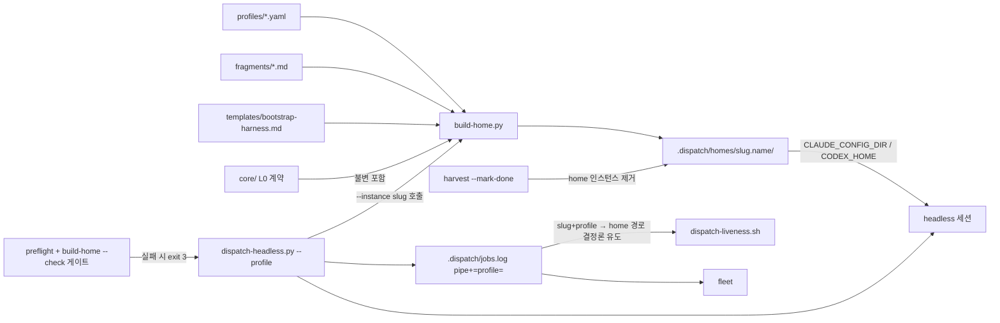

# Dispatch Profiles — PRD (v1 archive)

> mode: **cli** · component spec (repo 루트 spec = unified-memory-system, 무관) · 작성 2026-07-02 v1 (plan-review r1 반영 — B1·M1~M4·m1~m4)
> 입력: `research/cross-platform-agent-setting/00_overview.md`(+`cards/gsd-core.md`) · 세션 실측(CLAUDE_CONFIG_DIR) · repo 현황 조사(dispatch/roles/capabilities/projection)
> 본 문서는 청사진(PRD). 구현은 autopilot-code (산출물 `plans/`).
> **방향(사용자 확정 2026-07-02)**: 분사 케이스별 초기 컨텍스트를 "내용 수정 없는 마스킹(부분 투영)"으로 다이어트+특화. 특화 지침(role fragment)은 추가로 구성하되 main 세션은 오히려 그것들을 가린다. 이기종 하네스(codex·opencode)·모델(gpt·glm·deepseek)을 분사에서 자유 활용.

## 0. 한 줄

headless 분사마다 **마스킹된 config home(프로필)** 을 붙인다 — 단일 원본(repo)에서 심링크 부분 투영으로 생성하므로 내용 fork 없음. 프로필 = **harness × model × role fragment × 노출 subset** 선언. main 은 "오케스트레이터 프로필"일 뿐이라는 대칭 구조로, 특화 fragment 는 main 에서 가려진다(본문 마스킹, 존재는 한 줄 인덱스로 노출).

## 1. 배경 — 현행의 세 가지 갭

| 갭 | 현행 | 문제 |
|---|---|---|
| **동일 bootstrap 전 분사 로드** | 모든 `claude -p` 분사가 main 과 같은 `~/.claude` 전체(CLAUDE.md 라우팅·skill 카탈로그·도메인 트리거)를 로드 | 분사엔 불필요한 오케스트레이션 토큰 + 역할 특화 불가 |
| **Claude dispatch wrapper 부재** | codex/opencode 는 `dispatch-headless.py` 보유, Claude 는 수동 `claude -p` + 수기 jobs.log (OPERATIONS §5.10 prose 컨벤션) | 프로필을 주입할 프로그래밍 지점이 없음 · 등록 누락 인적 오류 |
| **모델·하네스 고정** | dispatch 에 `--model`/`--profile` 파라미터 없음 (§5.10 ⑥ — 모델은 adapter 매핑 소유) | 작업-모델 적합 선택·rate limit 분산·이기종(glm/deepseek) 활용 불가 |

선행 사례(research): gsd-core 의 capability.json 매니페스트 + 생성 레지스트리(`gen-capability-registry.cjs`), fresh-context subagents. 본 설계는 이를 repo 기존 idiom(심링크 projection + manifest `--check` 가드)으로 흡수한다.

## 2. 3층 지침 모델 (설계 핵심)

| 층 | 내용 | 노출 |
|---|---|---|
| **L0 core 계약** | `core/` (CORE·CONVENTIONS·OPERATIONS·WORKFLOW) · guard hooks(artifact-guard·git-state-guard 등) · git 규율 | **전원 불변 포함 — 마스킹 불가** |
| **L1 오케스트레이션** | 분사·수확·라우팅·관제 (§0 라우팅, §5.10, fleet 운영) — 현행 CLAUDE.md 본체 | **main 전용** (분사 프로필에서 마스킹) |
| **L2 role fragment** | 케이스별 특화 지침 (`profiles/fragments/<name>.md`) — 실험 도메인 규칙·스튜디오류 역할·문서 톤 계약 등 | **해당 프로필 전용** (main 에서 마스킹) |

규칙 2개:
- **가리는 건 본문이지 존재가 아니다** — main 은 `profiles/README.md` 의 "프로필명 + 한 줄 description" 인덱스로 라우팅 가능해야 함 (skill 카탈로그와 동일 계약).
- **마스킹 ≠ 접근 불가** — fragment 는 repo 파일이므로 진단 시 main 이 on-demand Read 가능. 자동 주입 범위만 프로필별로 다름.

## 3. 프로필 선언 — `profiles/<name>.yaml`

`profiles/` 는 top-level 디렉터리지만 roles/·capabilities/ 와 달리 **harness-scoped 선언**이다 — 각 프로필은 `harness:` 필드로 특정 하네스에 결속되며, 그 안에서만 concrete model 명이 허용된다 (portable 경계 규칙 "concrete model names belong in adapter documents" 의 **의도된 예외** — profiles/README.md 에 명시해 roles/README 와의 충돌 오해 차단). top-level 에 두는 이유는 카탈로그 단일성(main 인덱스 한 곳) 뿐.

```yaml
# profiles/lab-runner.yaml (예시)
name: lab-runner
description: "실험 실행 특화 — autopilot-lab 자율 구간 분사용"   # main 인덱스 한 줄
harness: claude            # claude | codex | opencode — 이 선언의 결속 하네스
model_role: fast implementer   # 1순위: portable role (core/ADAPTATION.md §3) — adapter 가 attach 시 concrete 매핑
# model: glm-4.6            # 2순위(대안): concrete 명 — 결속 하네스에서만 유효, model_role 과 배타
effort: medium             # 하네스가 지원할 때만 (codex model_reasoning_effort 등)
fragments:                 # L2 — 이 프로필에만 주입
  - profiles/fragments/lab-runner.md
expose:
  skills: [autopilot-lab, analyze-project, post-it]   # 노출 skill subset (미기재 = 마스킹)
  agents: [dev-team, qa-team, material-team]           # 노출 agent subset
  triggers: []               # 도메인 트리거 중 노출 행 (기본 전부 마스킹)
```

- **모델 표기 2단**: `model_role`(portable, 권장 — concrete 매핑은 adapter 소유) XOR `model`(concrete — 결속 하네스 한정, opencode provider 모델 glm/deepseek 류 포함). 둘 다 있으면 선언 오류.
- **L0(core+guards)는 선언 표면에 없다** — 생성기 불변식으로 항상 포함 (DP-2). 선언에 옵션으로 노출하지 않음 (장식 설정 금지).
- gsd-core 의 capability.json 대응물 — 단 코드 생성 레지스트리 대신 repo idiom 인 **`--check` 가드**로 정합 검증.

## 4. [cli] 명령·옵션

### 4.1 `tools/profile/build-home.py` — 프로필 home 생성기

| 옵션 | 의미 |
|---|---|
| `<name>` (positional) | 대상 프로필 (`profiles/<name>.yaml`) |
| `--instance <slug>` | per-dispatch home 인스턴스 생성 (§4.2 wrapper 가 호출) |
| `--check <name>` | 생성 없이 선언·템플릿 정합 검증 — 가드·CI 용 |
| `--home-root` | 기본 `$AGENT_HOME/.dispatch/homes/` override |

**bootstrap 조립 규칙 (B1 해소 — 층 경계는 마커가 아니라 소스 파일 분리)**: 생성기는 기존 CLAUDE.md/AGENTS.md 를 **파싱하지 않는다** (층 태깅 마커 없음·취약). 대신 분사 bootstrap 의 소스는 처음부터 층별 별도 파일:

| 소스 | 층 | 내용 |
|---|---|---|
| `profiles/templates/bootstrap-<harness>.md` | L0 참조부 | core 4문서 Read 지시 + 가드 준수 + artifact 컨벤션 포인터 + depth-1 규칙. 하네스별 1개 (claude/codex/opencode), L1 오케스트레이션 절은 처음부터 없음 |
| `profiles/fragments/<name>.md` | L2 | 프로필 선언의 `fragments:` 목록 순서로 append |

조립 = 템플릿 + fragments 의 **단순 concat** (변형 없음). 생성물 헤더에 `generated-from: profiles/<name>.yaml — do not edit`. `--check` 의 대조 기준 = 같은 입력의 재조립 결과 (결정론이므로 안정). main 의 CLAUDE.md 는 본 시스템이 손대지 않는다.

동작 (하네스별 attach 는 §6):
1. `profiles/<name>.yaml` 파싱 → 검증 (스키마·`model_role` XOR `model`·결속 하네스의 모델 허용 규칙).
2. `$AGENT_HOME/.dispatch/homes/<slug>.<name>/` (인스턴스, §4.2) 에 masked home 을 **심링크 farm** 으로 생성 — codex `install-runtime-projection.sh` 의 `link()` primitive 재사용 (runtime-owned 파일 clobber 거부). expose subset 만 링크, L0(core+guards) 하드 포함.
3. bootstrap 조립 (위 규칙).
4. credentials 심링크 공유, 세션 상태(projects/ 등)는 인스턴스 격리 (§6).

exit code: `0` 정상 / `1` 선언·템플릿 오류 / `2` `--check` drift. (하네스 preflight 게이트는 §4.2 wrapper 단독 소유 — exit 3 은 wrapper 의 것.)

### 4.2 `adapters/claude/bin/dispatch-headless.py` — Claude dispatch wrapper (신설)

codex 동명 wrapper 의 이식 (280줄 규모 실증 코드가 템플릿). 옵션 동형: `--dry-run|--register|--start` · `--worktree` · `--slug` · `--capability` · `--mode` · `--qa` · `--prompt-file|--prompt-text` · `--jobs` · **`--profile <name>` (신규)**.

- **home 수명주기 = per-dispatch ephemeral 인스턴스** (codex scratch-home idiom 승계 — M3 해소): `--start` 시 wrapper 가 `build-home.py <name> --instance <slug>` 를 호출해 `homes/<slug>.<name>/` 를 그 자리에서 생성. run 간 상태 누적·regen-vs-live 경합이 원천 소거되고, liveness 는 인스턴스 안 transcript 만 보면 되므로 오판 없음. harvest `--mark-done` 시 인스턴스 제거 (DEAD 진단용 `--keep-home` 옵션).
- **게이트 (wrapper 단독 소유)**: launch 전 ① 해당 하네스 `preflight doctor`/`check-runtime-projection` ② `build-home.py --check <name>` — 하나라도 실패 시 launch 거부 exit 3.
- `--profile` 시: `CLAUDE_CONFIG_DIR=$AGENT_HOME/.dispatch/homes/<slug>.<name>` 환경으로 `claude -p` 를 `start_new_session=True` 분사.
- `--profile` 생략 = 현행과 동일 (main home, 인스턴스 생성 없음) — **기존 흐름 무파괴**.
- jobs.log 등록: 기존 6필드 스키마 유지, `pipe` 필드에 `profile=<name>` k=v 추가 (`capability=,mode=,qa=,profile=`) — 순수 확장. 후방호환은 검증됨: liveness 는 pipe 를 통필드로만 읽고, harvest 는 join 으로 보존, fleet `_parse_pipe` 는 미지 k=v 를 자연 무시.
- **home 경로는 (slug, name) 결정론 유도** — jobs.log 의 slug + `profile=` 만으로 `homes/<slug>.<name>/` 계산 가능. 별도 인덱스 파일 없음 (M4 해소 — 동시성 표면 제거).
- codex `dispatch-headless.py` 에 동일 `--profile` 옵션 추가 (`CODEX_HOME=<instance>` attach). opencode 는 §6 — P1 후속.

## 5. 마스킹 규칙 — 불변 영역 vs 가변 영역

| 영역 | 마스킹 | 근거 |
|---|---|---|
| guard hooks (artifact-guard·git-state-guard·spec-gate·builtin-memory-guard) | **불가** (생성기가 강제 포함) | 결정론 가드는 프로필 무관 불변식 (§0.5) |
| `core/` 4문서 | **불가** | L0 계약 |
| memory inject/recall hooks | 기본 포함, 프로필별 opt-out 가능 | 분사 성격 따라 (실험 러너는 recall 불필요할 수 있음) |
| skill 카탈로그 | subset (expose.skills) | 역할 집중 + 토큰 다이어트 |
| agents | subset (expose.agents) | 〃 |
| L1 오케스트레이션 | **분사 bootstrap 에 처음부터 부재** (DP-10 — 템플릿에 미포함, 마스킹이 아니라 소스 분리) | 분사는 depth-1 — 재분사 금지라 오케스트레이션 지침 자체가 불필요 |
| 도메인 트리거 표 | subset (expose.triggers) | 〃 |
| L2 fragments | 해당 프로필만 | 특화의 본체. main 은 인덱스만 |

경계 강제 선례 재사용: opencode `preflight.sh` 의 cross-harness 누출 거부 가드 (`adapters/opencode/bin/preflight.sh:181-184`) — 프로필 home 에 타 하네스 표면이 새면 `--check` 실패.

## 6. 하네스별 home attach (검증된 사실 기반)

| 하네스 | 메커니즘 | 검증 상태 |
|---|---|---|
| **claude** | `CLAUDE_CONFIG_DIR=<home>` | **실측 통과 (2026-07-02)** — 마커 CLAUDE.md 로드 ✓ · `.credentials.json` 심링크 auth ✓ · 세션 상태(projects/·sessions/) home 격리 ✓. 공식 env-vars 문서엔 미기재 — **릴리즈마다 회귀 확인 필요 (drill 항목화)** |
| **codex** | `CODEX_HOME=<home>` | repo 기실증 — `codex exec` scratch-home 격리 (`adapters/codex/ADAPTATION.md:441`), INSTALL_LAYOUT bootstrap 테스트가 상시 사용 |
| **opencode** (P1 후속) | `XDG_CONFIG_HOME=<home 상위>` — **파일 투영 채널로 통일** (skill 노출 = `<home>/agent-skills` 디렉터리, preflight 가 인정하는 두 채널 중 파일 쪽; inline `OPENCODE_CONFIG_CONTENT` 미사용) | 미실증 — 현행 opencode `dispatch-headless.py` 는 home env 를 세팅하지 않아(단순 `opencode run --dir`) env 주입 신규 작업 필요. v1 범위 = claude+codex (attach 기실증 하네스), opencode 는 채널 결정만 여기 고정하고 P1 |

공통 규칙:
- **auth·credential 은 심링크 공유** (하네스-owned 파일 비복제·비수정 — codex installer 의 불가침 규칙 승계).
- **활성 게이트는 dispatch wrapper 단독 소유** (§4.2) — 해당 하네스 preflight + `build-home --check` 통과 없이 launch 불가. 가드 미비 하네스로의 분사가 불변식 구멍이 되는 것 차단.

## 7. 관제·liveness 연동 (기존 도구 무파괴 확장)

프로필 home 은 세션 상태를 home 안에 격리하므로(§6 실측), `~/.claude/projects/` 만 보는 기존 도구가 프로필 분사를 놓친다. home 해석은 인덱스 파일이 아니라 **jobs.log 만으로 결정론 유도** — `profile=` k=v + slug → `homes/<slug>.<name>/` (§4.2). **transcript 기반 확장은 claude 레이아웃 한정** (m4) — codex/opencode 는 transcript 구조가 다르므로 각자 기존 채널(`.dispatch/logs/` mtime 등) 유지:

| 도구 | 현행 | 확장 |
|---|---|---|
| `utilities/dispatch-liveness.sh` | `$AGENT_HOME/projects/<enc>/*.jsonl` mtime | `profile=` 있고 harness=claude 면 `homes/<slug>.<name>/projects/<enc>/` 탐색 (인스턴스 격리라 run 간 혼입 없음). `profile=` 부재 시 현행 경로 (후방호환) |
| `tools/fleet` collectors | `~/.claude`·`~/.codex` 고정 | `.dispatch/homes/*/` 를 추가 스캔 루트로 (glob — 인덱스 불요) — dispatch 행 `(mode·qa)` 태그에 `·profile` 표기 |
| `dispatch-harvest` (codex/opencode) | jobs.log rewrite | `profile=` k=v 통과 보존 (join 보존 검증됨 — 무변경) + `--mark-done` 시 home 인스턴스 제거 훅 |

## 8. 하이브리드 라우팅 (운영 방향 기록 — **v1 구현 범위 외**, 별도 사이클)

프로필 인프라와 직교하는 운영 결정 (m2 — v1 blast radius 에서 분리, 방향만 여기 기록). **컨펌 구간은 main, 자율 본체는 분사**:

| entry skill | 컨펌 밀도 | 라우팅 |
|---|---|---|
| autopilot-code | plan 컨펌 후 자율 | 분사 (현행 유지) |
| autopilot-lab | 낮음 | 분사 + `lab-runner` 류 프로필 |
| autopilot-research | Step 0 clarify 만 | **하이브리드** — clarify main → 본체 분사 |
| autopilot-draft | `--user-refine` 없으면 자율 | 조건부 분사 |
| autopilot-spec | 컨펌 6–8자리가 본질 | main 유지 |
| analyze-project / audit | 짧음 | main (대형 repo 만 분사 고려) |

반영 위치: `core/WORKFLOW.md`(라우팅 표) + `core/OPERATIONS.md` §5.10(프로필 규칙 ⑦ 신설) + `profiles/README.md`(main 인덱스). CLAUDE.md 는 비확장 운영 정책상 §0(C) 한 줄 포인터만.

## 9. Module 구조

```
profiles/                       # 신설 top-level (harness-scoped 선언 — §3 예외 명시)
  README.md                     # 카탈로그 (main 인덱스 — name + 한 줄, sync-skills 자동 갱신 후보)
  <name>.yaml                   # 프로필 선언
  fragments/<name>.md           # L2 특화 지침
  templates/bootstrap-<harness>.md   # L0 참조부 템플릿 (하네스별 1개 — 조립 소스)
tools/profile/
  build-home.py                 # 생성기 + --check 가드
adapters/claude/bin/
  dispatch-headless.py          # 신설 (codex 이식 + --profile)
adapters/codex/bin/
  dispatch-headless.py          # --profile 옵션 추가 (opencode 는 P1)
$AGENT_HOME/.dispatch/homes/    # 생성물 (transient, gitignore, 인덱스 파일 없음)
  <slug>.<name>/                # per-dispatch ephemeral masked home (harvest 시 제거)
```

## 10. Component Diagram



## 11. 결정 목록

- **DP-1**: 마스킹 = 심링크 부분 투영 (내용 fork 금지). bootstrap 조립 생성물만 예외적 생성 파일 — `generated-from` 헤더 + `--check` 재조립 대조.
- **DP-2**: L0(core+guards) 마스킹 불가 — 생성기 하드 강제, 선언 표면에 옵션으로 노출하지 않음.
- **DP-3**: 프로필 선언 위치 = top-level `profiles/`, 단 **harness-scoped 선언** (portable 경계의 의도된 예외 — §3. concrete model 은 결속 하네스 한정, portable `model_role` 우선).
- **DP-4**: home = **per-dispatch ephemeral 인스턴스** `homes/<slug>.<name>/` (codex scratch-home idiom 승계) — 상태 누적·regen 경합 원천 소거. harvest 시 제거 (`--keep-home` 진단 예외).
- **DP-5**: jobs.log 스키마는 6필드 유지, `pipe` 에 `profile=` k=v 순수 확장 — 3개 reader (liveness/harvest/fleet) 후방호환 검증됨.
- **DP-6**: Claude dispatch wrapper 신설 = codex 이식 (§5.10 수기 컨벤션의 코드화 — 결정론 우선 §0.5).
- **DP-7**: `--profile` 생략 시 현행 동작 완전 보존 (무파괴 도입).
- **DP-8**: 활성 게이트 = dispatch wrapper 단독 소유 (preflight + `build-home --check`, 실패 exit 3).
- **DP-9**: CLAUDE_CONFIG_DIR 는 문서 미기재 실측 동작 (2026-07-02 검증) — drill/oncall 회귀 항목으로 등재 (릴리즈 파손 조기 감지).
- **DP-10**: 층 경계 = **소스 파일 분리** (`templates/bootstrap-<harness>.md` + `fragments/`) — 기존 CLAUDE.md/AGENTS.md 파싱·마커 태깅 금지 (결정론 §0.5).
- **DP-11**: home 인덱스 파일 없음 — 경로는 jobs.log 의 (slug, profile) 에서 결정론 유도 (동시성 표면 제거).
- **DP-12**: v1 하네스 범위 = claude + codex (attach 기실증). opencode 는 P1 — 채널만 고정 (XDG 파일 투영, inline JSON 미사용).

## 12. 의미↔규칙 경계 체크 (DESIGN_PRINCIPLES §0.7)

- 의미 판단 구간: **"어느 프로필로 분사할까"** (main 라우팅) — LLM 판단으로 남김 (WORKFLOW 표는 보조 지도, 강제 규칙 아님).
- 규칙 구간: 마스킹 생성·불변 포함·게이트·인덱스 — 전부 코드 (§0.5 결정론 우선).
- 충돌: 없음 — 의미 판단을 규칙으로 떠넘기는 자리 없음.
