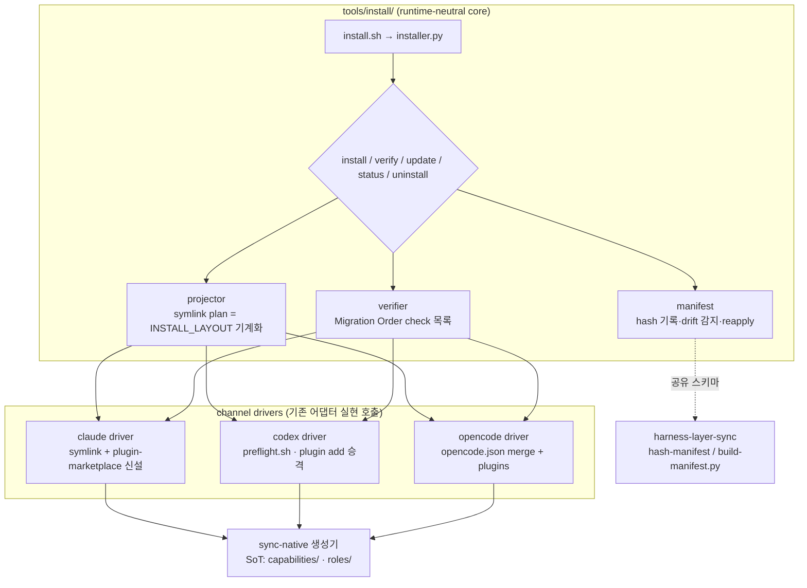

# harness-installer — Spec (PRD)

> mode: **cli** (하네스 배포 표면 — 2-채널 하이브리드 installer) · 작성 2026-07-12 · v1 · **v2 (2026-07-13)**: 구현 사이클 1·2 반영 — INST-OPEN-1 확정(plugin hook 목록), INST-OPEN-3 완료(INSTALL_LAYOUT 축소), verify 채널-인지 계약 추가. 구 버전 = `_internal/versions/v1/prd.md`
> 컴포넌트: `agent_setting` repo 의 **배포·설치 표면** — 하네스를 Claude Code·Codex·OpenCode 세 런타임에서 "바로 플러그인 형태로" 설치·검증·갱신하게 한다. `spec/harness-layer-sync/`(내부 canonical 바인딩)와 **형제·interlock** 관계의 독립 청사진 — 이 폴더(`spec/harness-installer/`)가 자체 SoT.
> 입력(1순위 근거):
> - research `.agent_reports/research/cross-platform-agent-frameworks/` — `05_deployment.md`(3단 배포 골격·cost model), `06_implementation.md`(채택 후보 1 = GSD hash-manifest), `cards/{gsd,claude-code-official-plugins,multi-harness-projection,claude-flow}.md`
> - 현행 실측(2026-07-12): `INSTALL_LAYOUT.md`(수동 symlink 레시피 + Migration Order 수동 검증 절차), `adapters/codex/plugin-marketplace/`(Codex plugin 채널 기존재), `adapters/claude/bin/install-windows.sh`(Windows 일회성 installer 선례), `tools/fleet/`(runtime-neutral zero-dep CLI 선례), `tools/build-manifest.py`(`--check` drift 생성기)
> - interlock spec: `.agent_reports/spec/harness-layer-sync/prd.md` v2 — §3(canonical 바인딩)·§3.2(GSD 실코드 정독 게이트)·§3.3(생성기 재사용)
> - **runtime-currentness 검증(2026-07-12, 본 spec 작성 중 공식 문서 재확인)**: Claude Code `code.claude.com/docs/en/{plugins,plugins-reference,plugin-marketplaces}` · Codex `developers.openai.com/codex/{plugins,build-plugins,hooks}` + `openai/codex` 소스(`codex-rs/plugin/src/manifest.rs`·`cli/src/main.rs`) · OpenCode `opencode.ai/docs/{config,plugins,skills}` — 주요 사실은 본문 해당 절에 인용, research 카드(7/9)와의 차이는 ⚠️drift 로 명시
> 본 문서는 청사진(PRD). 구현은 autopilot-code (산출물 `plans/`). 사용자 확정(2026-07-12): 새 spec 독립 생성(HLS v3 확장 아님) + **2-채널 하이브리드** 구조.

## 0. 한 줄

**하네스를 한 명령으로 설치·검증·갱신한다.** 소비·새 머신은 각 런타임의 native **plugin 채널**(Claude Code marketplace 신설 · Codex `agent-harness-codex` 승격 · OpenCode config+plugin)로, dev 머신은 **bootstrap installer CLI** 가 symlink projection 을 자동화하고, plugin 이 못 담는 runtime-owned 표면(settings 복사·memory DB 복원·PATH launcher·env 주입·검증)을 처리한다. installer 가 쓴 파일은 **hash-manifest** 로 추적해 사용자 로컬 수정을 감지·보존(`--reapply`)한다. `INSTALL_LAYOUT.md` 의 수동 레시피·수동 검증 절차가 이 CLI 의 `install`/`verify` 로 대체된다.

## 0.5 설계 원칙 ★ cross-cutting

1. **2-채널 하이브리드 (사용자 확정)** — plugin 채널(consume: 새 머신·제3자)과 installer CLI(dev: 본인 머신·repo 개발 흐름)는 **대체가 아니라 병존**. 근거: Claude Code plugin 은 설치 시 `~/.claude/plugins/cache` 로 **복사**되는 모델이라(`cards/claude-code-official-plugins.md` §2) "repo 수정 즉시 반영" dev 흐름과 구조적으로 상충 — GSD 도 같은 이유로 npm installer + Claude plugin 2경로 병존(`cards/gsd.md` §2).
2. **결정론 우선 (DESIGN_PRINCIPLES §0.5)** — 설치·검증·drift 감지·config merge 는 전부 코드. 에이전트 판단 개입 0. `verify` 는 exit code 로 말한다.
3. **파일-복제 회피 (claude-flow #1834 반면교사)** — plugin 채널에 들어가는 내용물도 **생성된 projection**(`codex_setting/codex-skills` 동형)에서 나온다. 손복사·중복 SoT 금지. plugin 내용물의 SoT 는 언제나 `capabilities/`·`roles/`·core 이고, sync-native-* 생성기가 유일 경로.
4. **소유 경계 (GSD 모델)** — installer 는 **자신이 설치한 파일(manifest 등재분)만** 관리한다. 사용자 영역(runtime credentials·sessions·`projects/`·기존 사용자 config)은 불가침. 지우기 전 백업, 덮기 전 감지.
5. **idempotent** — 같은 명령 재실행이 안전 (`install-windows.sh` 선례 계승). 부분 실패 후 재실행이 복구 경로.

## 1. 배경 — 문제와 근거

- **현행 = 수동 레시피**: `INSTALL_LAYOUT.md` 는 런타임별 `ln -sfn` 나열(Claude ~17줄·Codex ~30줄·OpenCode ~25줄) + Migration Order 검증 ~260줄을 **사람이 셸에 붙여넣는** 구조. 신규 머신 셋업·타인 온보딩·Windows 가 각각 다른 절차로 흩어져 있다(`install-windows.sh` 는 Windows 만 자동화한 부분해).
- **Codex 채널 절반 존재**: `adapters/codex/plugin-marketplace/` + `codex plugin add agent-harness-codex@agent-harness` 가 이미 동작(Migration Order 검증 항목으로 실측). Claude Code·OpenCode 에는 대응물이 없다 — 비대칭.
- **research 결론**: 모든 조사 대상이 "SoT repo → distribution channel → target" 3단 골격(`05_deployment.md` §1). 채택 권고 = **GSD-style hash-manifest + reapply**(후보 1, 유일한 양방향 divergence 실구현) + 보조(parity-loss warning·byte-budget). 파일-복제식 스캐폴딩은 명시 회피.
- **HLS 와의 경계 (interlock)**: HLS = repo **내부** canonical↔adapter 바인딩(공유층 물리 이중화 해소). installer = repo→**runtime home** 배포. hash-manifest 메커니즘·생성기(`tools/build-manifest.py` 증분)·GSD 실코드 정독 게이트(HLS §3.2)는 **공유** — 한 번 정독이 양쪽 구현의 입력이고, manifest 스키마는 두 spec 이 같은 것을 쓴다(중복 구현 금지). HLS 구현이 canonical 구조를 바꾸면 installer 의 projection 소스 경로가 따라간다 — installer 는 경로를 하드코드하지 않고 HLS 예외 목록·manifest 를 읽는다.

## 공통

- **Module 구조**: `tools/install/` (runtime-neutral core — `fleet` 과 같은 자리 컨벤션) + 런타임별 channel driver 는 core 안 모듈로 두되 adapter-specific 실현(기존 `adapters/*/bin/sync-native-*.py`·`preflight.sh`)을 **호출**한다(재구현 금지).
- **의존성**: python3 stdlib + git + (검증 단계 한정, 있으면 사용) 각 런타임 CLI (`claude`/`codex`/`opencode`). zero-pip (fleet 선례).
- **언어·런타임**: python3 ≥ 3.10 + thin sh launcher (`tools/install/install.sh`). Linux/macOS/WSL/Git Bash(Windows) — `install-windows.sh` 의 두 수리(HOME env 주입·symlink→copy 대체)를 Windows 분기로 **흡수**한다.
- **License**: repo 와 동일.

## [cli]

### 명령 (서브명령 트리)

| 명령 | 무엇 | 채널 |
|---|---|---|
| `install [claude\|codex\|opencode\|all]` | dev 머신 기본 경로 — symlink projection(INSTALL_LAYOUT 레시피 기계화) + runtime-owned 표면 처리(아래 표) + manifest 기록. `--plugin` 시 plugin 채널 경로(각 런타임 CLI 의 marketplace add/plugin add 를 wrapping·안내) | 양쪽 |
| `verify [runtime]` | Migration Order 수동 검증 ~260줄의 기계화 — projection 링크·생성기 `--check`·preflight 계약·bootstrap 로드 스모크를 check 목록으로 실행, 결과 pass/fail 표. **채널-인지**: plugin 채널 미채택 머신(dev projection 활성 + marketplace 미등록)에서 plugin check 는 명시 SKIP(ok) — parity-loss 원칙(silent drop 금지)과 동형. marketplace 등록됐는데 plugin 미설치·생성물 drift 는 실패 유지 | 공통 |
| `update [--reapply]` | repo pull 후 재-projection + plugin 채널이면 런타임 update 명령 wrapping. `--reapply` = local-patches 를 새 파일에 재적용 | 양쪽 |
| `status` | 설치 상태 요약 — 런타임별 채널·버전(commit)·drift(수정 감지) 유무 | 공통 |
| `uninstall [runtime]` | manifest 등재분만 제거(소유 경계) + 백업 안내 | 공통 |

- **공통 옵션**: `--runtime <r>`(반복 가능) · `--scope global|project` · `--dry-run`(실행 없이 계획 출력) · `--json`(기계 출력) · `--yes`(비대화)
- **채널 자동 판정**: cwd 또는 `AGENT_HOME` 에 git repo 가 있으면 dev 경로 기본, 없으면 plugin 채널 안내. `--plugin` 으로 명시 override.

### Input/Output 형식

- 사람: 단계별 진행 라인 + 최종 요약 표. `verify` 는 check 별 `✓/✗ <check-id> <한 줄>`.
- 기계(`--json`): `{runtime, channel, checks: [{id, ok, detail}], drift: [...], exit}` — fleet `--json` 스타일.

### Exit code

| code | 의미 |
|---|---|
| 0 | 성공 (verify: 전 check 통과) |
| 1 | 실행 실패 (I/O·전제 미충족) |
| 2 | verify 실패 — 1개 이상 check ✗ |
| 3 | BLOCKED — 대상 런타임 프로세스 활성 등 안전 정지 (INSTALL_LAYOUT Migration Order 2 계승) |
| 4 | drift 감지 — 사용자 수정 발견, `--reapply` 또는 백업 확인 필요 |
| 64 | usage 오류 |

### 표면 × 채널 결정 매트릭스

| 표면 | dev (installer symlink) | plugin 채널 | 비고 |
|---|---|---|---|
| capabilities(skills)·commands | ✓ symlink | ✓ (생성 projection 탑재) | SoT = `capabilities/`, 생성기 경유 |
| roles(agents)·modes | ✓ symlink | ✓ | 〃 (`roles/`) |
| hooks | ✓ symlink (settings.json 이 참조) | ✓ Claude·Codex `hooks/hooks.json` (currentness 확인 — Claude ~30 이벤트, Codex 는 `type:"command"` 만 실행) / OpenCode 는 JS plugin | 탑재 **범위**는 INST-OPEN-1 (소비자에 의미 있는 가드만, self-contained·fail-open) |
| MCP·bin(PATH) | ✓ | ✓ (`.mcp.json`·`bin/`) | fleet launcher 는 bin/ 후보 |
| settings.json·keybindings (runtime-owned 복사) | ✓ copy-once + manifest | ✗ (plugin 은 `agent`·`subagentStatusLine` 키만) | CLI 몫 |
| statusline·env 주입·PATH launcher | ✓ | ✗ | CLI 몫 |
| memory DB 복원 (`mem import`) | ✓ | ✗ | CLI 몫 (dump.jsonl → memory.db) |
| 검증 (Migration Order) | ✓ `verify` | ✓ 동일 `verify` 사용 | 공통 |

### plugin 채널 — 런타임별 스펙 (2026-07-12 currentness 검증 반영)

- **Claude Code (신설)**: `adapters/claude/plugin-marketplace/`(Codex 동형 대칭) 에 `.claude-plugin/marketplace.json` + plugin `agent-harness-claude`. source 는 relative-path(로컬)·github(원격) 2형. 내용물은 sync-native 생성기 산출(원칙 3).
  - **탑재 가능(공식 확인)**: skills·agents·`hooks/hooks.json`(~30 이벤트)·`.mcp.json`·`bin/`(Bash PATH). **불가**: settings.json 일반 키(`agent`·`subagentStatusLine` 만)·env·permissions·statusline·plugin 내 CLAUDE.md(컨텍스트 미로드).
  - **설치본은 self-contained**: cache 는 plugin root 밖 참조(`../`) 차단 + 버전-ephemeral(`~/.claude/plugins/cache`) — plugin 디렉토리에 생성물을 **빌드 시점에 물리 포함**해야 한다. 이는 claude-flow 식 손복제가 아니라 생성기 산출물이며(원칙 3), `build-manifest --check` 계열 가드로 SoT 와 바인딩. 영속 상태는 `${CLAUDE_PLUGIN_DATA}`(`~/.claude/plugins/data/<id>/`, 업데이트 생존).
  - **postinstall 부재** — 공식 대체 = `Setup`/`SessionStart` hook 이 `${CLAUDE_PLUGIN_DATA}` 에 초기화. runtime-owned 표면이 필요한 소비자는 plugin 이 CLI(`verify`/`install`) 실행을 안내.
  - version 정책 = git SHA 추종(`version` 생략) 기본 + 릴리스 채널 필요 시 marketplace 2개(`ref` 분리) 패턴.
  - CLI wrapping: 비대화 `claude plugin marketplace add` + `claude plugin install` 확인됨 — installer 의 `--plugin` 경로가 사용.
- **Codex (승격)**: 기존 `adapters/codex/plugin-marketplace/`(`.agents/plugins/marketplace.json` — 현행 공식 위치와 일치 확인) 재사용 — installer 는 `codex plugin marketplace add` + `codex plugin add <name>@<marketplace>` 를 wrapping 하고 verify 항목을 잇는다.
  - ⚠️ **plugin 이 못 싣는 것(공식 확인)**: custom agents(`.codex/agents/*.toml`)·prompts·config.toml fragment·AGENTS.md — plugin 은 skills·`.mcp.json`·`hooks/hooks.json`(`type:"command"` 만 실행)·`.app.json` 4종만. **따라서 Codex 는 plugin 채널만으로 완결 불가** — agents .toml 은 installer 의 symlink projection 이 계속 담당(현행 INSTALL_LAYOUT 배선 유지).
- **OpenCode**: marketplace·번들 포맷 **부재 확인** — plugin 채널 없음, installer 가 유일 경로. `opencode.json` 에 `instructions[]`·`plugin[]` 을 **non-destructive merge**(rulesync 선례: 기존 사용자 config 보존, 충돌 시 보고·중단 — 의미 판단 아닌 규칙) + convention 디렉토리 projection.
  - ⚠️ **drift(currentness 검증)**: 현행 공식 문서는 **복수형** 디렉토리(`.opencode/skills|commands|agents|plugins/`, global `~/.config/opencode/…`)이고 **`skills.paths` config key 는 문서에 없다**(skill 노출은 `permission.skill` 규칙 + convention 디렉토리) — 기존 `INSTALL_LAYOUT.md`·`opencode_setting` 배선(단수형 `agent/`·`command/`, `skills.paths`)은 legacy 일 가능성. **구현 Step 0 에서 로컬 opencode 버전 대상 실측 후 migration 포함**(구식 배선 침묵 유지 금지).

### hash-manifest + reapply (fork-drift 대응)

- **대상**: installer 가 runtime home 에 **복사**한 파일만 (settings.json·keybindings·Windows copy 분기). symlink 는 자체가 canonical 이라 제외, plugin cache 는 런타임 소유라 제외.
- **동작**: install 시 hash 기록 → `verify`/`update` 시 불일치 = 사용자 수정 감지 → `local-patches/` 백업 → `update --reapply` 가 새 파일 위에 재적용, 3-way 충돌은 명시 report(자동 머지 강행 금지).
- **구현 선행 게이트 (HLS §3.2 공유)**: GSD `bin/install.js` 실코드 line 단위 정독 후 manifest 스키마 확정. research 카드 서술 그대로 이식 금지.

### parity-loss warning (보조 채택)

런타임이 못 싣는 표면(예: OpenCode 에 없는 hook 이벤트)은 **silent drop 금지** — install/verify 출력에 `SKIP(<runtime>): <surface> — <사유>` 명시(ruler 반면교사, `cards/multi-harness-projection.md` §2).

## Architecture Diagrams

### Component diagram (mermaid)

## 의미↔규칙 경계 체크 (DESIGN_PRINCIPLES §0.7)

- 의미 판단 구간 스캔: installer 동작은 전부 결정론(파일 ops·hash 비교·config merge·check 실행). **충돌 0**.
- 유일 경계 후보 = OpenCode config merge 의 "충돌" 판정 — **규칙으로 처리**(같은 key 에 다른 값 = 충돌 → 보고·중단, 자동 해석 시도 없음). LLM fallback 불요.

## 열린 결정 (OPEN) — v2 현황

- ~~INST-OPEN-1~~ **확정(구현 사이클 2, 2026-07-13)**: plugin 탑재 hook 목록 — **채택 2**: `git-state-guard.sh`·`artifact-guard.sh`(self-contained·fail-open 충족) / ~~이월 3~~ **채택 완결(사이클 3, 2026-07-13)**: spec 파이프 3종(`spec-skill-gate`·`spec-read-marker`·`spec-sync-nudge`) — 생성기 `hooks.json` 의 `AGENT_HOME="${CLAUDE_PLUGIN_DATA}"` env-prefix 로 재기준, canonical 무수정 / **제외**: memory(mem-*)·statusline·dispatch·core-first 계열(CLI 설치 전제 상태 의존). 근거 = `plans/2026-07-13_harness-installer-impl2/final_report.md`.
- ~~INST-OPEN-2~~ **확정(사용자, 2026-07-12)**: CLI 진입 명령 = **`harness`** (fleet 동형 한 단어 + 서브명령, `tools/install/harness.sh` launcher → `~/.local/bin/harness` symlink). PATH 충돌은 install 시 기존 `harness` 명령 존재 검사로 방어.
- ~~INST-OPEN-3~~ **완료(구현 사이클 2, 2026-07-13)**: `INSTALL_LAYOUT.md` 514→250줄 — 셸 레시피 나열·수동 검증 블록을 `harness install`/`harness verify` 참조로 대체, 계약적 내용(Windows 절·런타임별 특기사항) 보존.
- **INST-OPEN-4** (유지): OpenCode 배선 drift(복수형 디렉토리·`skills.paths` 부재) — 로컬 1.17.13 은 단수형 배선으로 정상 동작(verify `opencode.drift-watch` check 가 상시 감시), 복수형 migration 은 opencode 버전업 시 별도 사이클.
