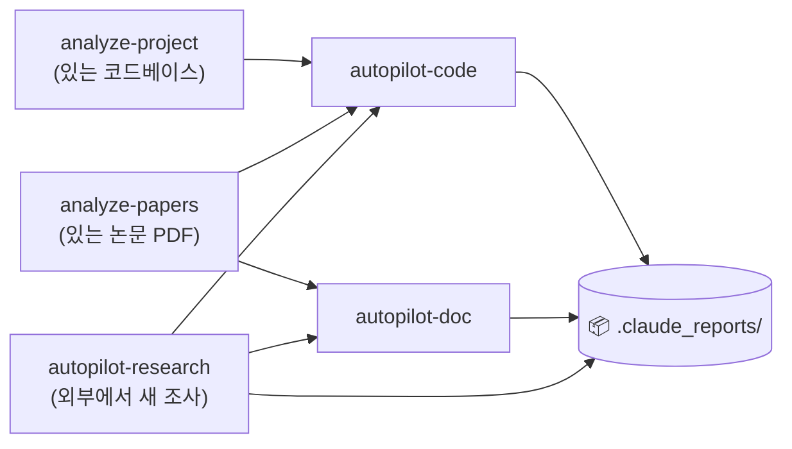
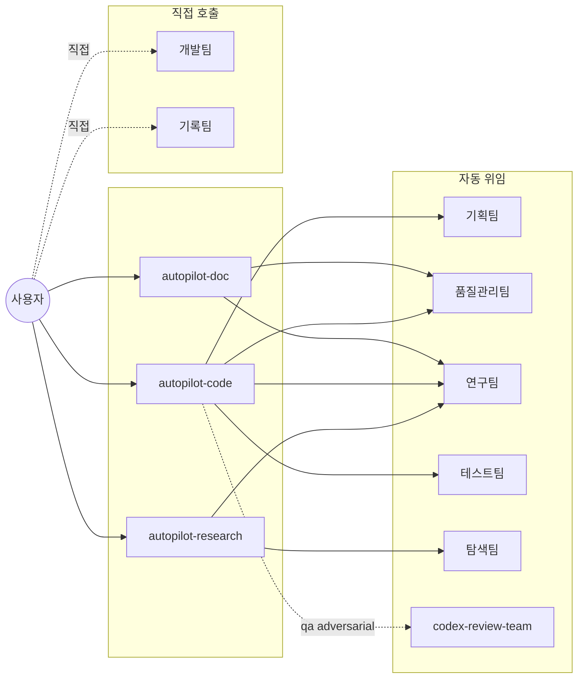

# Claude Setting

> Source: `~/.claude/skills/*/SKILL.md` + `~/.claude/agents/*.md`
> 마지막 sync: 2026-05-06 15:50 KST (`/sync-skills` 자동) — 직접 편집 금지.
> Notion 대문: [Agents/Skills](https://www.notion.so/34987c2bb75380d68df4d6ce4d469bff) (본 README와 동기화)

---

## 📊 워크플로우

세 가지 자료 수집 스킬(`analyze-project`, `analyze-papers`, `autopilot-research`)은 같은 레벨 — 손에 든 자료(코드/논문)가 이미 있는지(`analyze-*`) vs 외부에서 새로 조사해야 하는지(`autopilot-research`)에 따라 선택. 그 결과를 `autopilot-code` / `autopilot-doc`이 참조해 코드 변경·문서 생성을 수행.

---

## ⚡ 자주 쓰는 명령

| 상황 | 명령 |
|---|---|
| **세미나 발표 자료** | `/autopilot-research <주제> --depth medium` → `/autopilot-doc --mode presentation --refs <research_dir> --user-refine` |
| **논문 작성** | `/autopilot-research <주제>` → `/autopilot-doc --mode write --refs <research_dir> --user-refine` |
| **새 기능 개발** | `/autopilot-code --mode dev --user-refine "<task>"` (pause 후 `--from refine <plan>`) |
| **코드 사후 감사** | `/autopilot-code --mode audit <plan-name>` |
| **디버그** | `/autopilot-code --mode debug "<error / log path>"` |
| **리뷰 응답** | `/autopilot-doc --mode rebuttal --refs <reviewer_comments> --user-refine` |
| **있는 코드베이스 분석** | `/analyze-project` |
| **있는 논문 PDF 분석** | `/analyze-papers` |

---

## 📋 Skills

| Skill | 역할 | 주요 옵션 |
|---|---|---|
| `analyze-project` | 코드 → `docs_code/` | (없음) |
| `analyze-papers` | PDF → `docs_paper/` | (없음) |
| `autopilot-research` | 논문 조사 + 9개 보고서 | `--depth shallow/medium/deep` · `--qa` · `--from search/analyze/report` |
| `autopilot-code` | 코드 dev/audit/debug | `--mode dev/audit/debug` · `--qa` · `--from plan/refine/execute/test/report` · `--user-refine` |
| `autopilot-doc` | 문서 strategy + draft (markdown) | `--mode rebuttal/write/review/survey/report/proposal/presentation` · `--refs <dir>` · `--qa` · `--from analyze/strategy/strategy-refine/draft/draft-refine/finalize` · `--user-refine` |
| `sync-skills` | 본 README + 노션 대시보드 동기화 | `--check` · `--readme-only` · `--notion-only` · `--force` |

> sub-skill (`init-plan`, `refine-plan`, `init-doc-strategy`, `refine-doc-strategy`, `execute-plan`, `run-test`, `final-report`)은 autopilot 내부에서 자동 호출 — 직접 사용 X.

### 핵심 옵션 3가지

- **`--user-refine`** (autopilot-code dev / autopilot-doc) — 연구팀 메모 직후 pause. 같은 문서에 `<!-- memo: ... -->`를 직접 추가한 뒤 출력된 `--from <stage>` 명령으로 재개.
- **`--from <stage>`** — pause 또는 중간 실패 후 특정 단계부터 재개. stage 이름은 위 표.
- **`--qa light/standard/thorough/adversarial`** — 리뷰 강도. `adversarial`은 Codex 외부 리뷰 추가 (autopilot-code).

---

## 🤝 Agents

대부분은 skill이 자동 호출. **사용자가 직접 호출하는 agent는 2개뿐**:

- **개발팀** — 작은 리팩토링/정리 ("이 함수 이름 바꿔줘"). plan을 만들 정도가 아닐 때.
- **기록팀** — Notion 작업 ("노션에 기록해", "이번 실험 노션에 추가").

| Agent | 모델 | 호출자 |
|---|---|---|
| 기획팀 (plan-team) | opus | init-plan / refine-plan |
| 품질관리팀 (qa-team) | opus | 모든 autopilot의 review loop |
| 연구팀 (research-team) | opus | autopilot-research / -code / -doc |
| 테스트팀 (test-team) | opus | run-test |
| 탐색팀 (browser-team) | sonnet | autopilot-research (paywall 사이트) |
| codex-review-team | opus | `--qa adversarial` |

호출 구조 다이어그램

---

## 🔁 동기화

- `/sync-skills` — README + 노션 대시보드 갱신
- `/sync-skills --check` — drift 확인만 (쓰기 X)

GitHub: [dmlguq456/claude_setting](https://github.com/dmlguq456/claude_setting)
