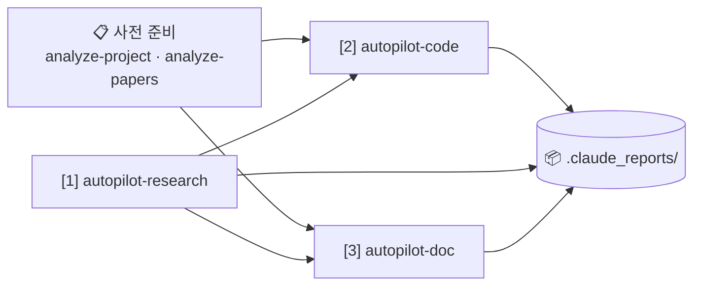
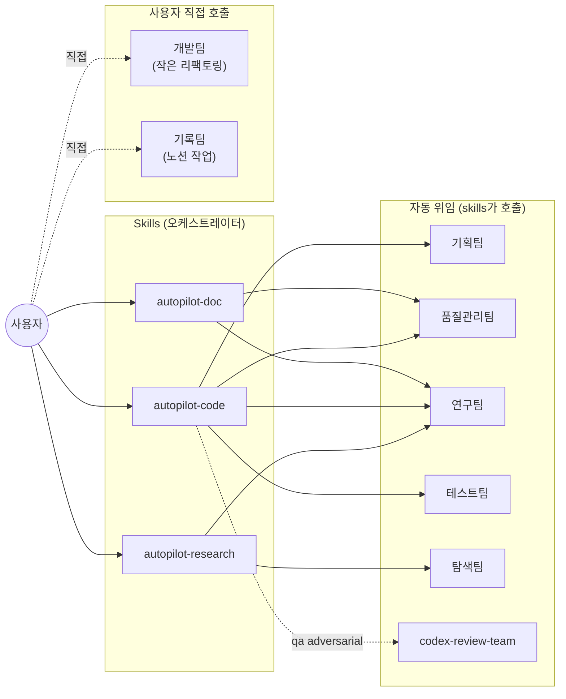

# Claude Setting — Personal Skills & Agents

> **Source of Truth**: `~/.claude/skills/*/SKILL.md` + `~/.claude/agents/*.md`
> **마지막 sync**: 2026-05-06 14:27 KST
> **자동 생성**: 직접 편집 금지. 수정하려면 SKILL.md / agent.md를 고치고 `/sync-skills`.

---

## 📊 워크플로우



### 파이프라인별 역할

**[0] analyze-project / analyze-papers — 사전 준비 (최초 1회)**
프로젝트 코드와 논문 PDF를 미리 분석해 정적 지식 베이스(`docs_code/`, `docs_paper/`)를 깔아 두는 단계. 이후 `autopilot-code`의 `final-report`가 코드 변경분만큼 `docs_code/`를 자동 갱신하므로 **재실행이 거의 필요 없음** (self-maintaining). 새 논문을 받았을 때만 `analyze-papers`를 한 번씩 더 돌려 주면 됩니다.

**[1] autopilot-research — 새 분야 조사**
arXiv / Semantic Scholar / OpenAlex / Hugging Face 등에서 논문을 검색·분석해 9개 markdown 보고서(`00_briefing.md` ~ `08_reading_guide.md`)로 정리. 산출물은 `.claude_reports/research/{topic}/`. 세미나 사전 준비, 논문 review를 위한 배경 조사, 새 분야 진입 시 시작점.

**[2] autopilot-code — 코드 변경**
세 모드: `dev`(신기능·리팩토링), `audit`(직전 dev cycle 사후 감사), `debug`(런타임 에러 진단·수정). 내부적으로 plan → review → execute → test → report 5단계를 거치며, 기획팀·품질관리팀·연구팀·테스트팀이 자동으로 위임된다. 산출물은 `.claude_reports/plans/{date}_{task}/`.

**[3] autopilot-doc — 문서 작성**
7개 모드(`rebuttal`, `write`, `review`, `survey`, `report`, `proposal`, `presentation`). 모두 strategy(전략 문서)와 draft(초안)을 함께 markdown으로 생성. 산출물은 `.claude_reports/documents/{date}_{name}/`. `--refs`에 `autopilot-research`의 artifact_dir을 그대로 넘기면 자동 체이닝.

### 자주 쓰는 체이닝 패턴

- **세미나 발표 자료**: `/autopilot-research <주제>` → `/autopilot-doc --mode presentation --refs <research_dir>`
- **논문 작성**: `/autopilot-research <주제>` → `/autopilot-doc --mode write --refs <research_dir>`
- **코드 변경 + 사후 감사**: `/autopilot-code --mode dev <task>` → `/autopilot-code --mode audit <plan>`
- **리뷰 응답**: `/autopilot-doc --mode rebuttal --refs <reviewer_comments>` (단일)
- **디버그**: `/autopilot-code --mode debug "<error description / log path>"` (빠른 진단·수정, pause 없음)

### 사용자 개입 지점

기본적으로 자동 진행하지만, 두 가지 옵션으로 개입 가능:

- **`--user-refine`** (autopilot-code dev / autopilot-doc) — 연구팀이 자동 메모를 박은 직후 pause. 사용자가 같은 문서에 `<!-- memo: ... -->` 형태로 직접 메모를 추가한 뒤, 출력된 명령으로 재개.
- **`--from <stage>`** — pause 후 또는 중간 실패 후 특정 단계부터 재개. 각 skill의 stage 이름은 아래 cheat-sheet 참고.

---

## 📋 Skills Cheat-Sheet

| Skill | 역할 | 주요 옵션 | 쓰는 시점 |
|---|---|---|---|
| `analyze-project` | 코드 → `docs_code/` | (없음) | 프로젝트 최초 1회 |
| `analyze-papers` | PDF → `docs_paper/` | (없음) | 논문 자료 최초 1회 |
| `autopilot-research` | 논문 조사 + 9개 보고서 | `--depth` `--qa` `--from` | 새 분야 조사 / 세미나 사전 준비 |
| `autopilot-code` | 코드 dev/audit/debug | `--mode` `--qa` `--from` `--user-refine` | 코드 변경 작업 |
| `autopilot-doc` | 문서 strategy + draft | `--mode`(7종) `--refs` `--qa` `--from` `--user-refine` | 논문/슬라이드/보고서 작성 |
| `init-plan` / `refine-plan` | autopilot-code의 sub | `--qa` | 보통 직접 호출 X (pause 후 `--from refine`) |
| `init-doc-strategy` / `refine-doc-strategy` | autopilot-doc의 sub | `--qa` | autopilot-doc pause 후 직접 재개 시 |
| `execute-plan` / `run-test` / `final-report` | autopilot-code의 sub | (각자) | 보통 내부 호출 |
| `sync-skills` | README + Notion 대시보드 동기화 | `--check` `--readme-only` `--notion-only` `--force` | 스킬·에이전트 수정 후 |

---

## 🤝 Agents Cheat-Sheet

| Agent | 역할 | 모델 | 호출자 / 직접 사용 |
|---|---|---|---|
| 기획팀 (plan-team) | plan 문서 작성·갱신 | opus | init-plan / refine-plan |
| 품질관리팀 (qa-team) | plan·diff 리뷰 | opus | 모든 autopilot의 review loop |
| 연구팀 (research-team) | 논문 검색·분석·plan domain review | opus | autopilot-research / -code / -doc |
| 테스트팀 (test-team) | syntax→import→smoke→functional→integration | opus | run-test |
| 개발팀 (dev-team) | refactor·rename·정리 | sonnet | **사용자 직접 호출** (interactive/auto) |
| 탐색팀 (browser-team) | Playwright 기반 paywall/JS 사이트 접근 | sonnet | autopilot-research |
| 기록팀 (record-team) | Notion CRUD (페이지·DB·실험 로그) | sonnet | **사용자 직접 호출** ("노션에 기록해") |
| codex-review-team | Codex CLI 기반 외부 리뷰 | opus | `--qa adversarial` 시 autopilot-code |

### Agent 호출 구조 (참고용)



---

## 🧭 통합 가이드라인 — Skills + Agents

**원칙**: 대부분의 Agent는 Skill이 자동으로 호출한다. 사용자가 직접 부르는 agent는 두 종류뿐.

**사용자가 직접 호출하는 agent (2개)**
1. **개발팀** — 작은 리팩토링/정리 ("이 함수 이름 바꿔줘", "이 코드 정리해줘"). plan을 만들 정도가 아닐 때.
2. **기록팀** — Notion 작업 ("노션에 기록해", "이번 실험 노션에 추가").

**나머지 agents는 skill에 위임**
- 코드 변경 → `/autopilot-code` (내부에서 기획팀 → 품질관리팀 → 연구팀 → 테스트팀 자동 호출)
- 논문 조사 → `/autopilot-research` (연구팀 + 탐색팀)
- 문서 작성 → `/autopilot-doc` (연구팀 + 품질관리팀)
- 외부 리뷰 추가 → `/autopilot-code --qa adversarial` (codex-review-team 추가 호출)

**언제 skill 대신 agent를 직접?**
- skill의 오버헤드가 부담스러울 만큼 작은 작업 → 개발팀
- 단발성 노션 정리 → 기록팀
- **그 외에는 항상 skill을 통해서.** Agent 단독 호출은 컨텍스트가 분리돼 plan/log 산출물이 남지 않으므로 추적이 어렵다.

**Skill 공통 옵션 cheat-sheet**
- `--user-refine` (autopilot-code dev / autopilot-doc) — 연구팀 메모 직후 pause해서 사용자가 직접 메모 추가
- `--from <stage>` — pause 후 또는 중간 실패 후 재개. 각 skill의 stage 이름은 위 cheat-sheet 참고
- `--qa light|standard|thorough|adversarial` — 리뷰 강도. `adversarial`은 codex-review-team 추가
- `--refs <folder>` (autopilot-doc) — 참조 자료 폴더. autopilot-research artifact_dir도 그대로 받음

**파이프라인 체이닝 패턴**
- `autopilot-research → autopilot-doc`: research artifact_dir을 `--refs`로 그대로 넘김
- `autopilot-research → autopilot-code`: research artifact_dir을 plan 컨텍스트로 활용 (수동)
- `autopilot-code → autopilot-code --mode audit`: dev plan 완료 후 사후 감사

---

## 📁 디렉토리 구조

```
~/.claude/
├─ skills/         # /<name> 형태로 호출되는 슬래시 스킬 (13개)
├─ agents/         # Agent 도구로 위임되는 서브에이전트 (8개)
├─ settings.json   # hooks, permissions, env, model 설정
└─ README.md       # 이 파일 (자동 생성)
```

## 🔗 관련 링크

- **Notion 대문**: [Agents/Skills](https://www.notion.so/34987c2bb75380d68df4d6ce4d469bff)
- **GitHub**: https://github.com/dmlguq456/claude_setting

---

*sync 명령*
- `/sync-skills` — 변경 감지 시 README + Notion 대문 갱신
- `/sync-skills --check` — drift 확인만 (쓰기 없음)
- `/sync-skills --force` — SHA 동일해도 재생성 (포맷 일괄 적용 시)
