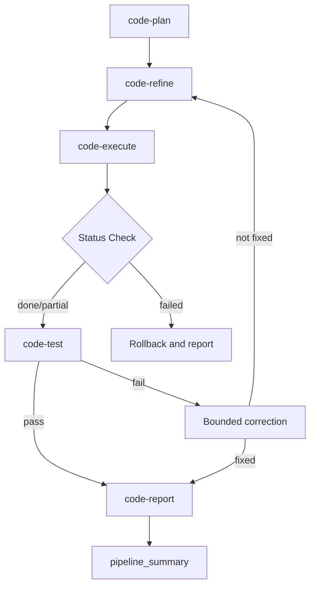
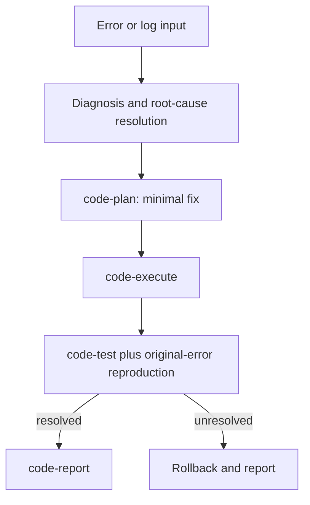

# autopilot-code

> This README summarizes the portable capability for users and maintainers. The model-neutral contract lives under `<agent-home>/capabilities/`; `SKILL.md` in this directory provides shared guidance for runtime-specific projections.

`autopilot-code` is the integrated code pipeline for development and debugging. Artifact audit remains the separate `/audit` Skill.

## Invocation

```text
/autopilot-code --mode dev|debug <args> [--from <step>] [--intensity direct|quick|standard|strong|thorough|adversarial] [--user-refine]
```

If mode is omitted, default to `dev` and warn once.

## Development Mode



After a test failure, roll back source, attach failure context to the user-facing plan mirror, run at most one plan-level correction cycle, and stop with rollback and a report if verification still fails.

## Debug Mode



Diagnose before editing. Ask the user only when multiple root causes remain plausible. For environment problems such as missing configuration or files, report environment repair steps instead of modifying code.

## Mode Comparison

| | dev | debug |
|---|---|---|
| Input | Task description | Error description or log |
| Preprocessing | None | Main agent diagnoses directly |
| code-refine | Selected plan correction | Normally skipped |
| code-test retry | At most one bounded pipeline retry | One verification plus original-error reproduction |
| Rollback | Changed source paths | Fix paths only |
| `--from` | plan/refine/execute/test/report | Unsupported; always diagnose first |
| adversarial intensity | Supported | Cap at thorough |

## Subskills

- [code-plan](../code-plan/README.md)
- [code-refine](../code-refine/README.md)
- [code-execute](../code-execute/README.md)
- [code-test](../code-test/README.md)
- [code-report](../code-report/README.md)

### Plan Resolution

code-execute, code-test, code-report, and code-refine share one algorithm:

1. `.md` suffix → use the path directly.
2. Directory → append `/plan/plan.md`.
3. Name → fuzzy-search and prefer directories without `_audit` or `_fix_`; ask when multiple candidates remain.
4. Apply subskill-specific exceptions: direct-test fallback for code-test and dual-language resolution for code-refine.

## QA Scaling

| Level | Condition | Reviewer shape |
|---|---|---|
| Light | At most three files; mechanical change | One fast reviewer |
| Standard | Four to ten files; one module | One deep reviewer |
| Thorough | More than ten files, cross-variant, or architectural | Two or three parallel reviewers divided by axis |
| Adversarial | Cross-variant plus an available external adversary; dev only | Thorough plus external-adversary review |

The code track does not use a document fact-checker because ground truth is source, tests, runtime behavior, API or CLI surfaces, and security review. code-test performs final concrete verification at the rigor derived from intensity and does not force parallel QA at every stage. code-report has a high parallelization threshold and stays single-writer even at thorough.

## Design Principles

1. Roles are project-independent; project context comes from project instructions and relevant memory.
2. Durable state lives in files so work can resume after conversation loss.
3. Plan, implementation, and test gates remain distinct.
4. Commit but do not push; the user owns push decisions.
5. Verify progressively: syntax → import → smoke → functional → integration.
6. Preserve rationale and insight in the final report.
7. Use paper analysis for domain-grounded plan review when relevant.
8. One pipeline serves multiple modes through `--mode`.
9. Scale assurance with change risk and size.
10. Treat cross-Skill keywords, schemas, and variable patterns as interfaces.
11. Specify loop counters, increments, and exits explicitly.
12. Do not delegate work outside a role's declared modes; extend the handler first.

---
*Portable capability contract: `<agent-home>/capabilities/autopilot-code.md`; shared skill guidance: `<agent-home>/skills/autopilot-code/SKILL.md`.*
