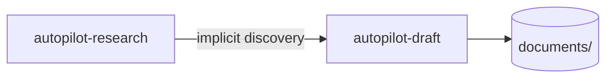

# autopilot-draft

> This README summarizes the portable capability for users and maintainers. The model-neutral contract lives under `<agent-home>/capabilities/`; `SKILL.md` in this directory provides shared guidance for runtime-specific projections.

> **Paper-mode rule for camera-ready and major-revision work** (2026-05-19): apply the natural-integration rule when converting reviewer concerns into paper-body mutations. Ask one gating question: *Can this be integrated naturally as a one- or two-sentence inline rewrite?* If yes, use an M15-style inline rewrite. If no, drop it or defer it to the appendix. Rebuttal-format material must not be pasted into the paper body. See the end of `SKILL.md` → Mode-Specific Draft Structure → `paper`.

## Pipeline


The pipeline analyzes source material such as PDFs, reviewer comments, and format specifications, then produces a Markdown strategy and draft. Run **autopilot-research** first when external research is required; autopilot-draft discovers its outputs automatically.

## Invocation

```text
/autopilot-draft "<task description>" [--mode paper|presentation|doc] [--intensity direct|quick|standard|strong|thorough|adversarial] [--user-refine] [--no-clarify] [--from analyze|strategy|strategy-refine|draft|draft-refine|finalize]
```

| Argument | Description |
|---|---|
| `<task description>` | First positional argument: one-line goal, intent, scope, and audience. |
| `--mode` | One of the three output forms. Infer it from the task when omitted. Document genres are selected from natural-language intent. |
| `--intensity` | Selects the stage graph and is the only source of verification rigor; there is no separate `--qa` axis (CONVENTIONS §1.1). Use the fact-checker only when claims, citations, or cards are in scope and the selected graph calls for it. |
| `--user-refine` | Pause after a review memo so the user can add `<!-- memo: ... -->`, then resume with `--from <stage>`. |
| `--no-clarify` | Skip Step 0 scope clarification. |
| `--from <stage>` | Resume after a pause or failure at `analyze`, `strategy`, `strategy-refine`, `draft`, `draft-refine`, or `finalize`. |

There is no `--refs` flag. Discover inputs implicitly under `<artifact-root>/{analysis_project,research}/*`; materialize them first with `/analyze-project --mode {paper|doc}` or `/autopilot-research`.

There is no `--format-ref` flag. Discover venue, journal, and lab guidance under `analysis_project/doc/{matching}/formats/`; preprocess the source folder with `/analyze-project --mode doc <folder>`.

## Output forms and genres

| Form | Natural-language genre intent | Output |
|---|---|---|
| `paper` | Academic paper, camera-ready revision, major revision, white paper, book chapter, or technical article | Section outline and prose or paste-ready LaTeX cards |
| `presentation` | Paper talk, internal seminar, lecture, or keynote | Slide-by-slide Markdown; PPTX export is not supported |
| `doc` | Rebuttal, peer review, technical or market report, post-mortem, grant, or business proposal | Format-aware strategy and draft |

Every form produces a strategy and a Markdown draft. The user remains responsible for final writing, build, and visual design.

## Format-spec discovery

Preprocess venue-, year-, journal-, or lab-specific templates and examples with `/analyze-project --mode doc`. autopilot-draft then discovers them under `analysis_project/doc/{matching}/formats/`. There are no built-in presets because requirements change by venue and year.

Resolution order:

1. Discover candidates in `analysis_project/doc/{matching}/formats/`.
2. If none exist, apply the form- and genre-specific fallback.

| Genre | Behavior without a format spec |
|---|---|
| Peer review | Hard fail; do not draft without the review form. |
| Rebuttal | Ask whether to materialize and retry, accept an inline declaration, or use a generic format. |
| Paper, presentation, proposal, report | Warn and continue with the generic layout. |

Rebuttal subtypes are inferred from the task or format spec: `meta-only`, `reviewer-dialogue`, and `response-with-revision`.

## QA scaling

Quality and fact review run in parallel at `standard+`.

| Level | Quality review | Fact review |
|---|---|---|
| `quick` | One fast, single-pass review; skip full refinement | Skip |
| `light` | One fast reviewer | Skip |
| `standard` | One deep reviewer | One fast fact-checker |
| `thorough` | Two deep reviewers when selected: Domain Expert plus Methodology, or Content Expert plus Quality | One fast fact-checker when sourced claims are in scope |

The fact-checker performs narrow matching against `analysis_project/paper/*.md` for venue, year, metrics, and citations. Apply the same pattern to strategy review in Step 3 and draft review in Step 5.

## Scope clarification

When the request is ambiguous or matches multiple forms or genres, ask two to four focused questions. Skip this step for a sufficiently specific request or when `--no-clarify` is set.

## Subskills

- [draft-strategy](../draft-strategy/README.md)
- [draft-refine](../draft-refine/README.md)

The orchestrator normally invokes these subskills. Direct use is reserved for resuming at a paused stage.

## Artifact layout

```text
<artifact-root>/documents/{YYYY-MM-DD}_{short-name}/
├─ pipeline_summary.md       (T1)
├─ draft/                    (T1)
│  ├─ draft.md
│  └─ draft_{language}.md    (explicitly required companion only)
├─ strategy/                 (T2)
│  ├─ strategy.md
│  └─ strategy_{language}.md (explicitly required companion only)
├─ analysis/                 (T2)
│  ├─ reviewer_analysis.md   (rebuttal)
│  ├─ ref_analysis.md
│  └─ material_index.md
└─ _internal/                (T3)
   ├─ strategy_reviews/
   ├─ draft_reviews/
   └─ versions/v{N}/strategy|draft/
```

## Design principles

1. The harness is portable across agent runtimes; adapter files realize the shared capability for a specific runtime.
2. Select an output form first, then infer the document genre from the task and format specification.
3. Follow the user's communication language for user-facing guidance and select the artifact language from its audience and venue. Generate a companion only when explicitly requested, required by an external audience, or already required by the artifact workflow.
4. Discover format specifications instead of embedding venue presets.
5. Run quality and fact review in parallel when the selected intensity requires both.
6. Cite only material present in discovered inputs, paper analyses, or the format specification.
7. Keep refinement versioned and grounded in references.
8. Treat memory as context for agent judgment, not as a source of rigid user-facing rules or fixed recall keywords.
9. Keep source discovery in the separate autopilot-research pipeline.

## Chaining from autopilot-research



Run autopilot-research first for academic, industry, or market research. autopilot-draft then discovers the resulting `research/{topic}/` artifacts automatically.

---

*Portable capability contract: `<agent-home>/capabilities/autopilot-draft.md`; shared skill guidance: `<agent-home>/skills/autopilot-draft/SKILL.md`.*
