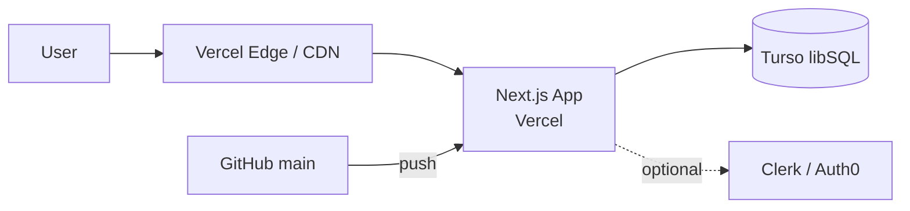

## Procedure

> **Default behavior: multiple intermediate confirmations.** A spec is where user intent is decided, so interaction is essential. Offer review points at Steps 1, 2, 3a, 3b, 3c, 4a, 4b, and 5: usually six to eight confirmations. If the user asks to move quickly—quoted examples include "쭉 진행", "ok 다 진행", and "다 알아서"—collapse them into batch confirmations: group 3a–3c and 4a–4b, leaving three to four confirmation points.

> **Concurrency guard for a shared `<artifact-root>`.** Immediately before a write stage—Step 3 or update-mode writes to `prd.md`, `pipeline_state.yaml`, or `pipeline_summary.md`—acquire `.pipeline-lock`. Release it on both normal completion and interruption; the protocol and snippet are defined in **OPERATIONS.md §5.8**. If acquisition is BLOCKED (`exit 3`) because another worktree is editing the spec, stop writing, report it, and decide whether to wait or override. This lock is also the single detect-only signal that this skill is editing a spec.

### Step 1: Collect Information and Confirm

**1-1. Determine the project name** from the request, cwd, and files such as `package.json` or `pyproject.toml`.

**1-2. Infer modes automatically** using the signal table in the invocation reference.

**1-3. Analyze existing assets.** If `<artifact-root>/analysis_project/code/` exists, cite relevant analyze-project outputs automatically; otherwise inspect the cwd directly. Record `similar_models.md` and `experiment_conventions.md` as possible Phase 0 scaffold inputs when present.

**1-4. Import autopilot-research results automatically.** When `<artifact-root>/research/` exists, cite relevant reference patterns and external baselines. Treat `code_resources/` repositories and pretrained-checkpoint entries from `07_resources.md` as external-reference candidates for scaffold Phase 0.

**1-5. In `app` mode only, summarize the environment and two or three stack candidates**, including Node, pnpm, and Docker availability.

**1-6. Show one confirmation screen**, rendered naturally in the user's communication language:

```
=== Collected information ===
Project:          <name>
Inferred modes:   <list> (evidence: <evidence>)
Existing assets:  analyze-project <found/not-found> — similar_models / experiment_conventions / code-module analysis
External research:<research/topic> when found — N candidates from code_resources and 07_resources
(app only) Environment: Node / pnpm / Docker

Proceed with these materials? (proceed / modify — add or remove material / stop)
```

### Step 2: Confirm the Spec Direction

```
=== Spec decisions ===
Project:          <name>
Inferred modes:   <mode list> (evidence: <evidence>)
Prior material:   N cited items from autopilot-research / analyze-project

(app only) Environment and stack candidates:
  Node ✓ / pnpm ✓ / Docker ✗
  Stack: 1. Next.js+Prisma+Turso  2. Expo+tRPC  3. SvelteKit+Drizzle
  → Recommendation: option 1 (reason: <request evidence>)

Proceed? (proceed / modify — change mode or stack / stop)
```

### Step 3: Author the PRD in Three Reviewed Sections

> **Stage-dispatch note:** PRD authoring is conductor-inline. The conductor writes `spec/prd.md` at a point that requires its own judgment, so it is not dispatched to a stage worker. The only dispatched stage is scaffold (`dev/new-lib` unit); see the stage-worker mapping in `scaffolding.md`.

Do not write all of `spec/prd.md` at once. Draft it in three sections and offer review after each. Batch them automatically when the user asks to move quickly.

#### Step 3a: Common Content and the Primary Mode

- **Common content**: module structure, dependencies, language/runtime, license
- **Primary mode section**: the first selected mode—features, scenarios, and API Contract for `app`; public API for `library`; endpoints for `api`; commands/options for `cli`; or entry points, configs, and metrics for `research`

```
=== PRD draft: common + primary mode ===
<output path>
Key decisions: <3–5 bullets>

Approve this draft? (proceed / modify — refine a section / back-jump to Step 2 / stop)
```

#### Step 3b: Architecture Diagrams

Treat the Component diagram as first-class for every structural mode, using the mode-specific views below. Create a Deployment diagram only for `app` and `api`; libraries and CLIs use package-registry/versioning or distribution sections instead. Add optional ER, Sequence, Activity, State, or Class diagrams only on explicit request or when the complexity rules below justify them.

```
=== Architecture Diagrams ===
Component diagram (Mermaid): <one-line summary of nodes and relationships>
(app/api only) Deployment diagram: <one-line summary of hosting, database, and external services>

Approve the diagrams? (proceed / modify — add or remove nodes / back-jump / stop)
```

#### Step 3c: Additional Sections for Combined Modes

For a combined mode such as `research,cli`, draft the second mode section and confirm it. Skip this step for a single mode.

```
=== Additional PRD mode section ===
Mode: <second mode>
Key decisions: <3–5 bullets>

Approve? (proceed / modify / back-jump to Step 3a / stop)
```

#### Step 3d: Check the Semantic-Judgment Boundary

> Added after the worklog-board incident on 2026-06-22. This substep catches PRDs that demand semantic judgment while delegating it to a deterministic script. **DESIGN_PRINCIPLES §0.7** owns the detailed definition; reference it rather than redefining it.

1. Review the PRD for passages requiring meaning, context, appropriateness, or naturalness. Detect these semantically; terms such as `meaning`, `judgment`, `appropriate`, `contextual`, `semantic`, or `natural` are examples, not a fixed trigger list.
2. Inspect the corresponding implementation plan. Flag a conflict when the spec asks for semantically appropriate behavior but the implementation reduces it to fixed rules, regexes, or token matching alone.
3. For each conflict, mark the PRD, record why, and offer three choices from §0.7: ① redefine the spec, ② use an LLM judgment stage, or ③ state an LLM fallback after deterministic rules.

```
=== Semantic-judgment boundary check ===
Semantic passages: <list with PRD line references>
Conflicts: <none / N — each passage and whether it was reduced to rules>
(when conflicts exist) Choices: ① redefine spec / ② add LLM judgment / ③ deterministic rules + LLM fallback

Approve? (proceed / modify / stop)
```

Use the following PRD structure. Render descriptive prose in the user's communication language while preserving code identifiers:

````markdown
# <Project Name> Spec

## Common
- Module structure
- Dependencies
- Language and runtime versions
- License

## [app] (only when selected)
### Feature list (P0/P1/P2)
### User scenarios (3–5)
### Nonfunctional requirements
### Initial data model (entities, relationships, migration plan)
### API Contract (shared by backend and frontend: endpoint, body, error, auth)
### Screen flow (when a UI exists)

## [library] (only when selected)
### Public API (exported functions, classes, and types)
### Usage examples (for README)
### Compatibility and versioning (semver policy)
### Module structure, such as src/{io,core,utils}/

## [api] (only when selected)
### Endpoints (POST /api/X, GET /api/Y, ...)
### Body and response shapes
### Error codes
### Auth (token / OAuth / API key)
### Rate limiting

## [cli] (only when selected)
### Commands (train / eval / serve / ...)
### Options (--config / --resume / --output / ...)
### Input/output formats
### Exit codes

## [research] (only when selected)
### Entry points (train.py / eval.py / command examples)
### Experiment configuration (`configs/*.yaml` structure)
### Reproduction commands (train / evaluate / test)
### Expected metrics (PSNR / accuracy / SI-SDR / ...)
### Baseline comparison

## Architecture Diagrams

### Component diagram (Mermaid; first-class for every mode)
Show module-level composition and dependencies at a glance:
- app: frontend, backend, database, and external-service dependencies
- api: router, handler, repository, model, and external-service dependencies
- library: public-to-internal module dependency graph, providing visual evidence for semver impact
- cli: command/subcommand tree and the core modules each command invokes
- research: data → preprocessing → model → training/evaluation pipeline
- Optional diagrams: ER / Sequence / Activity / State / Class, only for complex cases or explicit requests

### Deployment diagram (Mermaid; `app` and `api` only)
Show physical deployment at a glance:
- Hosting: Vercel / Fly / Railway / Cloudflare
- Database host: Turso / Supabase / Neon / RDS
- External services: Stripe / Auth0 / Cloudflare R2
- CDN
- CI/CD trigger: GitHub push → provider
- User entry point: domain

Example for an app:



### Optional diagrams
- **ER diagram** — supplements `data_model.md` when there are at least five entities
- **Sequence diagram** — complex authentication, transactions, or webhook ordering
- **Activity diagram** — complex checkout, login flow, or research pipeline
- **State diagram** — state-heavy domains such as order, payment, or game turns
- **Class diagram** — visualizes a library's public API; skip when the textual API is sufficient

Do not generate optional diagrams by default. Add them only on an explicit request such as `/autopilot-spec --add-diagram <type>` or a reasoned complexity inference such as five or more entities, a state-heavy domain, or a complex flow.
````

For one mode, include only that mode section. For combined modes, keep each section independent.

### Step 3.5: Coupled Updates When the PRD Changes

Prevent drift between textual PRD content and Architecture Diagrams by updating every affected artifact in one transaction:

| Change | Artifacts that must remain consistent |
|---|---|
| Add an API endpoint or change its body/error behavior | `spec/api_contract.md` + Component diagram + optional Sequence diagram |
| Add a database entity/field or migration | `spec/data_model.md` + optional ER diagram + backend area of the Component diagram |
| Add or change a UI screen/flow | `spec/ui_flow.md` + optional Activity diagram + frontend area of the Component diagram |
| Integrate an external service such as Stripe, Auth0, or S3 | Auth section of `spec/api_contract.md` + **Deployment diagram** + `spec/ship.md` + `.env.example` |
| Replace a stack component such as the database or framework | refined `spec/stack.md` + **Component diagram** + **Deployment diagram** |
| Add a domain state model such as order or payment | `spec/data_model.md` + optional State diagram |

**Invocation points**:

- In autopilot-spec refinement, list all affected artifacts, confirm the intended change, and update them together.
- When autopilot-code detects a spec-affecting implementation change, show the coupled-update plan, confirm it, and back-jump into autopilot-spec.

**Automatic Deployment-diagram updates** are needed less often: only on changes such as provider replacement, environment additions, or domain connections. When autopilot-ship handles one of these changes, update `ship.md` and the Deployment diagram together.
