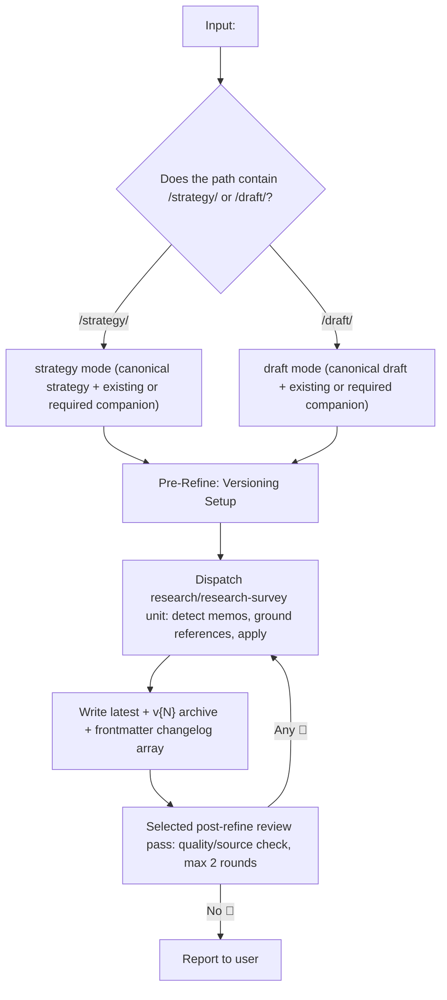
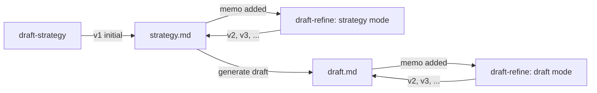

# draft-refine

> This README summarizes the portable capability for users and maintainers. The model-neutral contract lives under `<agent-home>/capabilities/`; `SKILL.md` in this directory provides shared guidance for runtime-specific projections.

> **Paragraph Cohesion Pre-Check (all modes, 2026-05-20):** Before applying a memo that adds or rewrites a paste-ready block, analyze the target paragraph's complete narrative flow and run four checks: (1) whether the substance is already stated, (2) whether the edit breaks the paragraph axis, (3) whether it creates section-level redundancy, and (4) the edit type, in cohesion order: inline EDIT > REPLACE > INSERT > DROP. If an existing mutation fails—for example, a trailing INSERT duplicates a prior sentence—rewrite it as EDIT, REPLACE, or DROP instead of polishing it. `draft-strategy/SKILL.md` §Paragraph Cohesion Pre-Check is the single source; also see this directory's `SKILL.md` §Other rules.

> **Paper-mode camera-ready rule (2026-05-19):** When adding or refining a mutation, apply the natural-integration rule after the pre-check. Ask one question: *Can this be integrated naturally as a one- or two-sentence inline rewrite?* YES → use an M15-style inline rewrite. NO → drop the entry rather than polish it. Remove any remaining rebuttal-format mutation. See `SKILL.md` §Other rules.

## Overview

The refinement sub-skill for autopilot-draft. It applies user memos or review feedback to a strategy or draft with **versioned output** and **mandatory reference grounding**, rereading sources for every memo.

## Invocation Flow



## 1. Memo Detection

Search the canonical artifact and any existing required companion for:

- `<!-- memo: ... -->` — standard memo tag
- `<!-- ... -->` — HTML comment, except a legacy `<!-- CHANGELOG (auto-managed by draft-refine ... -->` block. The block is not a memo; migrate it into the frontmatter `changelog:` array and delete it as described in §4.
- `// ...` — inline comment
- `[memo] ...` — bracketed comment
- `(**...**)` — parenthetical comment
- Any other text explicitly marked as a user annotation

## 2. Mandatory Reference Grounding

For every memo, before applying it:

1. Identify the relevant source:
   - Paper analyses at `<artifact-root>/analysis_project/paper/*.md` for citation, venue, score, or dataset facts; these are the single source of truth.
   - The strategy document for narrative-arc and outline alignment.
   - Analysis files for audience, key messages, and visual strategy.
   - Original PDFs only for nuanced claims that require rereading and are not covered by paper analyses.
2. **Reread the source.** Do not trust the memo alone.
3. Compare the memo with the source:
   - Match → apply the memo.
   - Conflict → **override the memo**, retain the original text, and record the conflict in the changelog.
   - Ambiguous source → apply but mark `[CAUTION: source ambiguous]`.
4. Record verification in the changelog, for example `[verified analysis_project/paper/2020_Hu_DCCRN.md]`.

Do not silently propagate an incorrect memo; the source controls factual truth.

## 3. Versioned Output

- Modern convention: `{artifact_root}/_internal/versions/v{N}/{strategy,draft}/`
- Legacy convention: sibling `{path.parent}/{path.stem}_v{N}.md`, only when the artifact already uses that pattern
- Preserve both the `latest` file at current vN and the `v{N-1}` archive.
- Prior versions are **immutable**; never modify them.
- On first refinement, snapshot the current state as v1 and write the change as v2.

## 4. Changelog — Managed Frontmatter Array

Store change history as a **YAML array inside frontmatter**, never as a top-of-file `<!-- CHANGELOG -->` HTML comment.

**Why this form is required**:

- An HTML comment above frontmatter moves `---` off line 1. Markdown previewers such as VS Code, GitHub, Obsidian, and Jupyter then render the delimiters as horizontal rules and YAML keys as prose.
- A YAML array is structured data that audit and downstream tools can parse.
- Previewers hide frontmatter, leaving a clean body.

**Invariant:** line 1 must be the opening `---`. No HTML comment, blank line, or prose may precede it.

**Format**:

```yaml
---
{preserve existing domain keys: type, venue, status, date, tone, ...}
changelog:
  - version: v{N}
    date: "{YYYY-MM-DDTHH:MM}"
    applied: X
    overridden: Y
    entries:
      - |
        [Slide N | Section X] [verified <source>]: <one-line description>
      - |
        [Slide N | Section X] [OVERRIDDEN — memo conflicted with <source>]: <reason>
  - version: v{N-1}
    {preserve prior entry}
---
```

- Keep `changelog:` as the **last** frontmatter key so domain keys remain readable.
- Prepend each new v{N+1} entry above older entries, newest first.
- Use literal block scalars (`|`) so backticks, backslashes, colons, brackets, and emoji need no escaping.
- **Required legacy migration:** when a `<!-- CHANGELOG (auto-managed by draft-refine ... -->` block exists, convert it into the frontmatter array and delete the HTML block in the same pass for the canonical artifact and every existing required companion.
- The autopilot manages this structure; the user does not edit it directly.

## 5. Selected Post-Refine Review Pass

After the `research/research-survey` unit finishes, run the quality/source checks required by the selected graph and QA budget, for at most two rounds.

| Level | Condition | Quality reviewer | Parallel fact-checker |
|---|---|---|---|
| Quick | `--intensity quick` | 1 fast reviewer, spot-check only | Skip; autopilot normally skips refinement entirely at quick intensity, so this applies only to manual invocation |
| Light | ≤3 changed sections | 1 fast reviewer | Skip |
| Standard | 4+ changed sections | 1 deep reviewer | 1 fast fact-checker |
| Thorough | Major overhaul or new evidence | 2 parallel deep reviewers | 1 fast fact-checker |

- **Quality reviewer:** narrative arc, cohesion, strategy coverage, and all reviewer points in rebuttal mode
- **Fact-checker:** verbatim comparison with `analysis_project/paper/*.md`

On a 🔴 finding, re-dispatch the `research/research-survey` unit, up to two rounds. If 🔴 remains after two rounds, record it under the functional compatibility heading `## 미해결 이슈` and tag factual residuals `[FACT-RESIDUAL]`.

## Relationship to Other Skills



`draft-strategy` creates only v1. `draft-refine` owns every later revision.

---
*Portable capability contract: `<agent-home>/capabilities/draft-refine.md`; shared skill guidance: `<agent-home>/skills/draft-refine/SKILL.md`.*
