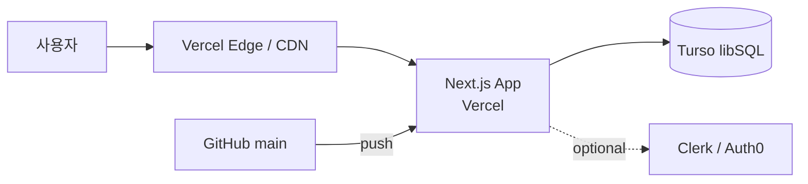

## Procedure

> **본 skill 의 default — 중간 컨펌 다회**: spec 자체가 _사용자 의도 결정 자리_ 라 _전반적 상호작용_ 이 본질. Step 1 / 2 / 3a / 3b / 3c / 4a / 4b / 5 자리에 사용자 검토 자리 (총 6-8 자리). 사용자 _빠른 진행_ 발화 ("쭉 진행" / "ok 다 진행" / "다 알아서") 시 _일괄 컨펌_ 으로 자동 축소 (3a-3c 한 묶음 / 4a-4b 한 묶음 → 실제 컨펌 3-4 자리).

> **동시성 가드 (공유 `<artifact-root>`)**: 쓰기 단계(Step 3 / update mode 의 `prd.md`·`pipeline_state.yaml`·`pipeline_summary.md` 쓰기) 진입 _직전_ `.pipeline-lock` 획득, 파이프 정상·중단 양쪽에서 해제 — 프로토콜·snippet 은 **OPERATIONS.md §5.8**. acquire 가 BLOCKED(`exit 3`, 다른 worktree 가 spec 편집 중) 면 쓰기 멈추고 사용자에 보고 후 대기/override 판단. 본 skill 이 _spec 편집 중_ 임을 가리키는 단일 신호이기도 하다(다른 worktree 의 detect-only 조회 대상).

### Step 1: 정보 수집 + 중간 컨펌

**1-1. 프로젝트 name 추출** — 발화·cwd·기존 `package.json`·`pyproject.toml` 등.

**1-2. mode 자동 추론** — 위 단서 표 적용.

**1-3. 기존 자산 분석** — `analyze-project` 산출물 (`<artifact-root>/analysis_project/code/`) 발견 시 자동 인용. 부재 시 cwd 코드 직접 검사. `similar_models.md` / `experiment_conventions.md` 가 있으면 scaffold Phase 0 의 ref source 후보로 기록.

**1-4. autopilot-research 결과 자동 import** — `<artifact-root>/research/` 발견 시 reference 패턴·외부 baseline 인용. `code_resources/` (외부 ref repo) + `07_resources.md` (pre-trained ckpt) 가 scaffold Phase 0 의 외부 ref source 후보.

**1-5. (app mode 만) 환경·스택 후보 정리** — Node / pnpm / Docker 확인, 스택 후보 2-3 안.

**1-6. 수집 결과 한 화면 컨펌**:

```
=== 정보 수집 결과 ===
프로젝트 name:    <name>
mode 추론:       <list> (근거: <증거>)
기존 자산:       analyze-project 산출 <found/not-found> — similar_models / experiment_conventions / code 모듈 분석
외부 research:   research/<topic>/ 발견 시 — code_resources (외부 ref) + 07_resources (pre-trained ckpt) 인용 자리 N
(app mode 만) 환경: Node / pnpm / Docker

이 자료들로 진행? (진행 / 수정 — 자료 추가 또는 제외 / 중단)
```

### Step 2: 한 화면 컨펌

```
=== Spec 결정 자리 ===
프로젝트 name:    <name>
mode (추론):     <mode list> (근거: <증거>)
사전 자료:       autopilot-research / analyze-project 발견 — 인용 자리 N

(app mode 만 추가) 환경 / 스택 후보:
  Node ✓ / pnpm ✓ / Docker ✗
  스택: 1. Next.js+Prisma+Turso  2. Expo+tRPC  3. SvelteKit+Drizzle
  → 권장 1순위 (근거: <발화>)

이대로 진행? (진행 / 수정 — mode·스택 변경 / 중단)
```

### Step 3: PRD 작성 — 3 자리 분할 (중간 컨펌)

`spec/prd.md` 를 한 번에 다 쓰지 않고 _3 자리로 분할_ 각자리 사용자 검토. _빠른 진행_ 발화 시 자동 일괄.

#### Step 3a: 공통 + 핵심 mode 섹션 작성 → 컨펌

- _공통_ (module 구조 / 의존성 / 언어·런타임 / License)
- _핵심 mode 섹션_ (해당 mode 의 첫 번째 — app 의 피처·시나리오·API Contract / library 의 공개 API / api 의 endpoint / cli 의 명령·옵션 / research 의 entry·configs·metric)

```
=== PRD 초안 (공통 + 핵심 mode) ===
<산출 path>
주요 결정: <3-5 bullet>

이 초안 ok? (진행 / 수정 — 섹션 단위 refine / back-jump Step 2 / 중단)
```

#### Step 3b: Architecture Diagrams 작성 → 컨펌

Component diagram 은 _모든 구조적 mode 1급_ — 각 mode 의 architecture view (아래) 를 기본 포함. Deployment diagram 은 app / api 만 (library/cli 는 package registry 배포라 deployment 자리 없음 — [library] versioning·[cli] 배포 섹션이 대신). 옵션 diagrams (ER / Sequence / Activity / State / Class) 는 사용자 명시 요청 시.

```
=== Architecture Diagrams ===
Component diagram (mermaid): <요약 — 노드·관계 한 줄>
(app / api 만) Deployment diagram: <호스팅·DB·외부 service 한 줄>

다이어그램 ok? (진행 / 수정 — 노드 추가·제거 / back-jump / 중단)
```

#### Step 3c: (복합 mode 시) 다른 mode 섹션 작성 → 컨펌

복합 mode (예: `research,cli`) 자리에서 _두 번째 mode 섹션_ 추가 작성. 단일 mode 면 본 단계 skip.

```
=== PRD 추가 mode 섹션 ===
mode: <두번째>
주요 결정: <3-5 bullet>

ok? (진행 / 수정 / back-jump Step 3a / 중단)
```

#### Step 3d: 의미↔규칙 경계 체크 (DESIGN_PRINCIPLES §0.7)

> worklog-board 참사 (2026-06-22) 계기 — spec 이 "의미 판단"을 규칙 스크립트로 떠넘기는 모순을 PRD 작성 시점에 잡는 substep. 상세 정의 = DESIGN_PRINCIPLES §0.7 (재정의 X, 참조).

1. PRD 본문에서 _의미 판단 구간_ grep — 키워드 신호: `의미 / 판단 / 적절 / 맥락 / contextual / semantic / 자연스러운 / 알맞은` 등. 매칭 구간을 list.
2. 각 구간의 _대응 구현 계획_ 이 그 의미를 **규칙·토큰 매칭으로 떨궜는지** 확인 — spec 이 "의미상 맞는 X"를 요구하는데 구현이 고정 룰·정규식·토큰 일치만으로 대신하려 하면 충돌.
3. 충돌 시 PRD 에 표시 + 이유 기록 + **3선택** 제시 (① spec 재정의 / ② 구현을 LLM 판단 단계로 / ③ 규칙 뒤 LLM fallback 명시 — §0.7).

```
=== 의미↔규칙 경계 체크 ===
의미 판단 구간: <list — PRD line ref>
충돌: <없음 / N건 — 각 구간 → 규칙 떨굼 여부>
(충돌 시) 3선택: ① spec 재정의 / ② 구현 LLM 판단 / ③ 규칙 뒤 LLM fallback

ok? (진행 / 수정 / 중단)
```

PRD 본문 형식 (공통 + mode 별 섹션 + Architecture Diagrams) 는 아래:

```markdown
# <Project Name> Spec

## 공통
- Module 구조
- 의존성
- 언어·런타임 버전
- License

## [app] (해당 mode 만)
### 피처 목록 (P0/P1/P2)
### 사용자 시나리오 (3-5개)
### 비기능 요구
### 데이터 모델 초안 (entity·관계·migration plan)
### API Contract (백·프론트 공유 — endpoint·body·error·auth)
### 화면 흐름 (UI 있을 시)

## [library] (해당 mode 만)
### 공개 API (export 함수·class·type)
### 사용 예시 (README 자리)
### 호환성·versioning (semver 정책)
### Module 구조 (src/{io, core, utils}/ 같은)

## [api] (해당 mode 만)
### Endpoint (POST /api/X / GET /api/Y / ...)
### Body / Response shape
### Error code
### Auth (token / OAuth / API key)
### Rate limiting

## [cli] (해당 mode 만)
### 명령 (train / eval / serve / ...)
### 옵션 (--config / --resume / --output / ...)
### Input/Output 형식
### Exit code

## [research] (해당 mode 만)
### Entry point (train.py / eval.py / 명령 예시)
### 실험 설정 (configs/*.yaml 구조)
### 재현 명령 (학습·평가·테스트)
### 예상 metric (PSNR / Acc / SI-SDR / 등)
### Baseline 비교

## Architecture Diagrams (Component = 모든 mode 1급 / Deployment = app·api 만)

### Component diagram (mermaid)
시스템의 _모듈 단위 구성·의존_ 한눈. mode 별 architecture view (각 mode 1급):
- app: frontend / backend / DB / external service 의 의존
- api: router / handler / repository / model / external service 의 의존
- library: 공개 module ↔ 내부 module 의존 그래프 (public surface 가 무엇에 의존하는지 — semver 영향 분석의 시각 근거)
- cli: 명령·서브명령 트리 + 각 명령이 호출하는 core module
- research: 데이터 → 전처리 → 모델 → 학습/평가 파이프라인 흐름 (재현 경로의 시각화)
- 옵션 diagrams (ER / Sequence / Activity / State / Class) 는 복잡 자리만 사용자 명시 요청

### Deployment diagram (mermaid, app / api mode 만)
시스템의 _물리 배포 자리_ 한눈. ship setup 의 시각 형태:
- 호스팅 (Vercel / Fly / Railway / Cloudflare)
- DB host (Turso / Supabase / Neon / RDS)
- 외부 service (Stripe / Auth0 / Cloudflare R2)
- CDN
- CI/CD trigger (GitHub push → provider)
- 사용자 진입점 (domain)

예 (app mode — 가사관리 앱 자리):


### 옵션 diagrams (사용자 명시 요청 또는 복잡 자리 자동 추론 시만)
- **ER diagram** — data_model.md 의 시각 보강 (entity 5+ 자리)
- **Sequence diagram** — 복잡한 인증·트랜잭션·webhook 순서 자리
- **Activity diagram** — 복잡한 checkout / login flow / research pipeline
- **State diagram** — 도메인이 상태 모델 강한 자리 (order / payment / 게임 turn)
- **Class diagram** — library mode 의 공개 API 시각화 (textual 공개 API 로 충분한 자리는 skip)

본 옵션 diagrams 는 _기본 생성 X_ — 사용자 명시 요청 (`/autopilot-spec --add-diagram <type>`) 또는 자동 추론 (entity 5+ / 도메인 상태 모델 인지 / 복잡 flow 등) 자리만.
```

mode 가 단일이면 _해당 섹션만_, 복수면 _각 섹션 독립_.

### Step 3.5: 묶음 갱신 logic (PRD 변경 자리)

PRD 의 textual 자리와 Architecture Diagrams 가 _drift 빠지지 않게_ — 변경 발생 자리에서 _영향 받는 모든 자리 한 트랜잭션_ 갱신. 변경 종류 → 영향 매핑:

| 변경 종류 | 영향 자리 (모두 일관 갱신) |
|---|---|
| 새 API endpoint 추가·body·error 변경 | `spec/api_contract.md` + Component diagram + (옵션) Sequence diagram |
| 새 DB entity·필드 추가·migration | `spec/data_model.md` + (옵션) ER diagram + Component diagram (backend 자리) |
| 새 UI 화면·flow 변경 | `spec/ui_flow.md` + (옵션) Activity diagram + Component diagram (frontend 자리) |
| 새 외부 service 통합 (Stripe / Auth0 / S3 등) | `spec/api_contract.md` (auth) + **Deployment diagram** + `spec/ship.md` + `.env.example` |
| 스택 교체 (DB·framework 등) | `spec/stack.md` (refine v{N}) + **Component diagram** + **Deployment diagram** |
| 도메인 상태 모델 추가 (order / payment 등) | `spec/data_model.md` + (옵션) State diagram |

**호출 자리**:
- autopilot-spec refine 자리에서 사용자 의도 변경 시 → 영향 자리 자동 list → 사용자 confirm → 일괄 갱신
- autopilot-code 가 spec 영향 변경 감지 자리에서 → 묶음 갱신 plan 보여주고 사용자 confirm → autopilot-spec back-jump 호출

**Deployment diagram 의 자동 갱신** — ship 자리 변경 빈도 낮음 (provider 교체·env 추가·domain 연결 자리만). `autopilot-ship` 호출 자리에서 _ship.md + Deployment diagram_ 한 묶음.
