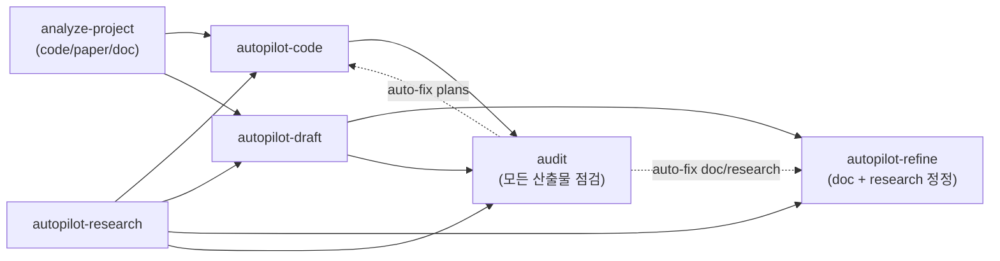

## Language Rule
- 사용자 응답은 한국어로.

## Purpose
스킬·에이전트를 수정한 후 매번 GitHub README 에 일관된 정보가 반영되어 있는지 확인하는 도구.

**Source of Truth**:
- `~/.claude/skills/*/SKILL.md` + `~/.claude/agents/*.md` — 각 skill·agent 의 frontmatter + 본문
- **`~/.claude/CONVENTIONS.md`** — family-wide 운영 규칙의 단일 source (QA 5단계 정의 / agent model 표기 / cross-doc invariants). 본 skill 의 Step 5b 가 본 문서를 canonical 로 cross-doc grep 해 drift 보고·자동 fix.

**파생 산출물**: GitHub `~/.claude/README.md`

본 skill 은 Source of Truth 로부터 README 를 재생성한다. 사용자가 파생물을 직접 편집해서는 안 된다 (자동 생성 표지 있음).

> **Notion 연동 제외 (2026-05-25)**: 본 skill 은 더 이상 Notion 대문·자식 페이지를 동기화하지 않는다. Notion 워크스페이스 운영은 사용자가 `mcp__claude_ai_Notion__*` 도구로 별도 처리 — 자세한 지침은 [`~/.claude/notion_guide.md`](../../notion_guide.md). `agents/_notion_mirror/*.md` 디렉토리와 `~/.claude/skills/{name}/README.md` 는 GitHub mirror 용도로 그대로 보존 (인간 독자가 GitHub 에서 읽기 위함).

## Targets

### 입력
- **Skills**: `~/.claude/skills/*/SKILL.md`
- **Agents**: `~/.claude/agents/*.md`

자동 발견: `ls ~/.claude/skills/*/SKILL.md ~/.claude/agents/*.md`. 실제 sync 시점에 발견된 파일 list 가 진실. 본 SKILL.md 본문에는 카운트·명단 hardcode 안 함 — drift 의 자기참조 source 가 됨.

각 파일에서 추출:
- frontmatter `name`, `description`, `argument-hint` (skills only), `tools`, `model`
- argument-hint 파싱 → 옵션 값 (예: `--mode dev|debug`, `--from analyze|strategy|...`)

### 출력
1. **GitHub**: `~/.claude/README.md` (repo: `git@github.com:dmlguq456/claude_setting.git`, root: `~/.claude/`)
2. **상태 파일**: `~/.claude/skills/.sync_state.json` — 각 입력 파일의 SHA-256, README sync 시각

## Argument Parsing
- `--check`: drift 만 보고하고 종료. 쓰기 작업 X.
- `--force`: SHA 가 같아도 재생성 (포맷 일괄 적용·서식 수정에 사용).
- `--auto-fix`: Step 5b 에서 발견한 cross-doc invariant drift 를 `CONVENTIONS.md` canonical wording 으로 자동 교체 (default 는 report-only). `--dry-run` 과 조합 시 미리보기.

기본 (인자 없음): drift 감지 → 변경 있으면 README 갱신.

## Pipeline

### Step 1: Discover + hash
```bash
ls ~/.claude/skills/*/SKILL.md ~/.claude/agents/*.md
```
각 파일:
- SHA-256 (`shasum -a 256 <file> | awk '{print $1}'`)
- frontmatter 파싱 (간단한 YAML 파서: 첫 `---` ~ 두 번째 `---`)

### Step 2: Read sync state
`~/.claude/skills/.sync_state.json` 로드. 없으면 빈 dict.

스키마 (v4 — Notion 필드 제거):
```json
{
  "version": 4,
  "last_readme_sync": "ISO8601",
  "items": {
    "skills/autopilot-code": {
      "sha256": "...",
      "synced_at": "ISO8601"
    },
    "agents/research-team": {
      "sha256": "...",
      "synced_at": "ISO8601"
    }
  }
}
```

- `sha256` / `synced_at` — SKILL.md / agent.md 자체 (frontmatter parsing source)

> **version migration**: v2/v3 state JSON 로드 시 Notion 관련 필드 (`notion_page_id` / `notion_last_edited_time` / `notion_synced_sha256` / `readme_path` / `readme_sha256` / `readme_mtime`) 는 _읽지 않고 그대로 둠_ — v4 로 첫 저장 시 자연스레 제거. 기존 필드가 남아 있어도 본 skill 동작에 영향 없음.

### Step 3: Drift report
**신규 / 변경 / 삭제 / 동일** 4 분류. 한국어 출력:
```
Sync 상태 (2026-05-25 12:34 KST)
─────────────────────────────────────
Skills:  변경 3 / 신규 0 / 삭제 0 / 동일 9
Agents:  변경 0 / 신규 0 / 삭제 0 / 동일 8

[변경된 항목]
  ✏️  skills/autopilot-code   (마지막 sync: 2026-04-21)
  ✏️  skills/autopilot-draft    (마지막 sync: 2026-04-21)
  ✏️  skills/code-plan        (마지막 sync: 2026-04-21)

마지막 README sync: 2026-04-21 09:08
```

`--check` 이면 종료.

### Step 4: Generate dashboard sections

#### 4a. 워크플로우 다이어그램

A (사전조사) → B (코드)/C (문서) → D (점검) → E (정정) 5 갈래 큰 그림만. 옵션 플래그·호출 구조는 README 본문에서 _자연어 사용 표_ 가 대체.



> 다이어그램 직후 본문은 _5 카테고리 bullets_ (A 사전조사 / B 코드 / C 문서 / D 점검 / E 정정) + _3-tier 산출물 컨벤션 reference_ (CONVENTIONS.md §5) 까지만. 파이프라인별 prose·체이닝 패턴 prose·사용자 개입 지점 prose 는 새 layout 에서 _넣지 않음_ (자연어 사용 표 §2 가 대체).
>
> **Agent 호출 구조 mermaid 는 자동 생성에서 제외** — 새 README 핵심 메시지는 _자연어로 부르면 메인 Claude 가 알아서 컨펌받고 진행_ 이라 호출 구조 강조는 정보 dump. 필요 시 각 agent .md 또는 글로벌 CLAUDE.md 도메인 트리거에서 참조.

#### 4b. README 본문 구조 (canonical layout — 자연어 사용 표 중심)

`~/.claude/README.md` 가 본 sync 의 단일 진실 출처 (reference layout). sync 시 다음 순서로 7 섹션을 채운다:

1. **Header** — title + source 안내 (`/sync-skills` 자동 갱신 표지) + 운영 가이드 (`notion_guide.md`) 링크. sync 시각·이력은 git commit log 가 단일 출처.
2. **📊 워크플로우** — workspace 전제 quote (Claude 는 프로젝트 루트에서 실행 / `.claude_reports/` 현재 dir 생성 / `--refs` flag 없음) + sub-section 두 개:
   - `### Skill 호출 흐름` — Diagram 1 (위 4a) + 5 카테고리 한 줄 (A 사전조사 / B 코드 / C 문서 / D 점검 / E 정정)
   - `### 산출물 I/O (\`.claude_reports/\` 관점)` — Diagram 2 (산출물 I/O mermaid) + 누적 디렉토리 안내 + D/E 역할 한 줄 (D 는 OUT 을 _읽기만_ + 자동 fix dispatch / E 는 OUT 을 _read+write_ 양방향)
   - 3-tier 산출물 컨벤션 reference + 산출물 위치·scope·함정 reference (글로벌 CLAUDE.md "Drift-Free Essentials")
3. **🗣️ 사용 방식** (핵심 섹션 — _§3.(1) 자연어 발화 예시 표는 사람 유지 영역_)
   - 두 갈래 평등 prose 한 줄 (자연어 발화 / 직접 slash 입력 — 동일 skill 동일 동작)
   - `### (1) 자연어 발화로 부르기` — prose (메인 Claude 의 옵션 자동 구성 + 자연어 한 줄 요약 + 옵션 펼침 + 옵션 선택 근거 컨펌 흐름 + yes/수정/cancel/자율 진행) + ceremony 큰 5 (autopilot-* 4 + analyze-user) vs 작은 3 (audit / notes / analyze-project) 컨펌 의무 안내 + 글로벌 [`CLAUDE.md`](CLAUDE.md) §6 reference + **자연어 발화 예시 표** (사용자 발화 / 메인 Claude 컨펌 자연어 요약 — 6 행 정도, _사람 유지_)
   - `### (2) slash 명령 직접 입력` — prose (직접 입력 = 의도 명시 = 컨펌 skip 즉시 invoke 안내) + slash 예시 code block (autopilot-code / autopilot-draft / autopilot-research / autopilot-refine / audit / notes 6 줄, SKILL.md frontmatter `argument-hint` 에서 자동 생성) + QA 5단계 단일 정의는 [`CONVENTIONS.md`](CONVENTIONS.md) §1 reference
4. **📋 Skills** — name (SKILL.md 링크) / 역할 표만. 옵션 dump **X**. 표 직후 sub-skill 한 줄 + 세부 옵션은 각 SKILL.md `## Usage` reference 안내.
5. **🤝 Agents** — name (agent .md 링크) / 모델 / 역할 표. _자동 호출자 컬럼 X_ (새 패턴은 자연어로 부르면 메인 Claude 가 알아서). 직접 호출 안내 한 단락.
6. **⚙️ 운영 룰** — 한 단락. _자동 호출 패턴은 글로벌 [`CLAUDE.md`](CLAUDE.md) 가 단일 source of truth_ 안내. §6 autopilot-* 호출 패턴 + 도메인 트리거 표 reference. 각 SKILL.md `## Default Invocation Rule` 은 _그 SKILL.md 안에서만_ 의미 — README 에 모으지 않음.
7. **🔁 동기화** — `/sync-skills` 두 명령 + GitHub 링크

원칙:
- prose 최소화, 표·bullet 우선. 단 §2 _자연어 사용 방식_ 섹션은 _자연어 발화 예시 표_ 가 핵심 anchor 라 단단히 유지.
- 같은 정보를 두 군데 반복하지 않음 (옵션 spec 은 각 SKILL.md 가 source, autopilot 호출 룰은 글로벌 CLAUDE.md §6 가 source).
- _넣지 않음_ 항목 (의도적 제거):
  - 호출 구조 mermaid (Agent 측)
  - "자주 쓰는 명령" 시나리오 × 명령 표
  - "핵심 옵션 3가지" prose (`--user-refine` / `--from` / `--qa`)
  - 파이프라인별 prose / 체이닝 패턴 prose
  - Skills 표의 "주요 옵션" 컬럼 (argument-hint 자동 추출)
  - 운영 룰 표 (skill 별 4컬럼 dump)

**§3.(1) 자연어 발화 예시 표는 _사람 유지 영역_** — 자연어 발화 예시 표는 사람 손길 큐레이션 자료라 자동 생성 어려움. sync-skills 는 _현행 README 의 §3.(1) 자연어 발화 표 + 그 직전 prose 한 두 단락 을 그대로 보존_ 하고 (SHA 비교 skip), 나머지 (§1·§2·§3.(2)·§4-§7) 만 자동 갱신. 사용자가 §3.(1) 을 직접 편집해도 sync-skills 가 덮어쓰지 않음.

현행 README 가 본 layout 의 reference. 대규모 변경 시 README 를 먼저 손보고 본 SKILL.md 를 동기화.

### Step 5: Write README.md

`~/.claude/README.md` 를 4b 의 layout 그대로 작성. 단 _섹션별 자동 갱신 정책_ 이 다름:

| 섹션 | 처리 |
|---|---|
| §1 Header | 표지 텍스트 / 운영 가이드 링크 자동 갱신 |
| §2 워크플로우 | Diagram 1 (Skill 호출 흐름) + 5 카테고리 한 줄 + Diagram 2 (산출물 I/O `.claude_reports/` 관점) + 3-tier 컨벤션 reference 자동 갱신. workspace 전제 quote 고정 wording |
| **§3 사용 방식** | **§3.(1) 자연어 발화 예시 표 + 그 직전 prose 는 사람 유지 영역 — 현행 wording 그대로 보존 (SHA 비교 skip).** 사용자가 직접 편집한 발화 예시 표 그대로. 단 _섹션 헤딩 자체_ 가 누락됐으면 placeholder 헤딩 + 한 줄 안내만 자동 삽입. §3.(2) slash 예시 code block 은 각 SKILL.md frontmatter `argument-hint` 에서 자동 생성 + ceremony 큰 5 (autopilot-* 4 + analyze-user) vs 작은 3 (audit / notes / analyze-project) 컨펌 의무 안내·QA 5단계 reference 자동 갱신 |
| §4 Skills 표 | name / 역할 자동 추출. 옵션 컬럼 X. 새 skill 추가·삭제 자동 반영 |
| §5 Agents 표 | name / 모델 / 역할 자동 추출. 자동 호출자 컬럼 X |
| §6 운영 룰 | _글로벌 CLAUDE.md §6 가리킴 한 단락_. 표 자동 채우기 X |
| §7 동기화 | 두 명령 + GitHub 링크 고정 wording |

**sync 시각·이력은 README 본문에 쓰지 않음** (git commit log 가 단일 출처).

### Step 5a: 편집팀 검수 (사용자 영역 wording — LLM 스러운 어조 회피)

Step 5 에서 README 본문 wording 을 자동 생성·갱신한 자리 (§1 Header / §2 워크플로우 / §3.(2) slash 명령 직접 입력 / §4 Skills 표 wording / §5 Agents 표 wording / §6 운영 룰 / §7 동기화) 는 메인 Claude 가 wording 을 직접 짜므로 _LLM 스러운 인공적 어조_ (풀어쓰기 과잉·모범생 화법·친절 안내체) risk. Step 5 자동 갱신 직후 _같은 turn 안에_ `Agent(편집팀)` _다듬기 모드_ 호출해 검수.

**검수 범위** — Step 5 가 _자동 갱신_ 한 섹션만. _§3.(1) 자연어 발화 예시 표 + 그 직전 prose_ 는 _사람 유지 영역_ (이미 사람 손길 큐레이션) 이므로 검수 제외.

**Prompt 초점** (Agent 호출 시 그대로 전달):
- 풀어쓰기 과잉 정리 (한 줄 표현 가능한 자리)
- 모범생·친절 안내체 ("~가 평등하게 있습니다" / "어느 쪽을 써도 ~합니다") 회피
- 간결·단정 한국어 (`~다` / `~이다` 어미)
- 글로벌 [`CLAUDE.md`](../../CLAUDE.md) §1 한국어 가독성 정책 + 도메인 트리거 표 _사용자 영역 메타 문서 작성·수정_ 행 준수
- 표·코드 블록·heading 구조·mermaid·링크는 그대로 유지 (의미·구조 변경 X, 어조만)

**Skip 조건** — `--check` 는 drift 보고만이라 Step 5 자체가 안 돌아 검수 무관. `--force` / default 는 검수 포함.

> 본 step 추가 사유 (2026-05-22): 사용자가 README §3 사용 방식 첫 줄 _"두 가지 입구가 평등하게 있습니다 — 자연어로 부르기 와 직접 slash 입력. 어느 쪽을 써도 같은 skill 이 같은 방식으로 동작합니다."_ 같은 LLM 스러운 어조 지적. 자동 sync 가 매번 같은 risk 재발하지 않도록 검수 단계 의무화.

### Step 5b: Cross-doc invariant scan (QA 정의 & family-wide 규칙)

> 각 SKILL.md `## Default Invocation Rule` 은 _그 SKILL.md 안에서만_ 의미를 가지고 README 에 모으지 않음 (README §6 운영 룰은 _글로벌 CLAUDE.md §6 가리킴 한 단락_). autopilot-* 4 개 SKILL.md 의 trigger 신호·default 옵션·override 는 글로벌 §6 의 일반 패턴 + 각 SKILL.md 의 skill-specific 정보로 분리.

QA level / model 표기 / family-wide invariant 은 **`~/.claude/CONVENTIONS.md`** 가 단일 source of truth. 각 SKILL.md / README / `agents/*.md` 의 QA 표 wording 은 본 문서와 의미상 일치해야 함.

#### 5b-1. Canonical 정의 로드

```bash
# Read CONVENTIONS.md fully; then parse:
#   §1.1 5단계 공통 정의 표 → QA wording (canonical)
#   §2 Agent Model 표기 → agent model 정의
#   §3 Hard Cross-Doc Invariants → invariant rule list
```

이로부터 5단계 정의 (quick/light/standard/thorough/adversarial) 의 _구성_ 을 추출 (Quality reviewer / Fact-checker / Codex 컬럼 wording).

#### 5b-2. 모든 .md 파일에서 QA wording 추출

대상 파일:
- `~/.claude/skills/*/SKILL.md`
- `~/.claude/skills/*/README.md`
- `~/.claude/agents/*.md`
- `~/.claude/README.md`

각 파일에서 다음 패턴 grep:
- `adversarial` 정의 문장 (예: `adversarial = ...`, `Adversarial | ...`, `adversarial.*Codex`)
- `quick`/`light`/`standard`/`thorough` 정의 표 행
- "fact-checker" 적용 여부
- model 표기 (`opus`, `sonnet`, 가변 표기)

#### 5b-3. Invariance 검사 (drift 보고)

각 추출된 wording 을 canonical 정의와 비교. 다음 drift 패턴을 _하드 검사_:

| Invariant | 검사 패턴 | drift 시 보고 |
|---|---|---|
| **adversarial = thorough + Codex** | `adversarial.*standard.*Codex` 또는 `adversarial.*=.*standard` | 🔴 `잘못된 정의: adversarial 은 thorough + Codex 이지 standard + Codex 가 아님` |
| **autopilot-code 는 fact-checker 없음** | autopilot-code/SKILL.md or autopilot-code/README.md 에서 `fact-checker` 언급 (단, "doc/research 에만" 이라는 negative 안내는 OK) | 🔴 `code 파이프라인은 fact-checker 미적용` |
| **autopilot-* + analyze-user adversarial 지원** | autopilot-code / autopilot-draft / autopilot-research / autopilot-refine / analyze-user 의 argument-hint 에 `adversarial` 누락 | 🔴 `2026-05-22 통일 — analyze-user 는 adversarial 고정, 나머지 4 개는 default thorough + adversarial 지원` |
| **quick 은 refine skip + 1라운드 강제 종료** | quick 정의에서 위 둘 중 하나 누락 | 🟡 `quick 정의 incomplete` |
| **`--no-fact-check` / `--no-style-audit` 는 autopilot-refine·audit 전용** | 다른 skill 의 argument-hint 에 노출 | 🔴 `해당 flag 는 refine·audit 외 노출 금지` |

#### 5b-4. 보고 형식

drift 발견 시 Step 7 final report 에 별도 섹션:
```
[QA invariant drift]
🔴 skills/autopilot-refine/SKILL.md:46 — adversarial 정의가 'standard + Codex'로 잘못 적힘 (canonical: 'thorough + Codex')
🟡 skills/autopilot-research/SKILL.md:632 — quick 정의에 'refine skip' 명시 누락
```

자동 fix 정책 (CONVENTIONS.md §4):
- **default (report-only)**: drift 보고만, 수정 안 함
- **`--auto-fix`** flag 시: CONVENTIONS.md §3 hard invariants 위반은 canonical wording 으로 강제 교체. 단 _wording 자체_ 가 다를 경우 (의미 동일·표현 차이): skip (사람 결정). _의미가 다른_ 명백한 drift 만 propagate.
- **`--auto-fix --dry-run`**: 미리보기 (실제 write 안 함)
- `--check` 모드에서는 invariant drift 만 보고하고 종료 (auto-fix 자동 적용 안 함).

> **새 invariant 추가**: CONVENTIONS.md §3 에 한 행 추가하면 sync 시 자동 검사 list 에 포함.

### Step 5c: Cross-doc skill name reference scan (rename drift 차단)

**왜 신설** (2026-05-25): autopilot-app → autopilot-spec rename 자리에서 본 step 부재로 SKILL.md SHA 만 갱신되고 _README mermaid 다이어그램·다른 SKILL.md 의 cross-reference_ 가 그대로 통과. sync 가 _자동 잡았어야_ 자리. 본 step 이 _skill 이름 rename_ + _산출물 폴더 명 변경_ 자리의 drift 자동 검출.

#### 5c-1. Skill / agent name 인벤토리 추출

```bash
# 현재 진실 (entry point list)
SKILLS=$(ls -d ~/.claude/skills/*/  | xargs -n1 basename | sort)
AGENTS=$(ls ~/.claude/agents/*.md   | xargs -n1 basename .md | sort)
```

DEPRECATED 표지 있는 skill 별도 인지 — description 안 `[DEPRECATED` 또는 본문 첫 줄 `> **DEPRECATED**` 발견 시 _레거시 자료_ 표지로 분류.

#### 5c-2. Cross-doc reference grep

전체 `~/.claude/` 안 `*.md` / `*.json` / `*.yaml` 에서 다음 패턴 grep:

| 패턴 | 검출 |
|---|---|
| `autopilot-X` (X = 알파벳·하이픈) | autopilot-* skill name reference |
| `/autopilot-X` | slash 명령 reference |
| `\bX-Y\b` (X = app / code / design / draft, Y = init / spec / build / refine / 등) | sub-skill name reference |
| `Agent\(X팀` 또는 `Agent\(X-team` | agent reference |

각 reference 의 _name 부분_ 추출 후 인벤토리 (5c-1) 와 대조:

| drift 종류 | 보고 |
|---|---|
| **폴더 부재 skill name reference** | 🔴 `<file>:<line> — '<missing-name>' reference 발견, skill 폴더 없음. rename 후 정정 누락?` |
| **DEPRECATED skill 의 _description 안 흡수 자리_ 가 부재 skill 가리킴** | 🔴 `<file> — '<missing-target>' 가리키지만 폴더 없음` |
| **slash 명령 (`/autopilot-X`) 의 X 가 폴더 부재** | 🔴 `<file>:<line> — /autopilot-<missing> 호출 reference` |

#### 5c-3. README mermaid 노드 ↔ skill list 일관성

`~/.claude/README.md` 안 mermaid 블록 (\`\`\`mermaid ... \`\`\`) 추출 후 노드 정의 (`X["..."]`) 파싱:

- 실제 _entry point_ skill (ceremony 큰 7 개 + analyze-project + audit + notes) 가 _최소 한 다이어그램_ 에 등장하나
- 부재 entry 발견 시: 🟡 `README mermaid 에 '<missing-skill>' 노드 누락 — 다이어그램 보강 권장`

#### 5c-4. 산출물 폴더 컨벤션 일관성

`CONVENTIONS.md §6.5 산출물 폴더 컨벤션 정리` 표 파싱 → 각 skill 의 _산출물 폴더 명_ 추출 (예: `specs/<name>/`, `documents/<date>_<name>/`).

다른 SKILL.md 본문에서 _다른 skill 의 산출물 폴더 reference_ 추출 (예: autopilot-spec 의 본문이 autopilot-code 의 산출물 폴더 가리킴 자리).

| drift 종류 | 보고 |
|---|---|
| **CONVENTIONS 매핑 표와 SKILL.md 산출물 wording 불일치** | 🔴 `skills/<x>/SKILL.md 의 산출물 '<wrong>' — CONVENTIONS §6.5 매핑은 '<correct>'` |
| **다른 SKILL.md 의 _A skill 산출물 폴더 reference_ 가 매핑 표와 불일치** | 🔴 `skills/<other>/SKILL.md:<line> — '<x>' 산출물을 '<wrong>' 으로 reference (매핑: '<correct>')` |

#### 5c-5. 자동 fix 정책

- **default (report-only)**: drift 보고만, 수정 안 함
- **`--auto-fix`** flag 시:
  - 폴더 부재 skill name → _CONVENTIONS.md §6.6 DEPRECATED list_ 의 _이전 → 현재_ 매핑 표 참조해 자동 정정 가능 자리만 wording 교체. 매핑 없으면 사용자 결정.
  - 산출물 폴더 명 — CONVENTIONS.md §6.5 canonical 로 자동 정정
- **`--check` 모드**: drift 만 보고하고 종료

### Step 6: Update sync state
`~/.claude/skills/.sync_state.json` 을 새 SHA + 시각으로 저장. v4 스키마 필드 모두 갱신:

- SKILL.md / agent.md: `sha256`, `synced_at`
- 전역: `last_readme_sync`

### Step 7: Final report
```
✅ Sync 완료
─────────────────────────────────────
SKILL.md/agent.md 변경: 3 (autopilot-code, autopilot-draft, code-plan)
README.md 갱신: ~/.claude/README.md

다음에 PR/푸시:
  cd ~/.claude && git add README.md skills/ agents/
  git commit -m "skills+agents: <변경 요약>"
  git push
```

## Hook integration (옵션)
`~/.claude/settings.json` 에 다음 추가하면 세션 종료 시 drift 알림:

```json
{
  "hooks": {
    "Stop": [{
      "matcher": "",
      "hooks": [{
        "type": "command",
        "command": "find ~/.claude/skills ~/.claude/agents -name '*.md' -newer ~/.claude/skills/.sync_state.json 2>/dev/null | head -1 | grep -q . && echo '[sync-skills] drift detected — run /sync-skills' || true"
      }]
    }]
  }
}
```

자동 sync 는 권하지 않음 — 명시적 호출 + drift 알림만이 권장 패턴.

## Safety Rules
- README.md 는 자동 생성 표지가 있는 경우에만 덮어쓴다. 사용자 수동 편집 흔적이 감지되면 abort + 경고.
- `--force` 없이는 SHA 동일 항목은 처리 스킵.
- sync state JSON parse 실패 시 backup 으로 옮기고 빈 dict 로 재시작 (모든 항목을 변경으로 처리).
- 자기 자신 (`sync-skills/SKILL.md`) 갱신도 동일하게 처리 (메타 — `sync-skills` 가 자기 hash 를 state 에 기록).

## Task
$ARGUMENTS
